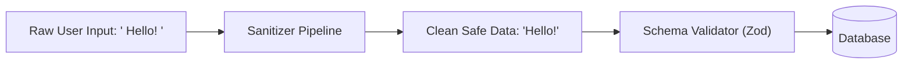

## 🧼 Validation vs Sanitization

- **Validation:** ត្រួតពិនិត្យមើលថាតើទិន្នន័យត្រឹមត្រូវតាមច្បាប់ឬអត់ (ឧ. Email មាន `@`, អាយុ > 18)។ បើខុស គឺបដិសេធ (Reject)។
- **Sanitization:** លាងសម្អាត ឬកែប្រែទិន្នន័យដែលគ្រោះថ្នាក់ឱ្យមានសុវត្ថិភាព (ឧ. Trim space, Remove `<script>` tags, Normalize email) មុននឹងរក្សាទុក។



---

## 🛠️ ការប្រើប្រាស់ Sanitization Packages

```bash
npm install hpp sanitize-html
npm install -D @types/hpp @types/sanitize-html
```

```typescript
import express from "express";
import hpp from "hpp";
import sanitizeHtml from "sanitize-html";

const app = express();

// 1. កម្រិត Body Size ត្រឹម 10KB សម្រាប់ទប់ស្កាត់ Payload Flooding
app.use(express.json({ limit: "10kb" }));

// 2. ការពារ HTTP Parameter Pollution
app.use(hpp({ whitelist: ["sort", "page", "limit"] })); // អនុញ្ញាត array លើតែ parameters ទាំងនេះ

// 3. Custom String Sanitizer Middleware
export const sanitizeInputs = (req: express.Request, res: express.Response, next: express.NextFunction) => {
  if (req.body && typeof req.body === "object") {
    for (const key of Object.keys(req.body)) {
      if (typeof req.body[key] === "string") {
        req.body[key] = sanitizeHtml(req.body[key].trim(), {
          allowedTags: [], // លុប HTML tags ទាំងអស់ចោល
          allowedAttributes: {},
        });
      }
    }
  }
  next();
};

app.use(sanitizeInputs);
```
