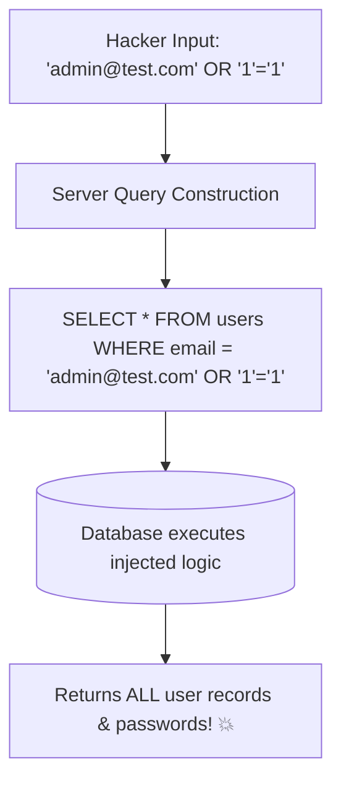

## 💉 អ្វីទៅជា SQL Injection (SQLi)?

**SQL Injection** កើតឡើងនៅពេលដែលកម្មវិធី Backend យកទិន្នន័យពី User មកបូកបញ្ចូលផ្ទាល់ (String Concatenation/Interpolation) ទៅក្នុង SQL Command ដោយមិនបានឆ្លងកាត់ការ Parameterize។



---

## 🛑 ការប្រៀបធៀបកូដដែលគ្រោះថ្នាក់ vs កូដមានសុវត្ថិភាព

### ❌ កូដងាយរងគ្រោះ (Vulnerable Code)
```javascript
// ប្រសិនបើ req.body.email គឺ "' OR '1'='1" នោះ Result នឹងចេញ True ជានិច្ច!
const sql = `SELECT * FROM users WHERE email = '${req.body.email}' AND password = '${req.body.password}'`;
const result = await db.query(sql);
```

### ✅ កូដមានសុវត្ថិភាព (Parameterized Query / Prepared Statement)
```javascript
const sql = `SELECT * FROM users WHERE email = $1 AND password = $2`;
const result = await db.query(sql, [req.body.email, req.body.password]);
```

---

## ⚠️ SQL Injection ក្នុង ORM (តើ ORM មានសុវត្ថិភាព ១០០% ទេ?)

TypeORM និង ORM ភាគច្រើនការពារ SQLi ដោយស្វ័យប្រវត្តិតាមរយៈ Parameter binding។ ប៉ុន្តែបើអ្នកប្រើ **Raw strings ក្នុង QueryBuilder** អ្នកនៅតែអាចជួបបញ្ហា៖

```typescript
// ❌ គ្រោះថ្នាក់៖ ការ Interpolate String ចូលក្នុង QueryBuilder
userRepo.createQueryBuilder("user")
  .where(`user.name = '${userName}'`); // ❌ SQL Injection Vulnerable!

// ✅ សុវត្ថិភាព៖ ប្រើ Parameters Object ជានិច្ច
userRepo.createQueryBuilder("user")
  .where("user.name = :name", { name: userName }); // ✅ Safe
```

> [!IMPORTANT]
> **ច្បាប់ដាច់ខាត:** កុំប្រើ Template Literals (`` `${var}` ``) ឬ String Concat (`+`) ដើម្បីផ្គុំទិន្នន័យ User ចូលទៅក្នុង SQL string ឱ្យសោះ មិនថាក្នុង Raw SQL ឬ ORM ឡើយ!
