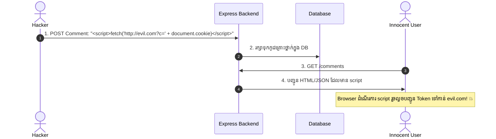
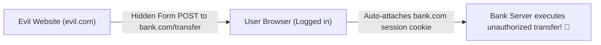

## 💥 1. Cross-Site Scripting (XSS)

**XSS** កើតឡើងនៅពេលដែល Hacker បញ្ចូលកូដ JavaScript ដែលបង្កប់គ្រោះថ្នាក់ (Malicious Script) ទៅក្នុងគេហទំព័រ ហើយ Browser របស់អ្នកប្រើប្រាស់ផ្សេងទៀតដំណើរការកូដនោះ។



### 🛡️ វិធីការពារ XSS:
1. **HttpOnly Cookies:** ការពារមិនឱ្យ JavaScript អាន Cookie សម្ងាត់បាន
2. **HTML Sanitization / Escaping:** សម្អាត tags `<script>`, `<iframe>`, `onerror`
3. **Content Security Policy (CSP):** បិទមិនឱ្យ Run Inline Scripts

---

## 🎭 2. Cross-Site Request Forgery (CSRF)

**CSRF** គឺជាការវាយប្រហារដែល Hacker បង្ខំ Browser របស់ជនរងគ្រោះឱ្យផ្ញើ Request ដែលមាន Session Cookie ស្រាប់ទៅកាន់ Server របស់ជនរងគ្រោះដោយមិនដឹងខ្លួន។



### 🛡️ វិធីការពារ CSRF:
1. **SameSite Cookie Attribute:**
   ```javascript
   res.cookie('token', jwtToken, {
     httpOnly: true,
     secure: true,
     sameSite: 'lax', // ឬ 'strict'
   });
   ```
2. **Custom Request Headers:** REST APIs ដែលផ្ញើទិន្នន័យតាម `Authorization: Bearer <token>` មិនងាយរងគ្រោះនឹង CSRF ដូច Cookie-based forms ឡើយ។
