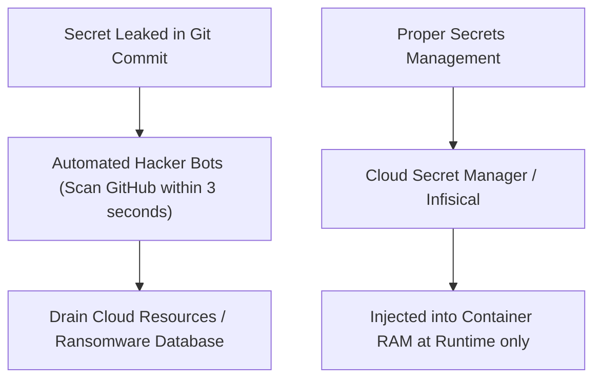

## 🔐 ហានិភ័យនៃ Secret Sprawl

**Secret Sprawl** គឺជាការដែល API Keys, Database Passwords, JWT Secrets, និង Private Keys ត្រូវបានសាយភាយនៅរាយប៉ាយតាម Chat, ក្នុង Codebase, ឬក្នុង Docker Images។

---

## 🛡️ Best Practices ក្នុងការគ្រប់គ្រង Secrets

1. **ប្រើប្រាស់ Pre-commit Hooks (`gitleaks`):** ត្រួតពិនិត្យ និងរារាំងមិនឱ្យ Commit កូដប្រសិនបើមានជាប់ Secrets ដូចជា Stripe Keys ឬ DB Strings។
2. **Environment Variable Injection:** ក្នុង Production (AWS ECS, Render, Railway, Kubernetes) បញ្ចូល Secrets តាម Dashboard ឬ Secret Manager មិនដាក់ក្នុង Image ឡើយ។
3. **Secret Rotation Policy:** កំណត់កាលវិភាគប្តូរលេខសម្ងាត់ Database និង API Keys រៀងរាល់ 90 ថ្ងៃម្តង។
4. **Least Privilege Principle:** គណនី DB ដែលប្រើក្នុង App គួរតែមានសិទ្ធិតែលើ Database របស់វា មិនត្រូវប្រើ User `postgres` (Superadmin) ក្នុង App ឡើយ។
