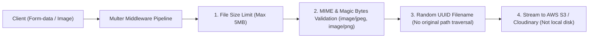

## 📁 ហានិភ័យនៃ File Uploads គ្មានសុវត្ថិភាព

1. **Remote Code Execution (RCE):** Hacker upload file `.php`, `.js`, ឬ `.sh` រួច execute វានៅលើ Server។
2. **Denial of Service (DoS):** Upload files ធំៗរាប់ Gigabytes ធ្វើឱ្យអស់ទំហំ Disk Space។
3. **MIME Sniffing:** Upload HTML file ដែលបង្កប់ XSS scripts។



---

## 💻 ការអនុវត្ត Multer Middleware ជាមួយសុវត្ថិភាព

```bash
npm install multer
npm install -D @types/multer
```

```typescript
// src/middlewares/upload.ts
import multer, { FileFilterCallback } from "multer";
import path from "path";
import crypto from "crypto";
import { Request } from "express";

// 1. ប្រើ MemoryStorage ដើម្បីកុំឱ្យផ្ទុក files លើ Disk មូលដ្ឋាន
const storage = multer.memoryStorage();

// 2. MIME Type Filter
const fileFilter = (
  req: Request,
  file: Express.Multer.File,
  callback: FileFilterCallback
) => {
  const allowedMimeTypes = ["image/jpeg", "image/png", "image/webp"];

  if (allowedMimeTypes.includes(file.mimetype)) {
    callback(null, true);
  } else {
    callback(new Error("ប្រភេទឯកសារមិនត្រូវបានអនុញ្ញាត! អនុញ្ញាតតែ JPG, PNG, WEBP ប៉ុណ្ណោះ"));
  }
};

// 3. កំណត់ Limits (5MB max)
export const uploadAvatar = multer({
  storage,
  limits: {
    fileSize: 5 * 1024 * 1024, // 5 Megabytes
    files: 1,
  },
  fileFilter,
});
```

### 4. ការប្រើប្រាស់ក្នុង Route (`src/routes/user.routes.ts`)
```typescript
import { Router } from "express";
import { uploadAvatar } from "../middlewares/upload";

const router = Router();

router.post("/avatar", uploadAvatar.single("avatar"), async (req, res) => {
  if (!req.file) {
    return res.status(400).json({ message: "សូមជ្រើសរើសរូបភាពដើម្បី Upload" });
  }

  // req.file.buffer អាច upload បន្តទៅកាន់ AWS S3 ឬ Cloudinary
  console.log("File Name:", req.file.originalname);
  console.log("File Size:", req.file.size, "bytes");

  res.status(200).json({
    success: true,
    message: "រូបភាពត្រូវបាន Upload និងផ្ទៀងផ្ទាត់ជោគជ័យ!",
  });
});

export default router;
```
