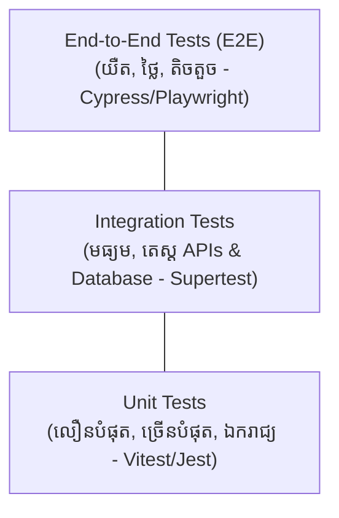

## 🔺 Testing Pyramid



---

## ⚡ ការដំឡើង Vitest ក្នុង TypeScript

```bash
npm install -D vitest @types/node
```

### `package.json`:
```json
{
  "scripts": {
    "test": "vitest",
    "test:run": "vitest run",
    "test:coverage": "vitest run --coverage"
  }
}
```

---

## 💻 ការអនុវត្ត Unit Tests ជាក់ស្តែង

### 1. Function ដែលត្រូវតេស្ត (`src/utils/calculator.ts`)
```typescript
export function calculateOrderTotal(
  items: Array<{ price: number; quantity: number }>,
  discountPercentage: number = 0
): number {
  if (discountPercentage < 0 || discountPercentage > 100) {
    throw new Error("ភាគរយបញ្ចុះតម្លៃត្រូវតែនៅចន្លោះពី 0 ដល់ 100");
  }

  const subtotal = items.reduce((sum, item) => sum + item.price * item.quantity, 0);
  const discount = (subtotal * discountPercentage) / 100;
  return Math.round((subtotal - discount) * 100) / 100;
}
```

### 2. Unit Test Suite (`tests/unit/calculator.test.ts`)
```typescript
import { describe, it, expect } from "vitest";
import { calculateOrderTotal } from "../../src/utils/calculator";

describe("calculateOrderTotal()", () => {
  it("គួរតែគណនាតម្លៃសរុបនៃទំនិញបានត្រឹមត្រូវពេលគ្មានបញ្ចុះតម្លៃ", () => {
    const items = [
      { price: 10, quantity: 2 }, // 20
      { price: 15, quantity: 3 }, // 45
    ];
    const total = calculateOrderTotal(items, 0);
    expect(total).toBe(65);
  });

  it("គួរតែគណនាបញ្ចុះតម្លៃ 10% បានត្រឹមត្រូវ", () => {
    const items = [{ price: 100, quantity: 1 }];
    const total = calculateOrderTotal(items, 10);
    expect(total).toBe(90);
  });

  it("គួរតែបោះ Error ប្រសិនបើ discountPercentage អវិជ្ជមាន (< 0)", () => {
    const items = [{ price: 50, quantity: 1 }];
    expect(() => calculateOrderTotal(items, -5)).toThrow(
      "ភាគរយបញ្ចុះតម្លៃត្រូវតែនៅចន្លោះពី 0 ដល់ 100"
    );
  });
});
```

---

## 🎭 Mocking Dependencies ជាមួយ `vi.fn()`

```typescript
import { describe, it, expect, vi } from "vitest";

describe("UserService.sendWelcomeEmail", () => {
  it("គួរតែហៅ EmailService.send យ៉ាងពិតប្រាកដ", async () => {
    // បង្កើត Mock function
    const mockSendEmail = vi.fn().mockResolvedValue(true);

    // សាកល្បងហៅ
    await mockSendEmail("sok@example.com", "Welcome to Full Stack!");

    // ផ្ទៀងផ្ទាត់ថា Mock ត្រូវបានហៅ ១ ដងជាមួយ Email ត្រឹមត្រូវ
    expect(mockSendEmail).toHaveBeenCalledTimes(1);
    expect(mockSendEmail).toHaveBeenCalledWith("sok@example.com", expect.any(String));
  });
});
```
