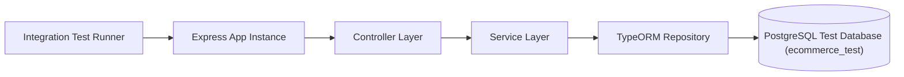

## 🧩 អ្វីទៅជា Integration Testing?

ខុសពី Unit Test ដែលតេស្តតែ Function មួយដាច់ដោយឡែក **Integration Testing** ផ្ទៀងផ្ទាត់ថាតើ Modules ផ្សេងៗគ្នា (Controller + Service + Repository + Database) អាចដំណើរការរួមគ្នាបានត្រឹមត្រូវឬទេ។



---

## 🔄 Test Hooks Lifecycle ក្នុង Vitest

| Hook | ពេលដែលដំណើរការ | ករណីប្រើប្រាស់ទូទៅ |
|---|---|---|
| `beforeAll` | រត់តែម្តងគត់ មុនគេបង្អស់ក្នុង Test File | បើក Database Connection, Start Mock Server |
| `beforeEach` | រត់រាល់ពេល មុន Test Case (`it(...)`) នីមួយៗ | Clear Database Tables, Reset Mocks |
| `afterEach` | រត់រាល់ពេល បន្ទាប់ពី Test Case នីមួយៗចប់ | Cleanup temporary files |
| `afterAll` | រត់តែម្តងគត់ ក្រោយគេបង្អស់ពេល Test ចប់ទាំងអស់ | បិទ Database Connection (`db.destroy()`) |

---

## 💻 ឧទាហរណ៍ជាក់ស្តែង៖ Auth Integration Test

```typescript
// tests/integration/auth.test.ts
import { describe, it, expect, beforeAll, afterAll, beforeEach } from "vitest";
import request from "supertest";
import app from "../../src/app";
import { AppDataSource } from "../../src/config/data-source";
import { User } from "../../src/entities/User.entity";

describe("POST /api/v1/auth/register", () => {
  // 1. បើក Database Test មុនពេលចាប់ផ្តើម
  beforeAll(async () => {
    await AppDataSource.initialize();
  });

  // 2. Clear Database មុន TestCase នីមួយៗ
  beforeEach(async () => {
    const userRepo = AppDataSource.getRepository(User);
    await userRepo.query('TRUNCATE TABLE "users" CASCADE;');
  });

  // 3. បិទ Connection ពេលចប់
  afterAll(async () => {
    await AppDataSource.destroy();
  });

  it("គួរតែចុះឈ្មោះ User ថ្មីបានជោគជ័យ (201 Created) និង Hash password", async () => {
    const payload = {
      email: "newuser@test.com",
      password: "securepassword123",
      fullName: "Sok San",
    };

    const res = await request(app)
      .post("/api/v1/auth/register")
      .send(payload)
      .expect(201);

    expect(res.body.success).toBe(true);
    expect(res.body.data.email).toBe(payload.email);
    expect(res.body.data.password).toBeUndefined(); // មិនត្រូវបង្ហាញ password ទេ

    // ផ្ទៀងផ្ទាត់ក្នុង Database ពិតប្រាកដ
    const userInDb = await AppDataSource.getRepository(User).findOneBy({ email: payload.email });
    expect(userInDb).not.toBeNull();
    expect(userInDb?.passwordHash).not.toBe(payload.password); // ត្រូវតែ Hash រួច
  });

  it("គួរតែបដិសេធ (400/409) ប្រសិនបើ Email ត្រូវបានចុះឈ្មោះរួចហើយ", async () => {
    const payload = {
      email: "duplicate@test.com",
      password: "securepassword123",
      fullName: "Sok San",
    };

    // បង្កើតលើកទី ១
    await request(app).post("/api/v1/auth/register").send(payload).expect(201);

    // បង្កើតលើកទី ២ ដោយប្រើ Email ដដែល
    const res = await request(app)
      .post("/api/v1/auth/register")
      .send(payload)
      .expect(400);

    expect(res.body.success).toBe(false);
  });
});
```
