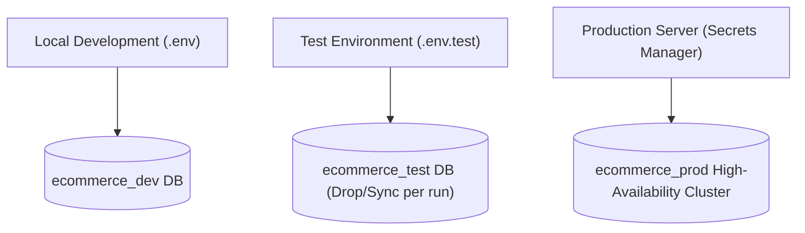

## 🗄️ យុទ្ធសាស្ត្រ Test Database Isolation

ដើម្បីធានាសុវត្ថិភាពទិន្នន័យ ការតេស្តត្រូវតែធ្វើឡើងនៅលើ **Isolated Database (ឧ. `ecommerce_test`)**៖



---

## 🏭 ការបង្កើត Test Data Factories & Fixtures

ជំនួសឱ្យការសរសេរ `INSERT` ទិន្នន័យដោយដៃនៅគ្រប់ Test Case យើងបង្កើត **Factory Helpers**៖

```typescript
// tests/factories/user.factory.ts
import { AppDataSource } from "../../src/config/data-source";
import { User, UserRole } from "../../src/entities/User.entity";
import { hashPassword } from "../../src/utils/password";

export async function createTestUser(overrides: Partial<User> = {}): Promise<User> {
  const userRepo = AppDataSource.getRepository(User);
  const randomSuffix = Math.floor(Math.random() * 100000);

  const passwordHash = await hashPassword(overrides.passwordHash || "password123");

  const user = userRepo.create({
    fullName: overrides.fullName || `Test User ${randomSuffix}`,
    email: overrides.email || `test_${randomSuffix}@example.com`,
    passwordHash,
    role: overrides.role || UserRole.CUSTOMER,
    isActive: overrides.isActive ?? true,
    ...overrides,
  });

  return userRepo.save(user);
}
```

---

## 🌐 Mocking Third-Party HTTP APIs ជាមួយ MSW / Nock

នៅពេលសរសេរ Test សម្រាប់ Payments យើង Mock HTTP Response ដើម្បីកុំឱ្យកាត់លុយពិត៖

```typescript
import { describe, it, expect, vi } from "vitest";
import { PaymentService } from "../../src/services/payment.service";

describe("PaymentService.chargeCard()", () => {
  it("គួរតែដំណើរការ Payment បានជោគជ័យតាម Mock Stripe Response", async () => {
    // Mock Stripe SDK method
    const mockStripeCharge = vi.fn().mockResolvedValue({
      id: "ch_mock_12345",
      status: "succeeded",
      amount: 5000, // $50.00
    });

    const paymentService = new PaymentService(mockStripeCharge);
    const result = await paymentService.processOrderPayment("order_999", 50);

    expect(result.status).toBe("succeeded");
    expect(mockStripeCharge).toHaveBeenCalledTimes(1);
  });
});
```
