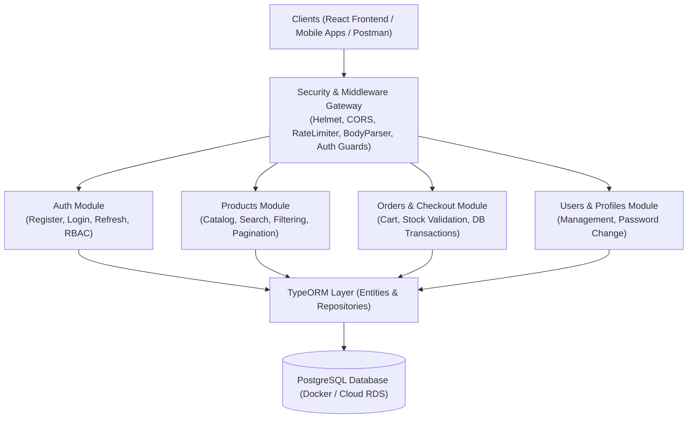
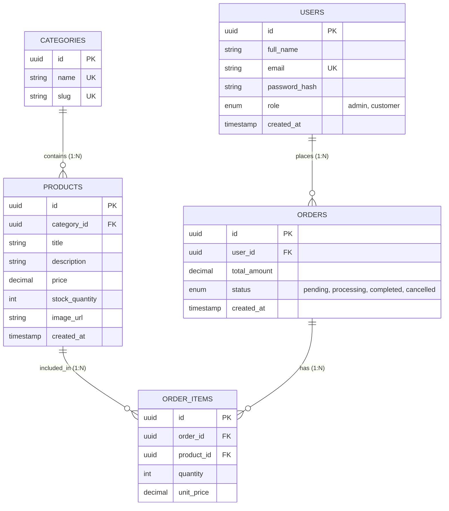

## 🎓 គម្រោងបញ្ចប់ការសិក្សា (Capstone Project Overview)

សូមអបអរសាទរដែលអ្នកបានធ្វើដំណើរមកដល់ចុងបញ្ចប់នៃវគ្គសិក្សា **Backend Architecture & Engineering**! 
នៅក្នុងគម្រោង Capstone នេះ អ្នកនឹងយកចំណេះដឹង និងបច្ចេកវិទ្យាទាំងអស់ដែលបានរៀនមកផ្គុំគ្នា ដើម្បីកសាង **Production-Ready E-Commerce REST API** មួយដែលត្រៀមរួចជាស្រេចសម្រាប់ការ Deploy ទៅកាន់ Cloud។

---

## 🏗️ ស្ថាបត្យកម្មទិន្នន័យ (Database Schema & ERD)

---

## 📋 បញ្ជីតម្រូវការមុខងារ (System Feature Matrix)

### 1. Authentication & User Management
- `POST /api/v1/auth/register` — ចុះឈ្មោះគណនីថ្មី (Hash password ជាមួយ bcrypt, validate ជាមួយ Zod)
- `POST /api/v1/auth/login` — ផ្ទៀងផ្ទាត់ email/password, ផ្តល់ Access Token (15m) + HttpOnly Refresh Token Cookie
- `POST /api/v1/auth/refresh` — បន្តសុពលភាព Access Token ថ្មី
- `POST /api/v1/auth/logout` — សម្អាត Refresh Token Cookie
- `GET /api/v1/users/me` — ទាញយកព័ត៌មាន Profile របស់ User បច្ចុប្បន្ន

### 2. Products & Categories (Catalog Management)
- `GET /api/v1/products` — បង្ហាញទំនិញទាំងអស់ (ជាមួយ Dynamic Keyword Search, Filter by Category, Min/Max Price, Pagination)
- `GET /api/v1/products/:id` — មើលព័ត៌មានលម្អិតនៃទំនិញ
- `POST /api/v1/products` — បង្កើតទំនិញថ្មី (**Admin Role Only**)
- `PATCH /api/v1/products/:id` — កែប្រែព័ត៌មានទំនិញ (**Admin Role Only**)
- `DELETE /api/v1/products/:id` — លុបទំនិញ (**Admin Role Only**)

### 3. Orders & Transactions (Checkout Engine)
- `POST /api/v1/orders/checkout` — បញ្ជាទិញទំនិញ (**Customer Role**):
  - ត្រួតពិនិត្យ និងកាត់បន្ថយស្តុកទំនិញក្នុង **ACID Transaction**
  - បង្កើត Order និង Order Items
  - បដិសេធ Transaction ភ្លាមប្រសិនបើទំនិញណាមួយមិនគ្រប់ស្តុក
- `GET /api/v1/orders/my-orders` — មើលប្រវត្តិបញ្ជាទិញរបស់ User ផ្ទាល់
- `GET /api/v1/orders/:id` — មើល Order ជាក់លាក់ (**Ownership Guard:** អាចមើលបានតែ Admin ឬម្ចាស់ Order)
- `PATCH /api/v1/orders/:id/status` — ផ្លាស់ប្តូរ Status (Pending -> Processing -> Completed) (**Admin Only**)

---

## 🛡️ Security Hardening Checklist

- [x] **Helmet.js** សម្រាប់កំណត់ Security Headers
- [x] **CORS Configuration** កំណត់ Allowed Origins ជាក់លាក់
- [x] **Rate Limiting** (Global 100 req/15m, Strict Auth 5 req/hour)
- [x] **Parameterized Queries / TypeORM QueryBuilder** ការពារ SQL Injection
- [x] **Input Sanitization** (HPP, XSS strip)
- [x] **Centralized Error Handling** (AppError, 404 handler, Env-safe responses)

---

## 🧪 Automated Testing & Deployment Requirements

1. **Unit Tests:** សរសេរ Unit Tests សម្រាប់ `calculateOrderTotal`, `password hashing`, និង `JWT helpers`។
2. **Integration Tests:** សរសេរ Integration Tests ជាមួយ `Supertest` សម្រាប់ Endpoints:
   - Register -> Login -> Fetch Profile (Auth Flow)
   - Product Pagination & Filtering Flow
   - Order Checkout & Stock Deduction Flow
3. **Dockerization:** បង្កើត `Dockerfile` (Multi-stage build) និង `docker-compose.yml` (App + PostgreSQL) សម្រាប់ដំណើរការប្រព័ន្ធទាំងមូលដោយពាក្យបញ្ជាតែមួយ `docker compose up --build`។

> [!TIP]
> គម្រោង Capstone នេះគឺជា **Portfolio Piece ដ៏មានតម្លៃបំផុត** សម្រាប់បង្ហាញទៅកាន់ក្រុមហ៊ុនបច្ចេកវិទ្យា និងអតិថិជន។ សូមសរសេរកូដឱ្យមានរបៀបរៀបរយ ដាក់ Comments ពន្យល់ និងបង្កើត `README.md` ឱ្យបានស្អាតល្អ! 🚀
