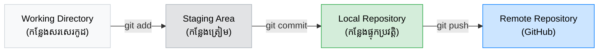

## 🤷‍♂️ អ្វីទៅជា Version Control?

អ្នកប្រហែលជាធ្លាប់ជួបប្រទះបញ្ហានេះនៅពេលធ្វើកិច្ចការសាលា៖
`final-assignment.docx` -> `final-assignment-v2.docx` -> `final-assignment-final-true.docx`...

នៅពេលសរសេរកូដ ការបង្កើត File ថ្មីរាល់ពេលមានការផ្លាស់ប្តូរ ជារឿងមិនអាចទៅរួចទេ។
**Version Control System (VCS)** គឺជាប្រព័ន្ធមួយដែលជួយតាមដានរាល់ការផ្លាស់ប្តូរដែលអ្នកបានធ្វើទៅលើ File ។ បើអ្នកធ្វើខុស អ្នកអាច "ត្រលប់ពេលវេលា" ទៅយក File ចាស់មកវិញបានយ៉ាងងាយស្រួល។

---

## 🤖 អ្វីទៅជា Git និង GitHub?

- **Git:** គឺជាកម្មវិធី VCS ដែលពេញនិយមបំផុតក្នុងលោក (បង្កើតដោយលោក Linus Torvalds ដែលជាបិតារបស់ Linux)។ វាដើរតួជាអ្នកតាមដានប្រវត្តិកូដនៅលើកុំព្យូទ័រ (Local) របស់អ្នក។
- **GitHub:** គឺជាសេវាកម្ម Cloud (វេបសាយ) ដែលអនុញ្ញាតអោយអ្នកយកប្រវត្តិកូដពី Git ទៅរក្សាទុក។ វាក៏ជួយអោយអ្នកអាចធ្វើការជាក្រុមជាមួយអ្នកដទៃបានយ៉ាងងាយស្រួលផងដែរ។

---

## 🌊 លំហូរការងារ (Git Workflow) ដ៏សំខាន់បំផុត

មុននឹងអ្នករៀនវាយ Command ណាមួយរបស់ Git អ្នក **ត្រូវតែ** ចងចាំលំហូរនេះអោយច្បាស់។ វាគឺជាបេះដូងនៃ Git ទាំងមូល។

Git បែងចែកទីតាំងផ្ទុកកូដរបស់អ្នកជា ៤ ដំណាក់កាល៖

1. **Working Directory (ថតការងារ):** នេះគឺជាកន្លែងដែលអ្នកបើក VS Code និងសរសេរកូដរាល់ថ្ងៃ។ កូដដែលទើបតែសរសេរថ្មីៗ គឺស្ថិតនៅទីនេះ។
2. **Staging Area (កន្លែងត្រៀម):** ពេលអ្នកសរសេរកូដរួច អ្នកមិនទាន់អាចបញ្ជូនវាចូលប្រវត្តិភ្លាមៗទេ។ អ្នកត្រូវតែជ្រើសរើសវា (Add) យកមកទុកនៅ Staging Area សិន។ នេះប្រៀបដូចជាការរៀបអីវ៉ាន់ដាក់ចូលក្នុងប្រអប់ មុននឹងបិទស្កុត។
3. **Local Repository (កន្លែងផ្ទុកប្រវត្តិក្នុងម៉ាស៊ីន):** នៅពេលអ្នក Commmit, Git នឹងវេចខ្ចប់អ្វីៗនៅក្នុង Staging Area ទៅជា "ប្រវត្តិមួយ" ដែលមិនអាចលុបបាន។ វាត្រូវបានរក្សាទុកសុវត្ថិភាពនៅក្នុងកុំព្យូទ័ររបស់អ្នក។
4. **Remote Repository (កន្លែងផ្ទុកលើ Cloud):** ចុងក្រោយ អ្នកប្រើប្រាស់ការ Push ដើម្បីរុញប្រវត្តិទាំងអស់ពីម៉ាស៊ីនរបស់អ្នក ទៅកាន់ GitHub ដើម្បីចែករំលែកឫរក្សាទុកជាការបម្រុង (Backup)។
