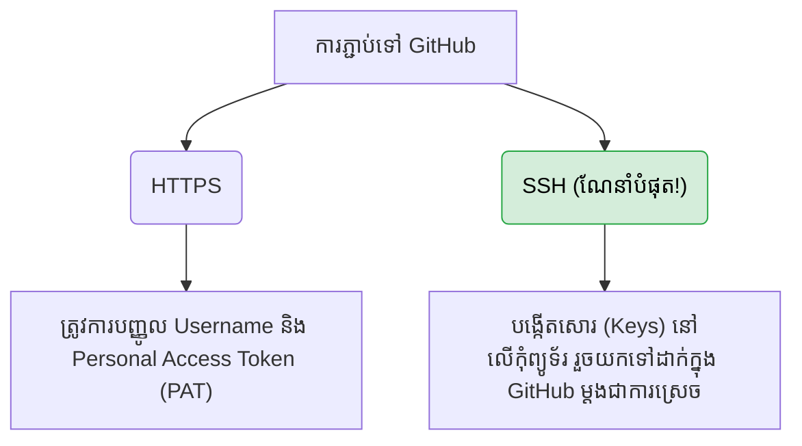

## ⚙️ ការដំឡើង Git

ដើម្បីអាចប្រើប្រាស់ Git បាន អ្នកត្រូវតែដំឡើងវាជាមុនសិន។

- **សម្រាប់ Windows:** ដោនឡូតពីវេបសាយ [git-scm.com](https://git-scm.com/) រួចចុច Next រហូតដល់ចប់ (សូមទុកការកំណត់លំនាំដើមទាំងអស់)។
- **សម្រាប់ Mac:** បើក Terminal ហើយវាយពាក្យបញ្ជា `git --version`។ ប្រសិនបើកុំព្យូទ័រអ្នកមិនទាន់មានទេ វានឹងលោតផ្ទាំងអោយដំឡើង Command Line Tools ដោយស្វ័យប្រវត្តិ។

បន្ទាប់ពីដំឡើងរួចរាល់ សូមបើក Terminal (ឫ Git Bash សម្រាប់ Windows) ហើយវាយ៖
```bash
git --version
# លទ្ធផលគួរតែចេញ: git version 2.39.0 ឫថ្មីជាងនេះ
```

---

## 👤 ការកំណត់អត្តសញ្ញាណ (Configuration)

រាល់ពេលដែលអ្នកបង្កើតប្រវត្តិ (Commit) នៅក្នុង Git វានឹងកត់ត្រាទុកថា **តើនរណាជាអ្នកសរសេរកូដនេះ?**
ដូច្នេះ ជំហានដំបូងបំផុត អ្នកត្រូវប្រាប់ Git ពីឈ្មោះ និងអ៊ីមែលរបស់អ្នក។

```bash
git config --global user.name "Your Name"
git config --global user.email "your.email@example.com"
```

> 💡 **ចំណាំសំខាន់:** សូមប្រើប្រាស់ Email តែមួយជាមួយនឹងគណនី GitHub របស់អ្នក ដើម្បីអោយ GitHub អាចស្គាល់ថាអ្នកពិតជាម្ចាស់កូដនោះមែន!

**ផ្លាស់ប្តូរឈ្មោះ Branch លំនាំដើម:**
ពីមុន Git តែងតែបង្កើត Branch ដំបូងមានឈ្មោះថា `master`។ ប៉ុន្តែបច្ចុប្បន្ន សហគមន៍បានប្តូរទៅប្រើពាក្យថា `main` វិញ។ អ្នកគួរតែកំណត់វាទុកជាមុន៖
```bash
git config --global init.defaultBranch main
```

---

## 🔐 ការភ្ជាប់ទៅកាន់ GitHub (SSH vs HTTPS)

នៅពេលអ្នកចង់ទាញយក (Clone) ឫបញ្ជូនកូដ (Push) ទៅកាន់ GitHub, អ្នកត្រូវតែបញ្ជាក់អត្តសញ្ញាណ (Authentication) ថាអ្នកជាម្ចាស់វាពិតប្រាកដ។ មានពីរជម្រើស៖



### ហេតុអ្វីគួរប្រើ SSH?
ការប្រើប្រាស់ HTTPS តម្រូវអោយអ្នកបង្កើត Access Token (កូដវែងៗ) ហើយវាមានការលំបាកក្នុងការគ្រប់គ្រង។
ការប្រើប្រាស់ SSH គឺមានសុវត្ថិភាពខ្ពស់ និងផ្តល់ភាពងាយស្រួល ព្រោះអ្នកធ្វើវាតែម្តងគត់សម្រាប់កុំព្យូទ័រមួយ។ រាល់ពេលអ្នក Push កូដទៅថ្ងៃក្រោយ អ្នកលែងត្រូវការវាយលេខសម្ងាត់ទៀតហើយ!

*(របៀបបង្កើត SSH Key មានភាពលម្អិតបន្តិច អ្នកនឹងត្រូវរៀនវានៅក្នុងផ្នែកបន្ទាប់ ឫនៅក្នុងមេរៀនការងារជាក្រុម)*
