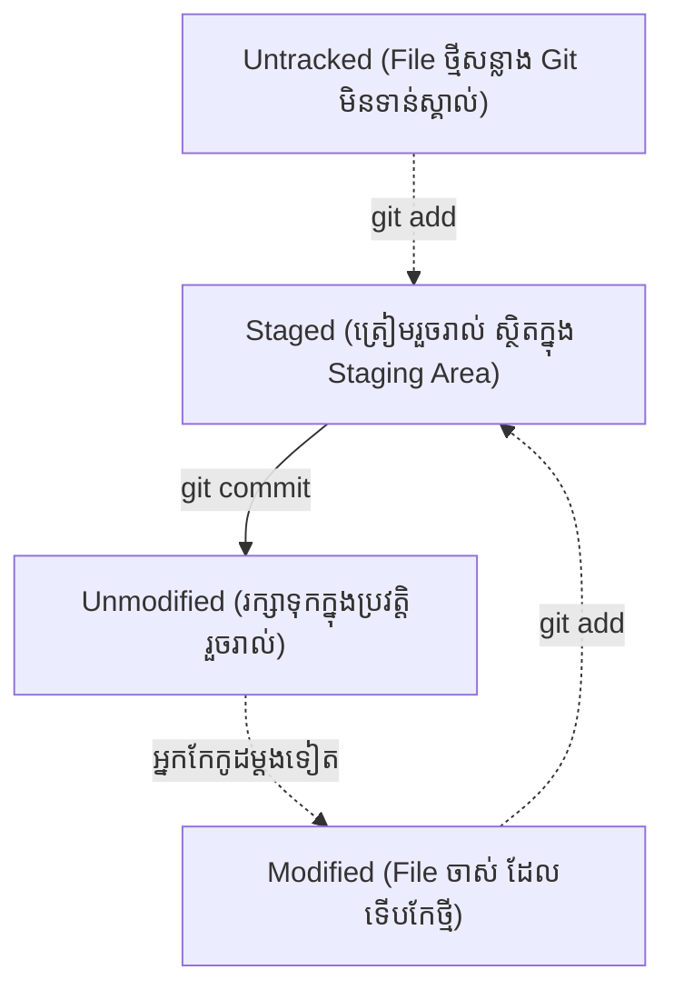

## 🎬 ការចាប់ផ្តើម (git init)

ដើម្បីប្រាប់ Git អោយចាប់ផ្តើមតាមដានប្រវត្តិកូដនៅក្នុង Folder ណាមួយ អ្នកគ្រាន់តែបើក Terminal នៅក្នុង Folder នោះ ហើយវាយ៖

```bash
git init
```
ពេលនេះ Git បានបង្កើត Folder លាក់កំបាំងមួយឈ្មោះថា `.git` នៅពីក្រោយខ្នង ដែលជាកន្លែងផ្ទុកប្រវត្តិទាំងអស់។ Folder របស់អ្នកឥឡូវនេះបានក្លាយជា **Git Repository** (ឃ្លាំងផ្ទុកកូដ) ហើយ។

---

## 🔍 ការត្រួតពិនិត្យស្ថានភាព (git status)

នេះគឺជា **ពាក្យបញ្ជាដែលអ្នកត្រូវវាយញឹកញាប់បំផុត**! រាល់ពេលដែលអ្នកវង្វេង ឫមិនដឹងថាត្រូវធ្វើអ្វីបន្ត សូមវាយ៖

```bash
git status
```
វានឹងប្រាប់អ្នកថា តើមាន File ណាខ្លះទើបតែបង្កើតថ្មី, តើមាន File ណាខ្លះត្រូវបានកែប្រែ, និងតើពួកវាស្ថិតនៅកន្លែងណាខ្លះ។



---

## 📦 លំហូរការងារជាមូលដ្ឋាន (Add & Commit)

ឧទាហរណ៍ អ្នកទើបតែបង្កើត File ថ្មីមួយឈ្មោះថា `index.html`។

### ជំហានទី 1: យកកូដដាក់ក្នុង Staging Area
បច្ចុប្បន្ន `index.html` មិនទាន់ស្ថិតក្នុងប្រវត្តិទេ។ យើងត្រូវប្រាប់ Git អោយចាប់ផ្តើមតាមដានវាដោយប្រើពាក្យបញ្ជា `git add`:

```bash
# ដើម្បីបញ្ជូល File តែមួយ
git add index.html

# ឫដើម្បីបញ្ជូលរាល់ការផ្លាស់ប្តូរទាំងអស់ក្នុង Folder
git add .
```

### ជំហានទី 2: រក្សាទុកចូលក្នុងប្រវត្តិ (Commit)
បន្ទាប់ពី File ស្ថិតក្នុង Staging Area ហើយ យើងត្រូវធ្វើការបិទស្កុត (Commit) រក្សាវាទុកជាអចិន្ត្រៃយ៍។ ការ Commit **ត្រូវតែមានសារ (Message)** ខ្លីមួយដើម្បីប្រាប់អ្នកដទៃថា អ្នកបានធ្វើអ្វីខ្លះ។

```bash
git commit -m "feat: បង្កើតទំព័រដើម (homepage)"
```

អបអរសាទរ! កូដរបស់អ្នកត្រូវបានរក្សាទុកនៅក្នុងប្រវត្តិកុំព្យូទ័រ (Local Repository) ដោយសុវត្ថិភាពហើយ។

> 💡 **ចំណាំ:** កុំសរសេរ Commit Message ព្រាវៗដូចជា `git commit -m "update"` អោយសោះ! ត្រូវសរសេរអោយចំៗ ដូចជា `fix: កែទម្រង់ពាក្យសម្ងាត់` ឬ `feat: បន្ថែមប៊ូតុងចុះឈ្មោះ` ដើម្បីងាយស្រួលតាមដានពេលក្រោយ។
