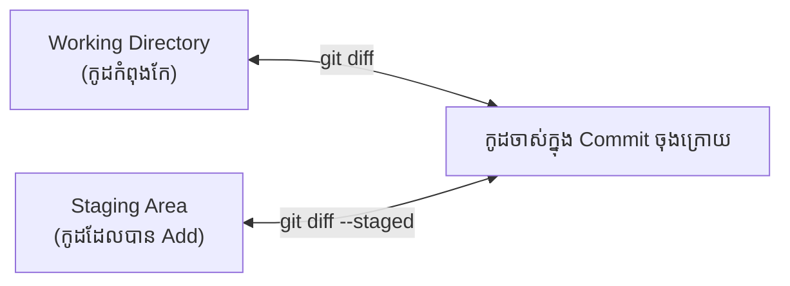

## 📜 ការមើលប្រវត្តិ (git log)

រាល់ពេលអ្នកបង្កើត Commit, Git នឹងកត់ត្រាទុកយ៉ាងលម្អិតថានរណាជាអ្នកធ្វើ ធ្វើម៉ោងប៉ុន្មាន និងមានសារអ្វីខ្លះ។
ដើម្បីមើលបញ្ជីនេះ សូមវាយ៖

```bash
git log
```

ប៉ុន្តែពេលអ្នកមានប្រវត្តិរាប់រយ ផ្ទាំងនេះនឹងមើលទៅរញ៉េរញ៉ៃខ្លាំងណាស់។ វិធីដែលអ្នកជំនាញចូលចិត្តប្រើគឺការមើលបែបសង្ខេប៖

```bash
# បង្ហាញត្រឹមតែលេខកូដសម្ងាត់ (Hash) ខ្លីៗ និងសារប៉ុណ្ណោះ
git log --oneline

# បើចង់មើលគំនូសបំព្រួញនៃមែកធាងកូដ (Branches)
git log --oneline --graph
```

---

## 🧐 ការប្រៀបធៀបការផ្លាស់ប្តូរ (git diff)

> "តើខ្ញុំទើបតែកែអ្វីខ្លះអម្បាញ់មិញ?"

នេះជាសំនួរដែលអ្នកនឹងសួរខ្លួនឯងជាញឹកញាប់! មុននឹងអ្នក `git commit` អ្នកគួរតែឆែកមើលអោយច្បាស់ថាតើអ្នកពិតជាបានកែត្រូវកន្លែងមែនឫអត់ ដោយប្រើប្រាស់ `git diff`។



### 1. ការប្រៀបធៀបកូដដែល "មិនទាន់ Add"
ប្រសិនបើអ្នកកែ File រួច ហើយ **មិនទាន់** បានវាយពាក្យបញ្ជា `git add` ទេ, អ្នកអាចប្រៀបធៀបវាជាមួយកូដចាស់បានដោយ៖
```bash
git diff
```
អ្នកនឹងឃើញកូដដែលបានបន្ថែមចូល មានពណ៌បៃតង `+` និងកូដដែលបានលុបចេញ មានពណ៌ក្រហម `-`។

### 2. ការប្រៀបធៀបកូដដែល "បាន Add រួច"
ចុះបើអ្នកបាន `git add .` រួចរាល់ហើយ ទើបនឹកឃើញចង់ឆែកមើល? ពេលនោះ `git diff` ធម្មតានឹងមិនចេញលទ្ធផលអ្វីទេ (ព្រោះ File បានចូលក្នុង Staging Area បាត់ហើយ)។ 
អ្នកត្រូវថែមពាក្យ `--staged` នៅពីក្រោយ៖
```bash
git diff --staged
```

### 3. ការមើលកូដនៃ Commit ណាមួយជាក់លាក់
ប្រសិនបើអ្នកចង់ដឹងថា តើកាលពី Commit កន្លងទៅនោះ មានការកែប្រែអ្វីខ្លះ? អ្នកអាចយកលេខ Hash ពី `git log --oneline` មកប្រើ៖
```bash
# ឧទាហរណ៍ Hash គឺ 5a3b2c1
git show 5a3b2c1
```
