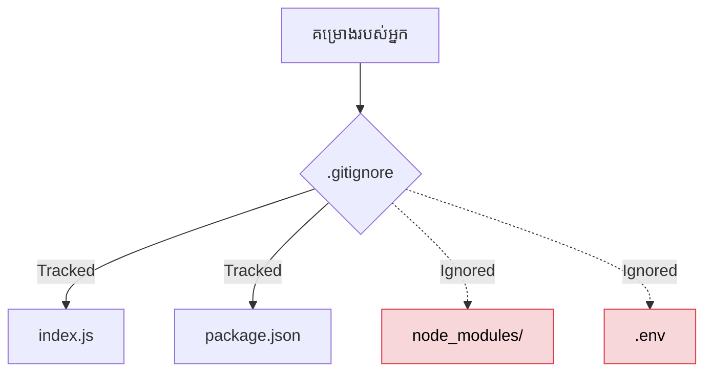

## 🛑 ហេតុអ្វីយើងត្រូវការ `.gitignore`?

នៅពេលអ្នកធ្វើការលើគម្រោងធំៗ មានរបស់ជាច្រើនដែលអ្នក **មិនគួរ** និង **មិនចាំបាច់** រក្សាទុកក្នុង Git នោះទេ។ ឧទាហរណ៍៖
- កូដបណ្ណាល័យ (ដូចជា `node_modules` ដែលមានទំហំធំរាប់រយមេហ្គាបៃ)
- ឯកសារដែលកុំព្យូទ័របង្កើតដោយស្វ័យប្រវត្តិ (ដូចជា `.DS_Store` លើ Mac ឫ Folder `dist`/`build`)
- លេខសម្ងាត់ (API Keys) ដែលរក្សាទុកក្នុង `.env`

បើសិនជាអ្នកច្រឡំយករបស់ទាំងនេះទៅដាក់លើ GitHub នោះទំហំគម្រោងអ្នកនឹងធំសម្បើម ហើយលេខសម្ងាត់របស់អ្នកអាចនឹងត្រូវចោរលួច!



---

## 📝 របៀបបង្កើតនិងសរសេរ `.gitignore`

គ្រាន់តែបង្កើតឯកសារមួយឈ្មោះថា **`.gitignore`** (ត្រូវតែមានសញ្ញាចុចនៅពីមុខ) នៅកន្លែងដំបូងបង្អស់នៃគម្រោងរបស់អ្នក។

នេះជាទម្រង់ស្តង់ដារសម្រាប់គម្រោង JavaScript (React / Next.js / Node.js)៖

```gitignore
# រំលង folder ឈ្មោះ node_modules
node_modules/

# រំលងឯកសារ build ដែលបានមកពីការ compile
dist/
build/
.next/

# រំលងឯកសាររក្សាទុកលេខសម្ងាត់ (សំខាន់បំផុត!)
.env
.env.local

# រំលងឯកសារប្រព័ន្ធប្រតិបត្តិការ
.DS_Store
Thumbs.db

# អ្នកអាចប្រើសញ្ញាផ្កាយ (*) ដើម្បីជំនួសអក្សរអ្វីក៏បាន
*.log       # រំលងគ្រប់ឯកសារដែលបញ្ចប់ដោយ .log (ឧ. error.log)
```

**ចំណាំ:** អ្នកគួរតែបង្កើតវា **មុនពេល** អ្នកចាប់ផ្តើមសរសេរកូដ និង `git add` លើកដំបូង!

---

## 🚨 បញ្ហាទូទៅ៖ "ខ្ញុំច្រឡំ Add ចូលបាត់ហើយ ធ្វើម៉េចទៅ?"

ដូចដែលបានសួរនៅក្នុង Quiz ខាងលើ ប្រសិនបើអ្នកច្រឡំ `git commit` File មួយរួចទៅហើយ ការយកឈ្មោះវាទៅដាក់ក្នុង `.gitignore` នៅពេលក្រោយគឺ **គ្មានប្រសិទ្ធភាពទេ** ព្រោះ Git បានចំណាំ (Track) វាបាត់ទៅហើយ។

**ដំណោះស្រាយ:** អ្នកត្រូវដកវាចេញពីការចងចាំរបស់ Git (Cache) សិន៖

```bash
# លុប File ចេញពីការតាមដានរបស់ Git ប៉ុន្តែវានៅសល់ក្នុងកុំព្យូទ័រដដែល (មិនបាត់បង់ទេ)
git rm --cached <ឈ្មោះឯកសារ>

# ឧទាហរណ៍:
git rm --cached .env

# បើចង់លុប Folder ទាំងមូល ត្រូវថែម -r (Recursive)
git rm -r --cached node_modules/
```
បន្ទាប់ពីវាយពាក្យបញ្ជានេះរួច អ្នកត្រូវធ្វើការ `git commit -m "យក File ចេញពីការតាមដាន"` ម្តងទៀត ជាការស្រេច។ ពេលនោះអ្នកនឹងមានសុវត្ថិភាព!
