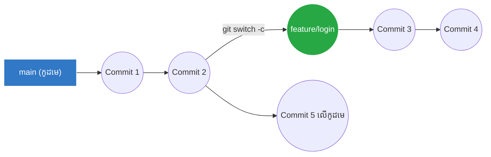

## 🌳 អ្វីទៅជា Branch?

ស្រមៃថាអ្នកកំពុងសរសេរគម្រោងវេបសាយមួយ ហើយវាកំពុងតែដំណើរការល្អឥតខ្ចោះ។ ថ្ងៃមួយ មេរបស់អ្នកប្រាប់អោយបន្ថែមមុខងារ "ចុះឈ្មោះ"។ ប្រសិនបើអ្នកសរសេរកូដនោះចំពីលើកូដដើមតែម្តង ពេលអ្នកសរសេរខុស វេបសាយទាំងមូលរបស់អ្នកនឹងគាំង!

ដំណោះស្រាយគឺការបង្កើត **Branch (មែកធាងកូដ)**។ ការបង្កើត Branch គឺប្រៀបដូចជាការថតចម្លង (Clone) កូដមេទាំងមូលយកមកទុកដាច់ដោយឡែក។ អ្នកអាចធ្វើអ្វីក៏បានលើមែកថ្មីនេះ ដោយមិនប៉ះពាល់ដល់កូដមេសូម្បីតែបន្តិច! ពេលសរសេរចប់ ទើបយើងយកវាទៅផ្គុំបញ្ចូលគ្នាវិញ (Merge)។



```gitdiagram
Branching
```

សាខាដើមដែល Git បង្កើតអោយដោយស្វ័យប្រវត្តិគឺមានឈ្មោះថា **`main`** (ឫពីមុនហៅថា `master`)។

---

## 🛠️ ការប្រើប្រាស់ Branches

### 1. ការពិនិត្យមើលសាខា (git branch)
ដើម្បីដឹងថាបច្ចុប្បន្នគម្រោងអ្នកមានសាខាប៉ុន្មាន សូមវាយ៖
```bash
git branch
```
វានឹងបង្ហាញបញ្ជីឈ្មោះសាខាទាំងអស់ ហើយសាខាដែលអ្នកកំពុងឈរពីលើ នឹងមានសញ្ញាផ្កាយ `*` ឫពណ៌បៃតង។

### 2. ការបង្កើត និងផ្លាស់ប្តូរសាខា (git switch)

ជំនួសអោយការប្រើប្រាស់ `git checkout` ដូចជំនាន់ចាស់ អ្នកគប្បីប្រើប្រាស់ `git switch` ព្រោះវាងាយយល់ជាង៖

```bash
# ដើម្បីបង្កើតសាខាថ្មី ហើយផ្លាស់ប្តូរទៅកាន់ទីនោះភ្លាមៗ (ថែម -c)
git switch -c feature/login

# បន្ទាប់មកអ្នកសរសេរកូដ ធ្វើការ git add និង git commit ធម្មតា

# ដើម្បីត្រលប់មកកូដមេ (main) វិញ 
git switch main
# ពេលនេះ កូដដែលអ្នកសរសេរអម្បាញ់មិញនឹង "បាត់" ជាបណ្តោះអាសន្ន កុំភ័យ! វាស្ថិតនៅសាខាមួយទៀត
```

### 3. ការលុបសាខាចោល
ប្រសិនបើអ្នកសរសេរខុស ឫលែងត្រូវការសាខានោះហើយ អ្នកអាចលុបវាបាន។ (ចំណាំ: អ្នកមិនអាចលុបសាខាដែលអ្នកកំពុងឈរលើវាទេ ត្រូវ switch ទៅកន្លែងផ្សេងសិន)។
```bash
git branch -d feature/login

# បើវាមិនព្រមអោយលុប ព្រោះមិនទាន់បាន Merge អ្នកអាចបង្ខំលុបដោយប្រើអក្សរ D ធំ
git branch -D feature/login
```

---

## 🏷️ ស្តង់ដារនៃការដាក់ឈ្មោះ Branch

នៅក្នុងការងារក្រុមហ៊ុន អ្នកមិនគួរដាក់ឈ្មោះសាខាផ្តេសផ្តាស (ដូចជា `test1` ឫ `my-branch`) នោះទេ។ អ្នកគួរប្រើបុព្វបទ (Prefix) ដូចខាងក្រោម៖

- **`feature/`**: សម្រាប់ការបន្ថែមមុខងារថ្មី (ឧ. `feature/login`, `feature/payment-gateway`)
- **`fix/`**: សម្រាប់ការកែកំហុស (Bugs) (ឧ. `fix/navbar-mobile`, `fix/login-error`)
- **`refactor/`**: សម្រាប់ការរៀបចំកូដចាស់ឡើងវិញអោយស្អាត ដោយមិនប៉ះពាល់មុខងារដើម
- **`docs/`**: សម្រាប់ការកែប្រែឯកសារ (Documentation)
- **`chore/`**: សម្រាប់ការរៀបចំប្រព័ន្ធ ឫការផ្លាស់ប្តូរតូចតាចដែលមិនពាក់ព័ន្ធអ្នកប្រើប្រាស់ (ឧ. ដំឡើងបណ្ណាល័យ)
