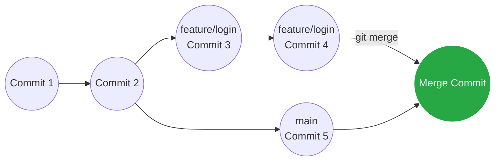

## 🤝 ការបញ្ចូលសាខា (git merge)

បន្ទាប់ពីអ្នកបានសរសេរកូដនៅលើសាខាថ្មី (ឧទាហរណ៍ `feature/login`) ហើយដំណើរការល្អ ដល់ពេលដែលអ្នកត្រូវយកវាទៅផ្គុំបញ្ចូលគ្នាជាមួយកូដមេ (`main`) វិញហើយ។

**វិធានការសំខាន់:** អ្នកចង់អោយកូដចូលទៅសាខាណា អ្នកត្រូវតែ **Switch** ទៅឈរលើសាខានោះសិន!

```bash
# 1. ត្រលប់ទៅសាខាមេ
git switch main

# 2. ទាញយកសាខា feature/login មកបញ្ចូល
git merge feature/login
```



---

## ⚔️ បញ្ហាកូដជាន់គ្នា (Merge Conflict)

ភាគច្រើនការ Merge នឹងដំណើរការយ៉ាងរលូន។ ប៉ុន្តែចុះបើអ្នកកែកូដនៅលើបន្ទាត់ទី ១០ នៃឯកសារ `index.html` ក្នុងសាខា `main` ហើយក្នុងពេលជាមួយគ្នានោះ អ្នកក៏បានកែកូដលើបន្ទាត់ទី ១០ ដដែលនេះ នៅក្នុងសាខា `feature/login` ដែរនោះ?

នៅពេលអ្នកធ្វើការ Merge, Git នឹងលោតសារបញ្ជាក់ថា៖
```text
Auto-merging index.html
CONFLICT (content): Merge conflict in index.html
Automatic merge failed; fix conflicts and then commit the result.
```
នេះមានន័យថា Git វាមិនដឹងថាត្រូវយកកូដមួយណាទេ! អ្នកត្រូវតែជាអ្នកសម្រេចចិត្ត។

### របៀបដោះស្រាយ៖
នៅពេលអ្នកបើកឯកសារ `index.html` នោះនៅក្នុង VS Code អ្នកនឹងឃើញរបស់ចម្លែកៗដូចនេះ៖

```html
<<<<<<< HEAD
<h1>សួស្តីពីសាខា Main</h1>
=======
<h1>សួស្តីពីមុខងារ Login</h1>
>>>>>>> feature/login
```

- កូដចន្លោះ `<<<<<<< HEAD` ដល់ `=======` គឺជាកូដបច្ចុប្បន្ន (របស់អ្នកដែលកំពុងឈរពីលើ)។
- កូដចន្លោះ `=======` ដល់ `>>>>>>> feature/login` គឺជាកូដថ្មីដែលកំពុងព្យាយាមហូរចូលមក។

អ្នកគ្រាន់តែលុបបន្ទាត់សញ្ញាចម្លែកៗនោះចោល រួចទុកតែកូដណាមួយដែលអ្នកគិតថាត្រូវ។ បន្ទាប់មក៖

```bash
git add index.html
git commit -m "ដោះស្រាយបញ្ហា Merge លើ index.html"
```
ចប់ការងារ! អ្នកបានដោះស្រាយបញ្ហា Conflict ដោយជោគជ័យ។

> 💡 **គន្លឹះ:** នៅក្នុង VS Code វាមានប៊ូតុងតូចៗ (Accept Current Change, Accept Incoming Change, Accept Both) ដែលជួយអោយអ្នកចុចដោះស្រាយបានយ៉ាងលឿន ដោយមិនបាច់លុបអក្សរដោយដៃឡើយ!
