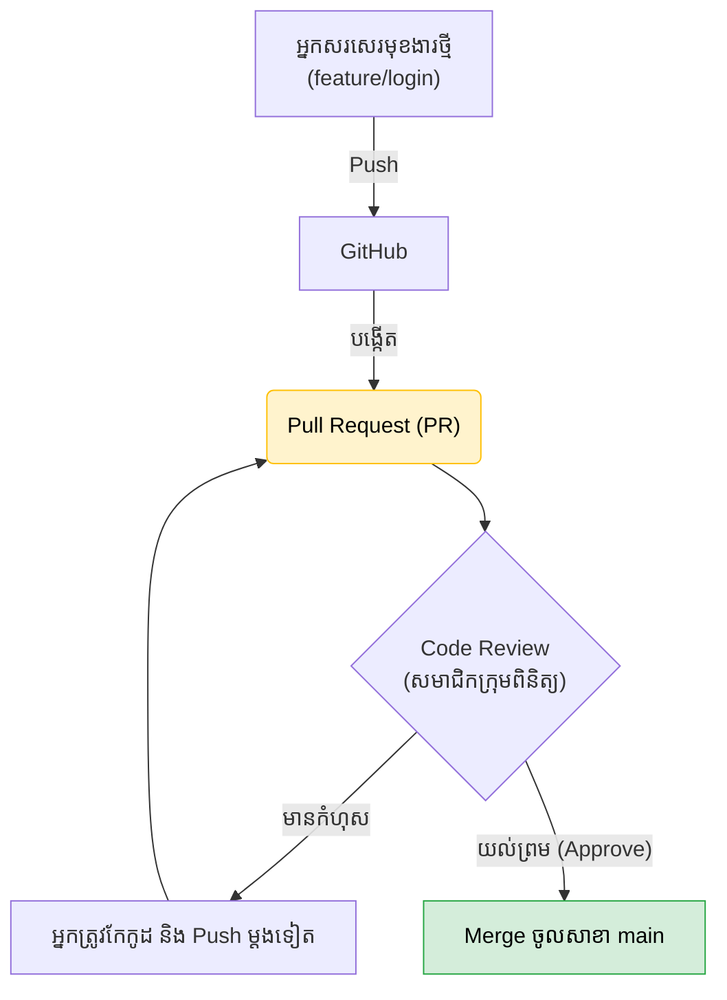

## 🙋‍♂️ អ្វីទៅជា Pull Request (PR)?

នៅក្នុងការងារក្រុមហ៊ុន អ្នកមិនគួរ `git merge` កូដរបស់អ្នកចូលទៅកាន់ `main` ដោយខ្លួនឯងនោះទេ។ 
ផ្ទុយទៅវិញ អ្នកត្រូវតែ **"ស្នើសុំ"** អោយអ្នកគ្រប់គ្រង ឫសមាជិកក្រុមរបស់អ្នក ធ្វើការត្រួតពិនិត្យកូដនោះជាមុនសិន។ ការស្នើសុំនេះហៅថា **Pull Request (PR)** នៅលើ GitHub។



---

## 📝 របៀបសរសេរ PR អោយមានវិជ្ជាជីវៈ

នៅពេលអ្នកបង្កើត PR វានឹងលោតផ្ទាំងអោយអ្នកសរសេរចំណងជើង និងការពិពណ៌នា។ កុំសរសេរត្រឹមតែពាក្យថា `"update"` ឫ `"កូដថ្មី"` អោយសោះ!

អ្នកគួរតែមានទម្រង់ច្បាស់លាស់ (Template) ដូចនេះ៖

```text
ចំណងជើង: feat: បន្ថែមមុខងារចុះឈ្មោះចូលគណនី

ការពិពណ៌នា:
- បង្កើតទម្រង់ UI សម្រាប់បញ្ចូល Email និង Password
- ភ្ជាប់ជាមួយ API របស់ Backend ដើម្បីបញ្ជាក់ភាពត្រឹមត្រូវ
- បង្ហាញសារ Error ពេលបញ្ចូលខុស

ការសាកល្បង (Testing):
- [x] បានសាកល្បង Login ជោគជ័យ
- [x] បានសាកល្បង Login មិនជោគជ័យ
- [x] ដំណើរការល្អនៅលើទូរស័ព្ទដៃ
```
ការសរសេរបានច្បាស់លាស់បែបនេះ ធ្វើអោយអ្នកត្រួតពិនិត្យងាយស្រួលយល់ និងរហ័សយល់ព្រម (Approve) លើកូដរបស់អ្នក។

---

## 🧐 ការត្រួតពិនិត្យកូដ (Code Review)

ប្រសិនបើអ្នកជាអ្នកមានតួនាទីត្រួតពិនិត្យកូដគេវិញ (Reviewer) តើអ្នកត្រូវមើលអ្វីខ្លះ?
1. **មើលភាពត្រឹមត្រូវ:** តើកូដនេះដើរតាមអ្វីដែលបានសន្យាក្នុង Description ដែរឫទេ?
2. **មើលគុណភាព:** តើមានកូដណាដែលរញ៉េរញ៉ៃ ឫអាចធ្វើអោយវេបសាយយឺតដែរឬទេ?
3. **មើលរចនាបថ:** តើការដាក់ឈ្មោះអថេរ (Variables) ត្រឹមត្រូវតាមស្តង់ដារក្រុមហ៊ុនដែរឬទេ?

ប្រសិនបើអ្នកឃើញបញ្ហា អ្នកអាចចូលទៅ **Comment (ផ្តល់យោបល់)** ចំពីលើបន្ទាត់កូដនោះតែម្តង!
ពេលដែលកូដនោះល្អឥតខ្ចោះហើយ អ្នកគ្រាន់តែចុចប៊ូតុង **Approve (យល់ព្រម)** ជាការស្រេច។

*(នៅក្រុមហ៊ុនខ្លះ បើគ្មានការ Approve ចំនួន ២ នាក់ទេ ប៊ូតុង Merge នឹងត្រូវបានបិទមិនអោយចុចឡើយ! នេះហៅថា Branch Protection Rule)*
