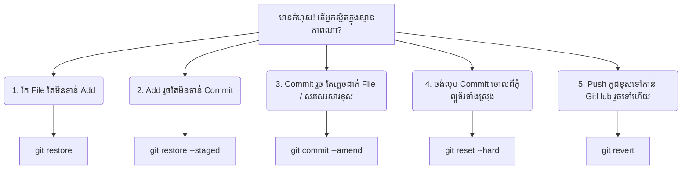

## 🚑 ការសង្គ្រោះទៅតាមស្ថានភាពជាក់ស្តែង

កុំភ័យស្លន់ស្លោពេលអ្នកវាយកូដខុស! Git ត្រូវបានរចនាឡើងដើម្បីការពារអ្នក។ នេះជាស្ថានភាព ៥ យ៉ាងដែលតែងតែកើតមាន៖



---

### ស្ថានភាពទី 1: កែកូដខុសរញ៉េរញ៉ៃ (មិនទាន់ Add)
អ្នកកែកូដច្រើនពេកហើយវាគាំង។ អ្នកចង់អោយ File នោះត្រលប់ទៅសភាពដើមដូចដែលវាធ្លាប់នៅកាលពី Commit ចុងក្រោយ៖
```bash
git restore index.html
```

### ស្ថានភាពទី 2: ច្រឡំ Add (មិនទាន់ Commit)
អ្នកច្រឡំវាយ `git add .` ដែលវាប្រមូលយក File មិនចង់បានចូលក្នុង Staging Area៖
```bash
# ដកវាចេញពី Staging Area ប៉ុន្តែរក្សាកូដនៅលើ File អោយនៅដដែល
git restore --staged index.html
```

### ស្ថានភាពទី 3: ភ្លេច File ឫសរសេរសារ Commit ខុស
អ្នកទើបតែ `git commit` រួច តែស្រាប់តែនឹកឃើញថាភ្លេច Add រូបភាពមួយសន្លឹក។ អ្នកមិនចាំបាច់បង្កើត Commit ថ្មីទេ!
```bash
# 1. យកផ្ទាំងរូបភាពនោះទៅ Add សិន
git add logo.png

# 2. បញ្ចូលវាទៅក្នុង Commit ចុងក្រោយគេបង្អស់ (អ្នកអាចកែសារថ្មីក៏បាន)
git commit --amend -m "សារដែលកែតម្រូវថ្មី"
```

### ស្ថានភាពទី 4: ចង់បំផ្លាញ Commit ចោល (ក្នុង Local)
ប្រសិនបើអ្នកចង់បោះបង់ចោលការងារ ៣ ថ្ងៃចុងក្រោយ ហើយត្រលប់ទៅកាន់អតីតកាលដ៏ល្អប្រសើរវិញ៖
```bash
# នេះនឹងលុប Commit ទាំងអស់ក្រោយលេខ Hash នោះចោល និងលុបកូដអ្នកចេញទាំងស្រុង! (ប្រុងប្រយ័ត្ន)
git reset --hard <លេខHashគោលដៅ>
```

### ស្ថានភាពទី 5: ធ្វើខុសតែ Push ទៅ GitHub បាត់ហើយ (git revert)
អ្នក **មិនត្រូវ** ប្រើ `git reset` នៅលើកូដដែលអ្នកដទៃទាញយកទៅប្រើប្រាស់ហើយនោះទេ (វាធ្វើអោយប្រវត្តិអ្នកដទៃខូច)។ 
អ្នកត្រូវប្រើ `git revert` ដែលវាបង្កើត Commit ថ្មីមួយ ដែលមានមុខងារ "ប្រឆាំង" ឬ "បន្សាប" កូដចាស់ដែលអ្នកបានធ្វើខុស៖
```bash
git revert <លេខHashដែលខុស>
```

---

## 🦸‍♂️ កំពូលមន្តអាគមន៍ `git reflog`

ចុះបើអ្នកច្រឡំប្រើ `git reset --hard` លុបកូដខ្លួនឯងបាត់ ហើយ `git log` លែងបង្ហាញ Commit នោះទៀត?
កុំបារម្ភ! វាយពាក្យបញ្ជានេះ៖

```bash
git reflog
```
វានឹងបង្ហាញរាល់សកម្មភាពរបស់អ្នកទាំងអស់ (សូម្បីតែការលុបក៏ដោយ)។ អ្នកគ្រាន់តែរកលេខ Hash ដែលនៅមុនពេលអ្នកធ្វើខុស រួចហើយ `git reset --hard <Hashនោះ>` កូដរបស់អ្នកនឹងរស់ឡើងវិញ!
