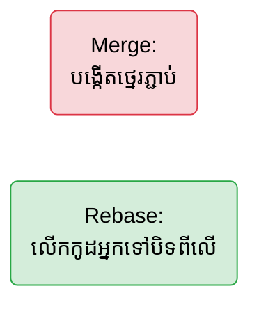

## 🏗️ ការរៀបចំប្រវត្តិដោយប្រើ `git rebase`

នៅពេលសាខា `main` មានការផ្លាស់ប្តូរថ្មីៗពីមិត្តភក្តិរបស់អ្នក ហើយអ្នកចង់ទាញយកការផ្លាស់ប្តូរនោះមកដាក់ក្នុងសាខាផ្ទាល់ខ្លួនរបស់អ្នក (`feature/login`) អ្នកមានជម្រើស ២ គឺ `merge` និង `rebase`។

- **`git merge main`:** យក `main` មកបូកបញ្ចូលគ្នាបង្កើតបានជា "ចំណុចថ្នេរ (Merge Commit)" មួយ។ (ប្រវត្តិមានភាពស្មុគស្មាញ និងមានសរសៃពាក់ព័ន្ធគ្នា)
- **`git rebase main`:** លើកយក Commits របស់អ្នកទាំងអស់ ទៅបិទភ្ជាប់នៅខាងចុងគេបង្អស់នៃ `main` តែម្តង! (ប្រវត្តិត្រង់ភ្លឹង ស្អាត)



> ⚠️ **បម្រាមធំបំផុត:** ដោយសារតែ Rebase សរសេរប្រវត្តិឡើងវិញ ដូច្នេះ **ហាមធ្វើវានៅលើសាខាដែលអ្នកដទៃកំពុងប្រើប្រាស់ដាច់ខាត!** (ប្រើវាបានតែលើសាខា Local ផ្ទាល់ខ្លួនរបស់អ្នកប៉ុណ្ណោះ)។ 
>
> បន្ទាប់ពី Rebase អ្នកត្រូវតែ Push ដោយប្រើ `git push --force-with-lease`។

---

## 🍒 ការបេះយកប្រវត្តិជាក់លាក់ (Cherry-pick)

ចុះបើមានគេបង្កើត Commit ល្អមួយនៅលើសាខា `test` ហើយអ្នកចង់ចម្លងយកតែ Commit មួយនោះ (មិនយកទាំងមូលទេ) មកដាក់ក្នុងសាខារបស់អ្នក?

```bash
# ឈរនៅលើសាខារបស់អ្នក ហើយវាយ:
git cherry-pick <លេខHashរបស់Commitនោះ>
```
Git នឹងទៅថតចម្លង (Copy) យកកូដនោះមកបិទភ្ជាប់ (Paste) ក្នុងសាខាអ្នកយ៉ាងងាយស្រួល!

---

## 🗄️ ការលាក់កូដបណ្តោះអាសន្ន (git stash)

ស្រមៃថាអ្នកកំពុងសរសេរកូដបានពាក់កណ្តាល (មិនទាន់អាច Commit បានទេ) ស្រាប់តែមេបញ្ជាអោយប្តូរទៅសាខា `main` ជាបន្ទាន់ដើម្បីកែកំហុស។ បើអ្នក Switch ទាំងមិនទាន់ Commit, កូដនឹងតាមទៅតាម!

ដំណោះស្រាយគឺ យកវាទៅលាក់ទុកសិន ដោយប្រើ **Stash**:

```bash
# 1. លាក់វាចូលទូ (កូដអ្នកនឹងត្រលប់ទៅសភាពដើម)
git stash

# 2. ប្តូរទៅសាខាផ្សេង ធ្វើការកែប្រែធម្មតា...

# 3. ពេលត្រលប់មកវិញ ចង់យកកូដពីក្នុងទូមកបន្តការងារទៀត
git stash pop
```
នេះជាពាក្យបញ្ជាដ៏មានប្រយោជន៍បំផុតសម្រាប់ការងារជាក់ស្តែងរាល់ថ្ងៃ!
