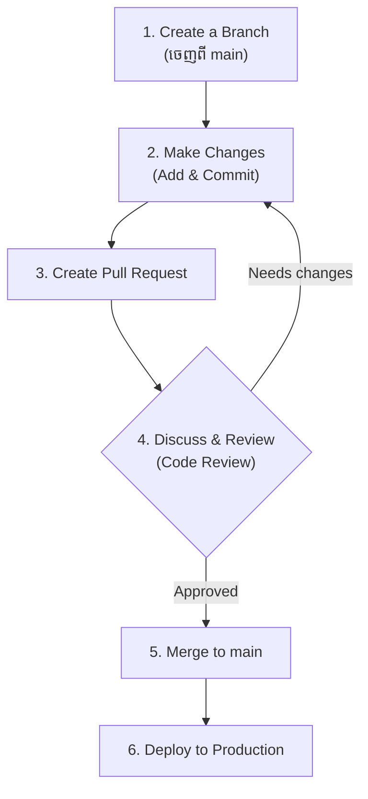

## 🌊 GitHub Flow (ស្តង់ដារឧស្សាហកម្ម)

កាលពីមុនក្រុមហ៊ុនប្រើប្រាស់ **Git Flow** ដែលមានភាពស្មុគស្មាញខ្លាំង (មានសាខា dev, release, hotfix ញ៉េរញ៉ៃ)។ បច្ចុប្បន្ន សម្រាប់ការអភិវឌ្ឍន៍វេបសាយ (Modern Web Development) ក្រុមហ៊ុនភាគច្រើនបានប្តូរមកប្រើប្រាស់ **GitHub Flow** ដែលមានភាពសាមញ្ញជាង៖



ច្បាប់តែមួយគត់គឺ៖ **"សាខា main ត្រូវតែមានស្ថេរភាព និងអាច Deploy ទៅកាន់អតិថិជនបានគ្រប់ពេលវេលា"**។

---

## 🏷️ ការប្រើប្រាស់ Tags និង Releases

នៅពេលដែលកម្មវិធីរបស់អ្នកួឈានដល់កំណែថ្មីមួយ (Version 1.0, 2.0) ការត្រឹមតែមាន Commit គឺពិបាកចំណាំណាស់។ យើងប្រើប្រាស់ **Tags** ដើម្បីបិទស្លាកចំណាំលើចំណុចនោះ។

```bash
# បង្កើត Tag ចំណាំកំណែ 1.0.0
git tag v1.0.0

# បញ្ជូន Tag ទៅកាន់ GitHub
git push origin v1.0.0
```
នៅលើ GitHub នៅពេលអ្នក Push Tag ឡើងទៅ អ្នកអាចបម្លែងវាទៅជា **Release** បាន។ វាជាកន្លែងដែលអ្នកអាចសរសេរកំណត់ហេតុ (Release Notes) ថាតើកំណែនេះមានមុខងារអ្វីថ្មីខ្លះ ដើម្បីអោយអ្នកប្រើប្រាស់បានដឹង។

---

## ✍️ ស្តង់ដារនៃការសរសេរសារ (Conventional Commits)

ជាញឹកញាប់ក្រុមហ៊ុនតែងតែតម្រូវអោយអ្នកសរសេរសារ Commit តាមស្តង់ដារមួយឈ្មោះថា **Conventional Commits** ដើម្បីភាពងាយស្រួលក្នុងការអាន និងបង្កើត Release Notes ដោយស្វ័យប្រវត្តិ។

ទម្រង់របស់វាគឺ៖ `ប្រភេទ(ទីតាំងកូដ): ការពិពណ៌នាខ្លី`

**ឧទាហរណ៍៖**
- `feat: add login screen` (បន្ថែមមុខងារថ្មី - feature)
- `fix(navbar): resolve mobile layout issue` (កែកំហុស - bug fix)
- `docs: update readme` (ឯកសារយោង - documentation)
- `style: format button css` (ការរៀបចំសោភ័ណភាពកូដ ដែលមិនប៉ះពាល់មុខងារ)
- `refactor: optimize user query` (រៀបចំរចនាសម្ព័ន្ធកូដចាស់)
- `chore: update dependencies` (ការងាររៀបចំទូទៅ)

ការអនុវត្តតាមទម្លាប់ទាំងនេះ នឹងប្រែក្លាយអ្នកពីសិស្សធម្មតា អោយទៅជាអ្នកអភិវឌ្ឍន៍ប្រកបដោយវិជ្ជាជីវៈ (Professional Developer) ដែលក្រុមហ៊ុនណាក៏ចង់បាន!
