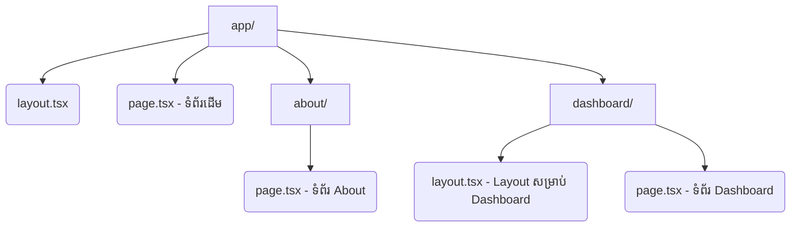

## 🏗️ រចនាសម្ព័ន្ធទំព័រ និង សំបកក្រៅ (Pages & Layouts)

នៅក្នុង Next.js (App Router) ការបង្កើតទំព័រថ្មីគឺផ្អែកលើការបង្កើត Folder និងឯកសារឈ្មោះថា **`page.tsx`** និង **`layout.tsx`**។ 



---

## 1. អ្វីទៅជា `layout.tsx` និង `page.tsx`?

រាល់ថត (Folder) នៅក្នុង `app` សុទ្ធតែអាចមានឯកសារ `layout.tsx` រៀងៗខ្លួន។ ប៉ុន្តែអ្វីដែលសំខាន់បំផុតគឺ **Root Layout** ដែលស្ថិតនៅក្នុងថត `src/app/layout.tsx` ផ្ទាល់តែម្តង។ វារុំព័ទ្ធគម្រោងរបស់អ្នកទាំងមូល!

**ឯកសារ `src/app/layout.tsx`:**
```tsx
import './globals.css';
import Navbar from '@/components/Navbar'; // ឧបមាថាយើងមាន Component នេះ
import Footer from '@/components/Footer';

export default function RootLayout({
  children,
}: {
  children: React.ReactNode;
}) {
  return (
    <html lang="en">
      <body>
        <Navbar />          {/* Navbar នឹងលេចឡើងគ្រប់ទំព័រទាំងអស់ */}
        
        <main style={{ minHeight: '80vh', padding: 20 }}>
          {children}        {/* ទីតាំងដែលទំព័រ (page.tsx) នីមួយៗនឹងបង្ហាញខ្លួន */}
        </main>
        
        <Footer />          {/* Footer នឹងលេចឡើងគ្រប់ទំព័រទាំងអស់ */}
      </body>
    </html>
  );
}
```

> **ចំណាំសំខាន់:** នៅពេលអ្នកផ្លាស់ប្តូរទំព័រ (ឧ. ពី Home ទៅ About) `layout.tsx` នឹង **មិនត្រូវបាន Re-render** (មិនដំណើរការឡើងវិញ) នោះទេ។ នេះមានន័យថា បើអ្នកមានវីដេអូកំពុងចាក់នៅលើ Navbar វានឹងនៅតែបន្តចាក់ដោយមិនរអាក់រអួលឡើយ!

---

## 2. Layout តូចៗតាមផ្នែក (Nested Layouts)

តើអ្នកចង់អោយទំព័រផ្នែកខាងក្នុង (ឧ. `app/dashboard/...`) មាន Sidebar ផ្ទាល់ខ្លួនរបស់វាដែរឬទេ? ងាយៗ! អ្នកគ្រាន់តែបង្កើតឯកសារ `layout.tsx` ថ្មីមួយនៅក្នុងថត `dashboard` ប៉ុណ្ណោះ។

នៅពេលនេះ ពេលអ្នកចូលទំព័រ Dashboard វានឹងត្រូវរុំដោយ `Dashboard Layout` ជាមុនសិន រួចទើបយកទៅរុំដោយ `Root Layout` ម្តងទៀត (ស្រទាប់ត្រួតគ្នា)។

---

## 3. (Advanced) ពេលណាត្រូវប្រើ `template.tsx`?

`template.tsx` គឺមានទម្រង់ការសរសេរដូចគ្នាបេះបិទទៅនឹង `layout.tsx` ដែរ តែវាត្រូវបានប្រើក្នុងករណីកម្រិតខ្ពស់។

**ចំណុចខុសគ្នា:**
- `layout.tsx`: រក្សាទុកកូដមិនអោយគូរឡើងវិញ (No Re-rendering) ពេលប្តូរទំព័រ។ (លឿន និងសន្សំសំចៃ)
- `template.tsx`: **តែងតែត្រូវបានគូរឡើងវិញ (Re-rendered/Remounted)** រាល់ពេលដែលអ្នកផ្លាស់ប្តូរទំព័រ។

**តើគួរប្រើ `template.tsx` ពេលណា?**
1. ពេលអ្នកចង់អោយ **Animations** កើតឡើងជានិច្ចពេលបើកចូលទំព័រម្តងៗ (ឧ. អក្សរអណ្តែតចេញមក)។
2. ពេលអ្នកចង់អោយទំព័រនីមួយៗមាន `useEffect` រត់ឡើងវិញរាល់ពេលចូលមើល។

ជាទូទៅ ៩៩% នៃគម្រោងរបស់អ្នកនឹងប្រើប្រាស់ `layout.tsx` ជានិច្ច លើកលែងតែអ្នកមានតម្រូវការពិសេសខាងលើ។
