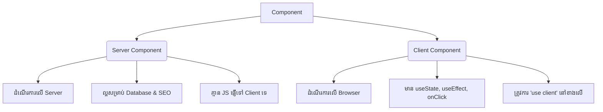

## 🎭 Server Components vs Client Components

នៅក្នុង React ធម្មតា រាល់ Component ទាំងអស់សុទ្ធតែដំណើរការនៅលើ Browser របស់អ្នកប្រើប្រាស់ (Client)។ ប៉ុន្តែនៅក្នុង Next.js (App Router) Component របស់អ្នកអាចដំណើរការនៅលើ **Server** ឬនៅលើ **Client** បាន។ នេះគឺជាចំណុចស្នូលដែលធ្វើអោយ Next.js ខុសប្លែកពី React!



---

## 1. Server Components (លំនាំដើម)

តាមលំនាំដើម (Default) រាល់ Component ទាំងអស់នៅក្នុង `src/app` គឺជា **Server Components**។ ពួកវាត្រូវបាន Render នៅលើ Server ហើយបញ្ជូនត្រឹមតែ HTML មកកាន់ Browser ប៉ុណ្ណោះ។

**អត្ថប្រយោជន៍:**
*   **លឿនជាងមុន:** មិនមាន JavaScript បញ្ជូនទៅ Browser ទេ ធ្វើអោយការបើកទំព័រលឿន។
*   **សុវត្ថិភាព:** អ្នកអាចទាញយកទិន្នន័យពី Database ឬប្រើ API Key សំងាត់ដោយផ្ទាល់ដោយមិនបារម្ភថា User អាចឃើញកូដទាំងនោះ។
*   **SEO ល្អ:** Google អាចអានទិន្នន័យបានពេញលេញ។

**ឧទាហរណ៍ (Server Component):**
```tsx
// មិនចាំបាច់មាន "use ..." ទេ ព្រោះវាជាលំនាំដើម

export default async function Page() {
  // ទាញទិន្នន័យពី Database ដោយផ្ទាល់នៅលើ Server!
  const data = await getData();

  return <div>{data.name}</div>;
}
```

---

## 2. Client Components (សម្រាប់ Interactivity)

នៅពេលដែលអ្នកចង់ប្រើប្រាស់ប៊ូតុងអោយគេចុច (`onClick`) ឬចង់ចងចាំទិន្នន័យបណ្តោះអាសន្ន (`useState`) អ្នកត្រូវប្រាប់ Next.js ថា Component នេះគឺជា **Client Component**។ 

ដើម្បីធ្វើបែបនេះ អ្នកគ្រាន់តែដាក់អក្សរ `"use client";` នៅជួរទីមួយនៃឯកសារ។

**ឧទាហរណ៍ (Client Component):**
```tsx
"use client"; // ប្រាប់ Next.js ថានេះជា Client Component!

import { useState } from "react";

export default function Counter() {
  const [count, setCount] = useState(0);

  return (
    <div>
      <p>លេខបច្ចុប្បន្ន: {count}</p>
      <button onClick={() => setCount(count + 1)}>
        បូក ១
      </button>
    </div>
  );
}
```

---

## 3. សង្ខេប៖ ពេលណាគួរប្រើមួយណា?

| កិច្ចការ | Server Component | Client Component |
| :--- | :---: | :---: |
| ទាញយកទិន្នន័យពី Database | ✅ | ❌ |
| លាក់ API Keys សំងាត់ | ✅ | ❌ |
| រក្សាទុកកូដធំៗនៅលើ Server (បន្ថយ JS) | ✅ | ❌ |
| ប្រើប្រាស់ `useState`, `useEffect` | ❌ | ✅ |
| ប្រើប្រាស់ `onClick`, `onChange` | ❌ | ✅ |
| ប្រើប្រាស់ Web API (ដូចជា `window`, `localStorage`) | ❌ | ✅ |

**ច្បាប់មាស:** តែងតែប្រើ Server Components ជាចម្បង លុះត្រាតែអ្នកត្រូវការ Interactivity ទើបអ្នកបំបែកផ្នែកតូចនោះទៅជា Client Component រួចយកវាមកហៅបញ្ចូល។
