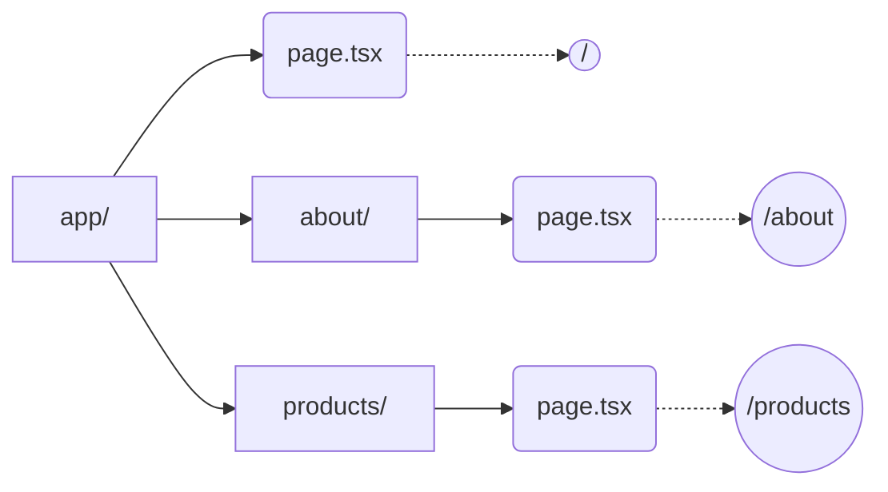

## 🗺️ ការរៀបចំផ្លូវ (Routing)

នៅក្នុង Next.js (App Router) ការបង្កើតទំព័រថ្មីគឺផ្អែកទាំងស្រុងទៅលើ **ថត (Folders)** នៅក្នុង `src/app`។ ថតនីមួយៗតំណាងអោយផ្លូវ (Route) មួយនៅលើ URL ។



---

## 1. Nested Routes (ផ្លូវត្រួតគ្នា)

អ្នកអាចបង្កើតថតនៅក្នុងថត ដើម្បីបង្កើតជា Nested Routes យ៉ាងងាយស្រួល។

```text
app/
├── page.tsx               -> (/)
├── about/
│   └── page.tsx           -> (/about)
└── dashboard/
    ├── page.tsx           -> (/dashboard)
    └── settings/
        └── page.tsx       -> (/dashboard/settings)
```

---

## 2. Route Groups (ការដាក់ក្រុមដោយមិនប៉ះពាល់ URL)

ពេលខ្លះអ្នកចង់ប្រមូលផ្តុំទំព័រមួយចំនួនចូលគ្នាក្នុងថតតែមួយ ដើម្បីងាយស្រួលគ្រប់គ្រង ប៉ុន្តែមិនចង់អោយឈ្មោះថតនោះលេចឡើងក្នុង URL នោះទេ។ 
អ្នកអាចប្រើប្រាស់ **Route Groups** ដោយដាក់ឈ្មោះថតក្នុងវង់ក្រចក `(ឈ្មោះថត)`។

```text
app/
├── (auth)/
│   ├── login/
│   │   └── page.tsx       -> (/login) 
│   └── register/
│       └── page.tsx       -> (/register)
```
> *ចំណាំ:* ពាក្យ `(auth)` មិនត្រូវបានបង្ហាញនៅក្នុង URL ទេ ព្រោះវាគ្រាន់តែជាក្រុមសម្រាប់រៀបចំឯកសារប៉ុណ្ណោះ។ វាជួយអោយអ្នកអាចបង្កើត `layout.tsx` ពិសេសមួយសម្រាប់តែទំព័រ Login និង Register បាន។

---

## 3. ការផ្លាស់ប្តូរទំព័រ (Navigation) ជាមួយ `<Link>`

នៅក្នុង HTML ធម្មតា យើងប្រើ `<a>` tag ដើម្បីបង្កើតតំណភ្ជាប់ (Link)។ ប៉ុន្តែនៅក្នុង Next.js ការប្រើ `<a>` នឹងធ្វើអោយ Browser ផ្ទុកទំព័រឡើងវិញ (Full Reload) ទាំងមូល ដែលធ្វើអោយមានភាពយឺតយ៉ាវ។

ដំណោះស្រាយគឺត្រូវប្រើប្រាស់ Component **`<Link>`** របស់ Next.js ដែលផ្តល់អោយអ្នកនូវការផ្លាស់ប្តូរទំព័រយ៉ាងរលូន (Client-side Navigation) ។

```tsx
import Link from 'next/link';

export default function Navbar() {
  return (
    <nav>
      {/* ខុស: នឹងធ្វើអោយ Reload ទាំងមូល */}
      <a href="/about">About Us (យឺត)</a>
      
      <br />
      
      {/* ត្រូវ: ផ្លាស់ប្តូរទំព័រលឿនដូចផ្លេកបន្ទោរ */}
      <Link href="/about">About Us (លឿន)</Link>
      
      {/* អ្នកអាចដាក់ Class ឬ Style បានដូចធម្មតា */}
      <Link href="/products" className="text-blue-500 font-bold">
        Products
      </Link>
    </nav>
  );
}
```

**អត្ថប្រយោជន៍របស់ `<Link>`:**
*   **Prefetching:** នៅពេលដែល Link លេចឡើងនៅលើអេក្រង់ Next.js នឹងលួចទាញយកទិន្នន័យនៃទំព័រនោះទុកជាមុន (Background)។ ដូច្នេះពេល User ចុច វានឹងលោតចេញមកភ្លាមៗតែម្តង!
*   **Client-side Navigation:** ប្តូរតែផ្នែកដែលត្រូវប្តូរ មិនបាច់ Reload ទំព័រទាំងមូលទេ។
