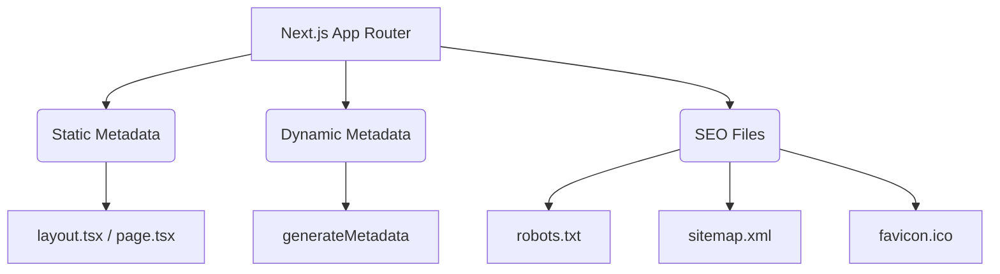

## 🔍 សារៈសំខាន់នៃ SEO ជាមួយ Next.js

**SEO (Search Engine Optimization)** គឺជាការរៀបចំគេហទំព័ររបស់អ្នកអោយស្របតាមស្តង់ដាររបស់ Google ដើម្បីអោយគេហទំព័រអ្នកអាចលោតនៅលេខរៀងលើគេពេលមានគេស្វែងរក។ 



---

## 1. ការកំណត់ Metadata ថេរ (Static Metadata)

អ្នកគ្រាន់តែ Export អថេរមួយឈ្មោះថា `metadata` ចេញពីឯកសារ `layout.tsx` ឬ `page.tsx` ណាមួយ នោះ Next.js នឹងរៀបចំវាទៅជា HTML យ៉ាងត្រឹមត្រូវដោយស្វ័យប្រវត្តិ។

**ឯកសារ `app/about/page.tsx`:**
```tsx
import type { Metadata } from 'next';

export const metadata: Metadata = {
  title: 'អំពីក្រុមហ៊ុនយើង - My Store',
  description: 'ស្វែងយល់បន្ថែមពីប្រវត្តិ និងគោលដៅរបស់ក្រុមហ៊ុន My Store ក្នុងការផ្តល់សេវាកម្មដ៏ល្អបំផុត។',
};
```

---

## 2. ការកំណត់ Metadata ឆ្លាតវៃ (Dynamic Metadata)

ឧបមាថាអ្នកមានទំព័រលក់ទំនិញ (Product Page) ដែលមានទំនិញរាប់ពាន់មុខ។ អ្នកចង់អោយចំណងជើងទំព័រប្តូរទៅតាមឈ្មោះទំនិញ។ អ្នកត្រូវប្រើប្រាស់អនុគមន៍ **`generateMetadata`**។

**ឯកសារ `app/products/[id]/page.tsx`:**
```tsx
import type { Metadata } from 'next';

type Props = { params: { id: string } };

export async function generateMetadata({ params }: Props): Promise<Metadata> {
  const product = await fetch(`https://api.example.com/products/${params.id}`).then((res) => res.json());

  return {
    title: `${product.name} | My Store`,
    description: product.description,
  };
}
```

---

## 3. Open Graph និង Twitter Sharing

ពេលខ្លះអ្នកចង់អោយគេហទំព័ររបស់អ្នកបង្ហាញរូបភាពស្អាតៗ និងចំណងជើងធំៗ ពេលដែលគេចែករំលែក (Share) ទៅកាន់ Facebook ឬ Twitter។ នេះហៅថា Open Graph (OG) និង Twitter Cards។

```tsx
export const metadata: Metadata = {
  title: 'ទំព័រដើម',
  openGraph: {
    title: 'ទំព័រដើម | My Store',
    description: 'ទិញទំនិញល្អៗនៅទីនេះ',
    images: ['https://mysite.com/og-image.jpg'],
  },
  twitter: {
    card: 'summary_large_image',
    title: 'ទំព័រដើម | My Store',
    description: 'ទិញទំនិញល្អៗនៅទីនេះ',
    images: ['https://mysite.com/twitter-image.jpg'],
  },
};
```

---

## 4. ឯកសារ SEO ផ្សេងៗ (Favicon, Robots, Sitemap)

Next.js ធ្វើអោយការគ្រប់គ្រងឯកសារ SEO កាន់តែងាយស្រួល ដោយអ្នកគ្រាន់តែដាក់ឯកសារទាំងនេះនៅក្នុងថត `app/` នោះវាដំណើរការដោយស្វ័យប្រវត្តិ៖

*   **`favicon.ico`** ឬ **`icon.png`**: ជារូបតំណាងតូចមួយដែលលេចឡើងនៅលើ Tab របស់ Browser។ អ្នកគ្រាន់តែទម្លាក់រូបភាពឈ្មោះ `icon.png` ចូលក្នុងថត `app/`។
*   **`robots.txt`**: ប្រាប់ Google ថាទំព័រណាខ្លះដែលអនុញ្ញាតអោយវាចូលអាន និងទំព័រណាខ្លះដែលហាមប្រាម (ដូចជាទំព័រ Admin)។ អ្នកអាចបង្កើតឯកសារ `app/robots.ts`។
*   **`sitemap.xml`**: ជាផែនទីនៃគេហទំព័រទាំងមូលរបស់អ្នក ដែលជួយអោយ Google ងាយស្រួលរកឃើញទំព័រទាំងអស់។ អ្នកអាចបង្កើតឯកសារ `app/sitemap.ts` ដើម្បីបង្កើតវាដោយស្វ័យប្រវត្តិ។

```tsx
// ឧទាហរណ៍ app/sitemap.ts
import { MetadataRoute } from 'next'
 
export default function sitemap(): MetadataRoute.Sitemap {
  return [
    {
      url: 'https://mysite.com',
      lastModified: new Date(),
    },
    {
      url: 'https://mysite.com/about',
      lastModified: new Date(),
    },
  ]
}
```
