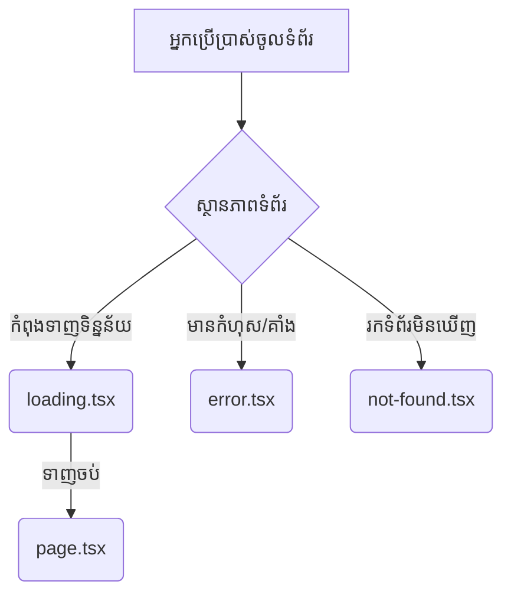

## ⏳ ការគ្រប់គ្រងស្ថានភាពទំព័រ (UI States)

នៅក្នុង Next.js យើងមានឯកសារពិសេសចំនួន ៣ សម្រាប់គ្រប់គ្រងស្ថានភាពផ្សេងៗគ្នានៃទំព័រ ដោយមិនចាំបាច់សរសេរកូដស្មុគស្មាញច្រើន។



---

## 1. ផ្ទាំងរង់ចាំ (`loading.tsx`)

នៅក្នុង Next.js អ្នកគ្រាន់តែបង្កើតឯកសារ `loading.tsx` មួយជាការស្រេច ដើម្បីបង្ហាញកំឡុងពេល Server កំពុងទាញទិន្នន័យ។

**ឯកសារ `app/dashboard/loading.tsx`:**
```tsx
export default function Loading() {
  return (
    <div style={{ padding: 50 }}>
      <h2>កំពុងរៀបចំទិន្នន័យ សូមរង់ចាំបន្តិច... 🔄</h2>
    </div>
  );
}
```

នៅពីក្រោយ Next.js ប្រើប្រាស់ `<Suspense fallback={<Loading />}>` របស់ React ដើម្បីរុំព័ទ្ធទំព័ររបស់អ្នកដោយស្វ័យប្រវត្តិ។

---

## 2. ការចាប់យកកំហុស (`error.tsx`)

ប្រសិនបើមានកូដណាមួយគាំង (crash) វានឹងបង្ហាញទំព័រ `error.tsx` ជំនួសអោយការគាំងសពេញអេក្រង់។
**ច្បាប់សំខាន់:** `error.tsx` ត្រូវតែជា Client Component ជាដាច់ខាត! 

**ឯកសារ `app/error.tsx`:**
```tsx
"use client"; // ត្រូវតែមាននៅបន្ទាត់លើគេបង្អស់!

export default function ErrorPage({
  error,
  reset,
}: {
  error: Error & { digest?: string };
  reset: () => void;
}) {
  return (
    <div style={{ padding: 50, textAlign: 'center' }}>
      <h2>អូស! មានបញ្ហាអ្វីម្យ៉ាងហើយ។ 🤕</h2>
      <p style={{ color: 'red' }}>សារកំហុស: {error.message}</p>
      
      {/* ប៊ូតុងអោយអ្នកប្រើប្រាស់សាកល្បងហៅទិន្នន័យម្តងទៀត */}
      <button onClick={() => reset()}>
        ព្យាយាមម្តងទៀត
      </button>
    </div>
  );
}
```

---

## 3. ទំព័ររកមិនឃើញ (`not-found.tsx`)

ដើម្បីផ្លាស់ប្តូរទំព័រ 404 របស់ Next.js ដែលអាក្រក់មើល ទៅជាទំព័រដ៏ស្រស់ស្អាតផ្ទាល់ខ្លួនរបស់អ្នក អ្នកគ្រាន់តែបង្កើតឯកសារ `not-found.tsx`។

**ឯកសារ `app/not-found.tsx`:**
```tsx
import Link from 'next/link';

export default function NotFound() {
  return (
    <div style={{ textAlign: 'center', padding: '100px' }}>
      <h1 style={{ fontSize: '100px', margin: 0 }}>៤០៤</h1>
      <h2>រកមិនឃើញទំព័រដែលអ្នកកំពុងស្វែងរកទេ! 🔍</h2>
      
      <Link href="/">
        <button>ត្រលប់ទៅទំព័រដើមវិញ</button>
      </Link>
    </div>
  );
}
```

> **គន្លឹះពិសេស:** អ្នកអាចហៅមុខងារ `notFound()` របស់ Next.js នៅក្នុងកូដ `page.tsx` របស់អ្នកដោយផ្ទាល់បាន បើអ្នករកទិន្នន័យមិនឃើញ (ឧ. រកមើលទំនិញលេខ ៩៩៩៩ តែក្នុង Database គ្មាន)!
