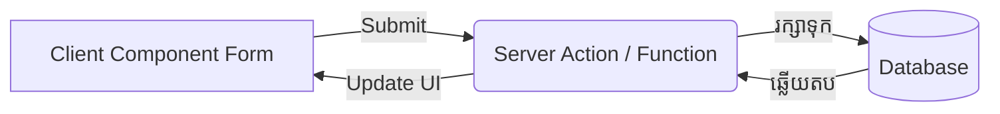

## 🚀 របកគំហើញថ្មី៖ Server Actions!

ប្រសិនបើអ្នកចង់អោយអ្នកប្រើប្រាស់វាយឈ្មោះរបស់គាត់ចូលទៅក្នុងប្រអប់ ហើយរក្សាទុកទៅក្នុង Database តើអ្នកត្រូវធ្វើអ្វីខ្លះកាលពីមុន?
1. បង្កើត API Route (ឧ. `POST /api/users`)
2. បង្កើត Form ក្នុង Client
3. សរសេរកូដចាប់យកព្រឹត្តិការណ៍ `e.preventDefault()` ពេល Submit
4. សរសេរកូដ `fetch(...)` ដើម្បីផ្ញើទៅកាន់ API
5. រង់ចាំចម្លើយ ហើយបង្ហាញសារជោគជ័យ។

ការធ្វើបែបនេះគឺហត់នឿយខ្លាំងណាស់! ឥឡូវនេះ Next.js បានណែនាំ **Server Functions** (ដែលគេនិយមហៅថា **Server Actions** នៅពេលប្រើប្រាស់ភ្ជាប់ជាមួយ Form) ដែលលុបបំបាត់ API និង `fetch` ចោលទាំងស្រុង! អ្នកអាចហៅ Function របស់ Server បានដោយផ្ទាល់ពីកូដ Client។



---

## 1. ការបង្កើត Server Action

ដើម្បីប្រាប់ Next.js ថាមុខងារណាមួយរត់តែនៅលើ Server នោះទេ យើងត្រូវប្រើពាក្យបញ្ជាពិសេស **`"use server";`** នៅក្នុងខ្លួនរបស់វា។

**ឯកសារ `app/actions.ts`:**
```ts
"use server"; // ប្រាប់ថាគ្រប់មុខងារក្នុងឯកសារនេះ រត់នៅលើ Server ប៉ុណ្ណោះ!

export async function createUser(formData: FormData) {
  // ចាប់យកទិន្នន័យពី Form តាមរយៈគុណលក្ខណៈ `name` របស់ Input
  const name = formData.get("username");
  const email = formData.get("email");

  // នៅទីនេះ អ្នកអាចសរសេរកូដរក្សាទុកចូល Database ដោយផ្ទាល់! (ឧ. Prisma)
  console.log("កំពុងរក្សាទុកទៅកាន់ Database...", { name, email });
  
  // អ្នកមិនអាច return កូដ HTML បានទេ តែអ្នកអាច return សារអក្សរបាន
  return { success: true, message: "ការចុះឈ្មោះទទួលបានជោគជ័យ!" };
}
```

---

## 2. ការហៅ Server Action ពីកូដ Client

ឥឡូវនេះ យើងយកអនុគមន៍ដែលយើងបានបង្កើតខាងលើ ទៅភ្ជាប់ជាមួយនឹង Form របស់ HTML ធម្មតា។ យើងមិនបាច់សរសេរ `e.preventDefault()` ឬ `fetch` ទៀតទេ!

**ឯកសារ `app/page.tsx`:**
```tsx
import { createUser } from './actions'; // ទាញយក Server Action

export default function RegisterPage() {
  return (
    <div>
      <h1>ចុះឈ្មោះអ្នកប្រើប្រាស់ថ្មី</h1>
      
      {/* ភ្ជាប់ Server Action ទៅកាន់គុណលក្ខណៈ action របស់ Form */}
      <form action={createUser} style={{ display: 'flex', flexDirection: 'column', width: 300 }}>
        
        {/* កុំភ្លេចដាក់គុណលក្ខណៈ name អោយសោះ! */}
        <input name="username" type="text" placeholder="ឈ្មោះ" required />
        <br />
        <input name="email" type="email" placeholder="អុីមែល" required />
        <br />
        
        <button type="submit">ចុះឈ្មោះ 🚀</button>
      </form>
    </div>
  );
}
```

ពេលអ្នកចុចប៊ូតុង "ចុះឈ្មោះ" Next.js នឹងវេចខ្ចប់ទិន្នន័យ Form នេះ រួចលួចហៅ API នៅពីក្រោយខ្នងអោយអ្នកដោយស្វ័យប្រវត្តិ ហើយបញ្ជូនវាទៅកាន់ Server!

> **គន្លឹះពិសេស:** ថ្វីត្បិតតែ Form ខាងលើសរសេរនៅក្នុង Client Component ក៏ដោយ បើអ្នកបិទ JavaScript នៅក្នុង Browser របស់អ្នក វានៅតែអាចដំណើរការបញ្ជូនទិន្នន័យទៅ Server បានយ៉ាងរលូន ដែលជួយដល់ល្បឿន និងសុវត្ថិភាព! នេះជាមន្តអាគមពិតៗរបស់ Next.js 14+។
