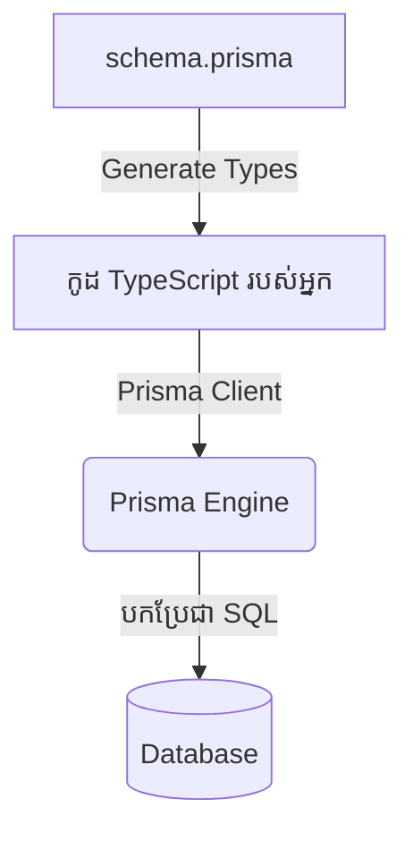

## 🛠️ អ្វីទៅជា ORM?

ដើម្បីអាចទាញយក ឬបញ្ចូលទិន្នន័យទៅក្នុង Database ប្រភេទ SQL (ដូចជា PostgreSQL) បាន កាលពីមុនអ្នកអភិវឌ្ឍន៍ត្រូវអង្គុយសរសេរកូដភាសា SQL (Structured Query Language) វែងៗដោយផ្ទាល់។

**ឧទាហរណ៍កូដ SQL សុទ្ធ:**
```sql
SELECT * FROM users WHERE email = 'ratha@example.com';
```

ការសរសេរកូដបែបនេះគឺប្រឈមនឹងបញ្ហាច្រើន ងាយនឹងសរសេរខុសអក្ខរាវិរុទ្ធ (Typos) និងពិបាករក្សាទុក។
ដើម្បីដោះស្រាយបញ្ហានេះ គេបានបង្កើត **ORM (Object-Relational Mapping)**!

ORM គឺជាអ្នកបកប្រែ។ វាអនុញ្ញាតអោយអ្នកសរសេរកូដដោយប្រើប្រាស់ភាសា JavaScript/TypeScript ធម្មតា ដែលអ្នកធ្លាប់ស្គាល់ រួចវានឹងបម្លែងកូដនោះទៅជាកូដ SQL ដោយស្វ័យប្រវត្តិ។



---

## 1. ជម្រើសទី ១៖ Prisma ORM 🏆

**Prisma** គឺជា ORM ដែលមានប្រជាប្រិយភាពបំផុតនៅក្នុងសហគមន៍ Next.js (សឹងតែអាចនិយាយបានថាជាស្តង់ដារទីផ្សារបច្ចុប្បន្ន)។

**លក្ខណៈពិសេសរបស់ Prisma:**
- **រចនាសម្ព័ន្ធទិន្នន័យងាយអាន (Prisma Schema):** អ្នកអាចរៀបចំតារាង Database របស់អ្នកនៅក្នុងឯកសារតែមួយគត់ (`schema.prisma`) ដែលមានទម្រង់ងាយស្រួលមើលបំផុតទោះអ្នកជាអ្នកថ្មីក៏ដោយ។
- **Type-Safety ដ៏អស្ចារ្យ:** ដោយសារវាធ្វើការជាមួយ TypeScript ប្រសិនបើអ្នកសរសេរកូដហៅឈ្មោះ Column ខុស វានឹងលោតក្រហមប្រាប់ភ្លាមៗ។
- **មានកម្មវិធីមើលទិន្នន័យ (Prisma Studio):** ផ្តល់ជូនផ្ទាំង Admin ស្រាប់សម្រាប់បើកមើល និងកែប្រែទិន្នន័យ។

**របៀបសរសេរកូដទាញយកទិន្នន័យដោយប្រើ Prisma:**
```ts
// កូដ TS នេះមើលទៅងាយស្រួលយល់ជាង SQL ឆ្ងាយណាស់!
const user = await prisma.user.findUnique({
  where: {
    email: 'ratha@example.com',
  },
})
```

---

## 2. ជម្រើសទី ២៖ Drizzle ORM (សេចក្តីណែនាំខ្លីៗ) 🚀

Drizzle គឺជា ORM ជំនាន់ថ្មីដែលកំពុងតែទទួលបានការចាប់អារម្មណ៍ខ្លាំង ដោយសារវាមានទម្ងន់ស្រាល និងដំណើរការលឿនជាង Prisma នៅក្នុងបរិស្ថាន Serverless (ដូចជា Vercel)។ ការសរសេរកូដរបស់វាមានទម្រង់ស្រដៀងនឹង SQL ជាង Prisma។

```ts
// កូដ Drizzle (ស្រដៀង SQL)
const user = await db.select().from(users).where(eq(users.email, 'ratha@example.com'));
```

> **ការសម្រេចចិត្តសម្រាប់វគ្គសិក្សានេះ:** យើងនឹងប្រើប្រាស់ **Prisma** ជាចម្បង ព្រោះវាមានភាពងាយស្រួលក្នុងការរៀនសម្រាប់អ្នកចាប់ផ្តើមដំបូង ផ្តល់នូវបទពិសោធន៍សរសេរកូដល្អ និងមានសហគមន៍ធំជាងគេ។ ការរៀន ORM តែមួយអោយច្បាស់ គឺគ្រប់គ្រាន់សម្រាប់សាងសង់កម្មវិធីខ្នាតធំបានហើយ។
