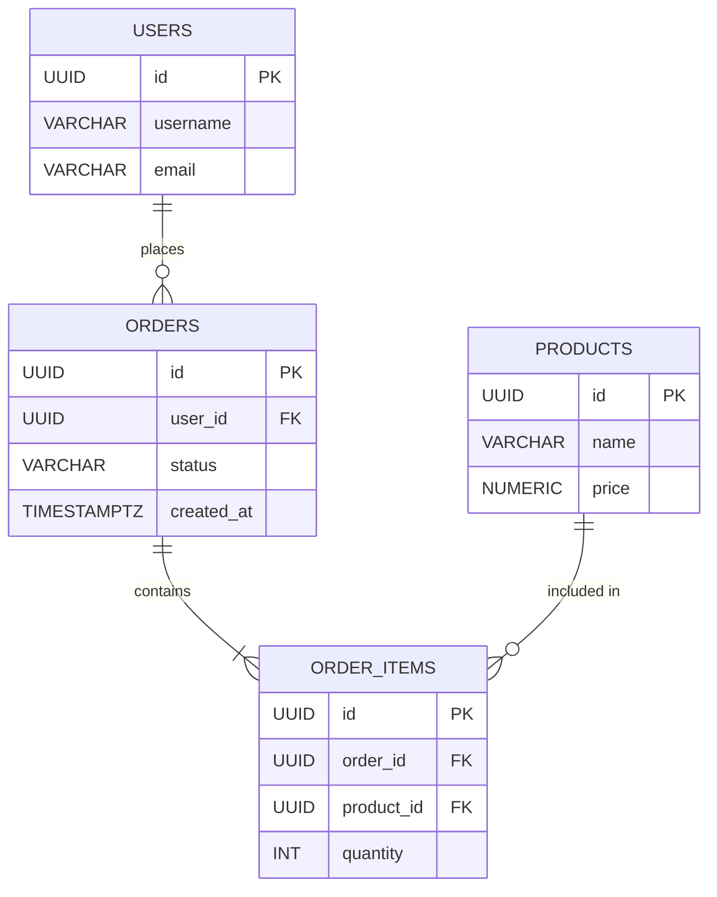

## 🧠 របៀបគិតក្នុងការដោះស្រាយបញ្ហា (Problem Solving Workflow)

មុននឹងសរសេរកូដបង្កើត Database អ្នកត្រូវមានសមត្ថភាពក្នុងការស្តាប់តម្រូវការរបស់អតិថិជន (Business Requirements) ហើយបំប្លែងវាទៅជារចនាសម្ព័ន្ធទិន្នន័យ។ នេះគឺជាដំណើរការគិត ៣ ជំហានដ៏សាមញ្ញ៖

### ជំហានទី ១៖ ស្វែងរក "នាម" (Identify Entities)
នៅពេលអានតម្រូវការ សូមគូសចំណាំពាក្យណាដែលជា **នាម (Nouns)** សំខាន់ៗ។
*ឧទាហរណ៍៖ "ប្រព័ន្ធត្រូវអនុញ្ញាតអោយ **អ្នកប្រើប្រាស់** អាចទិញ **ទំនិញ**។"* 
➡️ យើងទទួលបាន Entities (តារាង) ២ គឺ៖ `users` និង `products`។

### ជំហានទី ២៖ ស្វែងរក "លក្ខណៈ" (Identify Attributes)
តើ Entities នីមួយៗគួរមានព័ត៌មានអ្វីខ្លះ?
*ឧទាហរណ៍៖ "អ្នកប្រើប្រាស់ត្រូវមានឈ្មោះ អ៊ីមែល និងលេខសម្ងាត់។"*
➡️ យើងទទួលបាន Attributes (ជួរឈរ)៖ `name`, `email`, `password_hash`។

### ជំហានទី ៣៖ ស្វែងរក "កិរិយា" (Identify Relationships)
តើ Entities ទាំងនោះមានទំនាក់ទំនងគ្នាដូចម្តេច?
*ឧទាហរណ៍៖ "អ្នកប្រើប្រាស់ម្នាក់ អាចទិញទំនិញបានច្រើន។"*
➡️ នេះគឺជាទំនាក់ទំនង (Relationship) ប្រភេទ **One-to-Many**។ យើងប្រហែលជាត្រូវការតារាងកណ្តាលមួយឈ្មោះថា `orders`។

---

## 🗺️ អ្វីទៅជា ERD?

**ERD (Entity Relationship Diagram)** គឺជាការគូសវាសប្លង់ (Diagram) ដែលបង្ហាញពីការគិតរបស់អ្នកនៅក្នុងជំហានទាំង ៣ ខាងលើ។ ការគូស ERD គឺជាការងារដំបូងដ៏សំខាន់បំផុត ដើម្បីអោយសមាជិកក្រុមទាំងអស់មានការយល់ឃើញដូចគ្នា មុនពេលចាប់ផ្តើមសរសេរកូដ (Coding)។

---

## 🛒 Case Study: ការរចនា Database សម្រាប់ E-Commerce

យើងនឹងយកដំណើរការគិតខាងលើ មកដោះស្រាយបញ្ហាក្នុងការបង្កើតប្រព័ន្ធ E-Commerce មួយ។

**តម្រូវការ (Requirements):**
> "យើងត្រូវការប្រព័ន្ធមួយដែល **អតិថិជន (Users)** អាចបញ្ជាទិញ **ទំនិញ (Products)**។ អតិថិជនម្នាក់អាចបង្កើត **ការកម្ម៉ង់ (Orders)** បានច្រើនដង ហើយក្នុងការកម្ម៉ង់ម្តងៗ អាចមានទំនិញជាច្រើនមុខ (Order Items)។"

### ១. ការគូស ERD (Entity Relationship Diagram)

ខាងក្រោមនេះគឺជាការបង្ហាញពី ERD ដោយប្រើប្រាស់ Mermaid ដែលជា Tool ដ៏ពេញនិយមសម្រាប់ការគូស Diagram តាមរយៈកូដ៖

> 💡 **តើអ្វីទៅជាសញ្ញាជើងក្អែក (Crow's Foot Notation)?**
> 
> នៅក្នុងរូបភាព ERD ខាងលើ អ្នកប្រហែលជាឆ្ងល់ថាតើសញ្ញាខ្សែបន្ទាត់ដែលតភ្ជាប់តារាងមានន័យយ៉ាងដូចម្តេច។ នេះគឺជាវិធីអានយ៉ាងសាមញ្ញ៖
> - សញ្ញា `||` (ខ្សែឈរពីរ): មានន័យថា **"មួយគត់ (Exactly One)"**។ ឧទាហរណ៍ `USERS ||--` មានន័យថាទាមទារអោយមាន User តែម្នាក់គត់។
> - សញ្ញា `o{` (រង្វង់ និង ជើងក្អែក): មានន័យថា **"សូន្យ ឬ ច្រើន (Zero or Many)"**។ ឧទាហរណ៍ `--o{ ORDERS` មានន័យថា User ម្នាក់អាចមិនទាន់ទិញអីសោះ (០) ឬអាចទិញបានច្រើនដង (Many)។
> - សញ្ញា `|{` (ខ្សែឈរ និង ជើងក្អែក): មានន័យថា **"មួយ ឬ ច្រើន (One or Many)"**។ ឧទាហរណ៍ `--|{ ORDER_ITEMS` មានន័យថា ក្នុងការកម្ម៉ង់ម្តង ត្រូវតែមានទំនិញយ៉ាងហោចណាស់មួយមុខឡើងទៅ។

### ២. ការបំប្លែងទៅជា Database Schema (PostgreSQL)

បន្ទាប់ពីមាន ERD ច្បាស់លាស់ហើយ ការបង្កើតតារាងគឺជារឿងងាយស្រួល៖

#### តារាង Users
| Column Name | Data Type | លក្ខណៈពិសេស |
| :--- | :--- | :--- |
| `id` | `UUID` | Primary Key |
| `username` | `VARCHAR(50)` | Unique |
| `email` | `VARCHAR(100)`| Unique |

#### តារាង Products
| Column Name | Data Type | លក្ខណៈពិសេស |
| :--- | :--- | :--- |
| `id` | `UUID` | Primary Key |
| `name` | `VARCHAR(100)`| |
| `price` | `NUMERIC(10,2)`| តម្លៃទំនិញ |

#### តារាង Orders (ភ្ជាប់ Users ទៅនឺងការទិញ)
| Column Name | Data Type | លក្ខណៈពិសេស |
| :--- | :--- | :--- |
| `id` | `UUID` | Primary Key |
| `user_id` | `UUID` | Foreign Key ភ្ជាប់ទៅ `users.id` |
| `status` | `VARCHAR(20)` | ឧ. 'pending', 'paid' |

#### តារាង Order Items (ភ្ជាប់ Orders និង Products)
ដោយសារការកម្ម៉ង់មួយអាចមានទំនិញច្រើន ហើយទំនិញមួយអាចស្ថិតក្នុងការកម្ម៉ង់ច្រើន (Many-to-Many) យើងត្រូវមានតារាងកណ្តាល `order_items`។

| Column Name | Data Type | លក្ខណៈពិសេស |
| :--- | :--- | :--- |
| `id` | `UUID` | Primary Key |
| `order_id` | `UUID` | Foreign Key ភ្ជាប់ទៅ `orders.id` |
| `product_id` | `UUID` | Foreign Key ភ្ជាប់ទៅ `products.id` |
| `quantity` | `INT` | ចំនួនទំនិញ |

**សន្និដ្ឋាន:** ការរចនា Database មិនមែនជាការអង្គុយសរសេរកូដ SQL ភ្លាមៗនោះទេ វាគឺជាការគិតវិភាគ (Problem Solving) ការគូសវាស (ERD) និងការសម្រេចចិត្តថាតើត្រូវរៀបចំទិន្នន័យបែបណាទើបត្រឹមត្រូវ និងមានភាពរឹងមាំសម្រាប់អនាគត។
