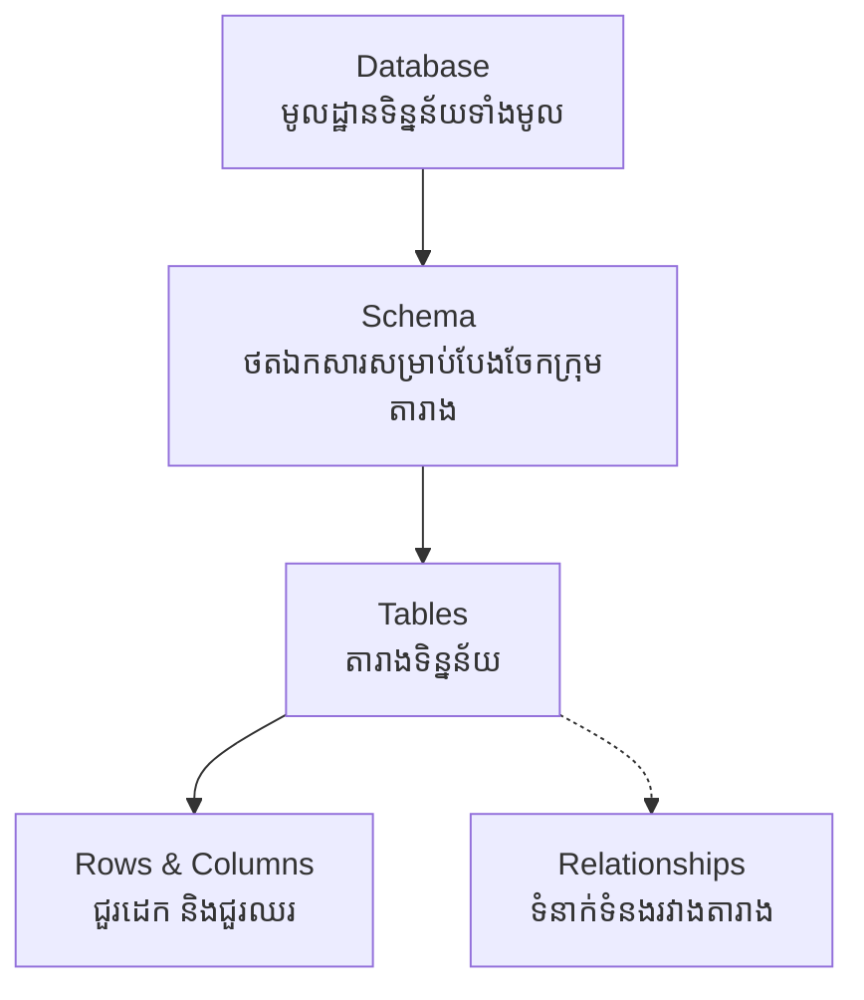

## 🐘 អ្វីទៅជា RDBMS & PostgreSQL?

**RDBMS (Relational Database Management System)** គឺជាប្រព័ន្ធគ្រប់គ្រងមូលដ្ឋានទិន្នន័យដែលរក្សាទុកទិន្នន័យជាទម្រង់ **តារាង (Tables)** និងអនុញ្ញាតអោយតារាងទាំងនោះមានទំនាក់ទំនង (Relationships) គ្នាទៅវិញទៅមក។

### រចនាសម្ព័ន្ធរបស់ RDBMS

ដើម្បីយល់ពីរបៀបដែលទិន្នន័យត្រូវបានរក្សាទុក អ្នកត្រូវយល់ពីរចនាសម្ព័ន្ធតាមលំដាប់លំដោយនេះ៖



**ឧទាហរណ៍ជាក់ស្តែង:**
- **Table:** ប្រៀបដូចជា File Excel មួយ (ឧទាហរណ៍៖ តារាង `users`)
- **Column (Field):** ប្រៀបដូចជាចំណងជើងជួរឈរ (ឧទាហរណ៍៖ `id`, `name`, `email`)
- **Row (Record):** ប្រៀបដូចជាទិន្នន័យរបស់មនុស្សម្នាក់ក្នុងជួរដេកនីមួយៗ។

### ហេតុអ្វីបានជាយើងជ្រើសរើស PostgreSQL?

1. **Free & Open-Source:** PostgreSQL គឺជាកម្មវិធីឥតគិតថ្លៃ និងបើកចំហកូដ ដែលចេញផ្សាយក្រោមអាជ្ញាប័ណ្ណ PostgreSQL License។
2. **ACID Compliance:** ធានាថារាល់ប្រតិបត្តិការទិន្នន័យ (Transactions) របស់អ្នកមានសុវត្ថិភាព។
3. **ការគាំទ្រ JSON (JSONB):** ផ្តល់សមត្ថភាពក្នុងការផ្ទុកទិន្នន័យបែប NoSQL នៅក្នុង RDBMS។

---

## 🛠️ Database Server ទល់នឹង Database Client

1. **Database Server (PostgreSQL):** 
   ប្រៀបដូចជាស្ថានីយ៍ទូរទស្សន៍ ដែលជាអ្នកផ្ទុកទិន្នន័យ។ វាមិនមានផ្ទាំងអោយយើងចុចមើលផ្ទាល់នោះទេ។
2. **Database Client:** 
   ប្រៀបដូចជាអេក្រង់ទូរទស្សន៍របស់អ្នក។ វាមានតួនាទី **ភ្ជាប់ (Connect)** ទៅកាន់ Server ដើម្បីទាញយកទិន្នន័យមកបង្ហាញ។ (ឧទាហរណ៍៖ `psql`, `pgAdmin`, `DBeaver`)។

---

## 🔗 ការតភ្ជាប់ (Connection Concepts)

ដើម្បីអោយ Database Client (ឫកូដ Backend ដូចជា Laravel, Node.js, Prisma) អាចនិយាយជាមួយ Database Server បាន យើងត្រូវការព័ត៌មាន ៥ យ៉ាងសំខាន់ៗ៖

```text
Host:      localhost       (ទីតាំងរបស់ Server, ប្រើ localhost បើវានៅក្នុងម៉ាស៊ីនតែមួយ)
Port:      5432            (ច្រកចូលរបស់ PostgreSQL ដែលកំណត់ជាស្តង់ដារ)
Database:  ecommerce       (ឈ្មោះរបស់ Database ដែលអ្នកចង់ចូល)
User:      postgres        (ឈ្មោះអ្នកប្រើប្រាស់)
Password:  ********        (លេខសម្ងាត់)
```

អ្នកនឹងឃើញទម្រង់នៃការតភ្ជាប់នេះជារឿយៗ នៅពេលដែលយើងសរសេរកូដ Backend នាពេលខាងមុខ!
