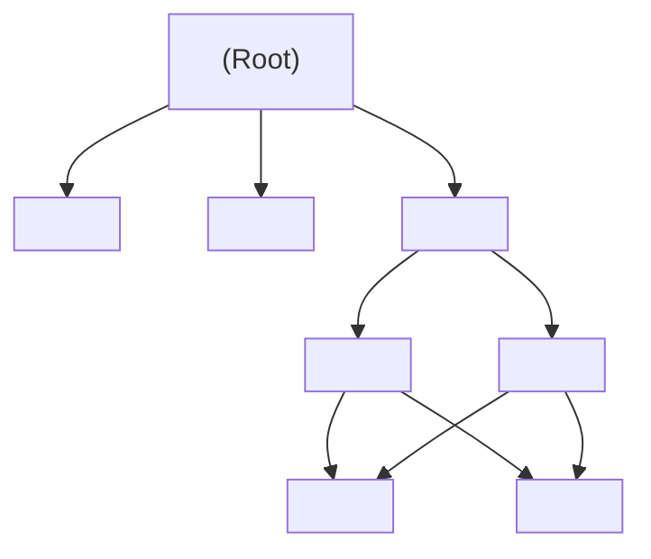

# 🧱 React Functional Components

នៅក្នុង React សម័យទំនើប **Component** គឺជាដុំឥដ្ឋ (Building Block) មូលដ្ឋានសម្រាប់សាងសង់ User Interface (UI) ទាំងអស់។ Component នីមួយៗគឺជា JavaScript Function សុទ្ធសាធដែលទទួលទិន្នន័យ និង return នូវ UI Elements តាមរយៈ JSX។



---

## ១. ការបង្កើត Functional Component ដំបូង

Component ត្រូវតែសរសេរជា **PascalCase** (អក្សរធំនៅដើមពាក្យនីមួយៗ)៖

```tsx
// src/components/UserProfile.tsx
interface UserProfileProps {
  name: string;
  role: string;
  avatarUrl: string;
}

export function UserProfile({ name, role, avatarUrl }: UserProfileProps) {
  return (
    <div className="flex items-center gap-4 p-4 bg-slate-800 rounded-xl border border-slate-700">
      
      <div>
        <h3 className="text-base font-semibold text-white">{name}</h3>
        <p className="text-sm text-slate-400">{role}</p>
      </div>
    </div>
  );
}
```

---

## ២. Component Composition (ការផ្សំ Component បញ្ចូលគ្នា)

យើងអាចយក Component តូចៗមកផ្គុំគ្នាបង្កើតជាទំព័រធំមួយបានយ៉ាងងាយស្រួល៖

```tsx
// src/App.tsx
import { UserProfile } from "./components/UserProfile";

export default function App() {
  return (
    <main className="min-h-screen bg-slate-950 p-8 text-white">
      <h1 className="text-2xl font-bold mb-6">Team Directory</h1>
      <div className="grid grid-cols-1 md:grid-cols-2 gap-4">
        <UserProfile
          name="Sophea Chea"
          role="Senior Frontend Engineer"
          avatarUrl="https://images.unsplash.com/photo-1534528741775-53994a69daeb?w=150"
        />
        <UserProfile
          name="Dara Vann"
          role="Full Stack Architect"
          avatarUrl="https://images.unsplash.com/photo-1507003211169-0a1dd7228f2d?w=150"
        />
      </div>
    </main>
  );
}
```

---

## ៣. Best Practices ក្នុងការរៀបចំ Component

1. **Keep Components Small & Focused:** កុំទុកឱ្យ Component មួយឡើងដល់ ៣០០-៤០០ ជួរ។ ប្រសិនបើវាចាប់ផ្តើមស្មុគស្មាញ ចូរបំបែកជា Sub-components។
2. **File per Component:** ដាក់ Component ធំៗនីមួយៗក្នុង File ដាច់ដោយឡែកពីគ្នា។
3. **PascalCase Naming:** ប្រើឈ្មោះដូចជា `Button.tsx`, `UserProfileCard.tsx` ជានិច្ច។
