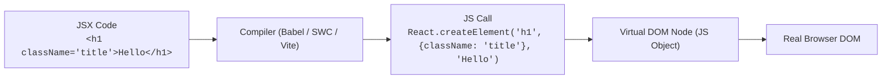

# 🎭 JSX Syntax & Transpilation

**JSX (JavaScript XML)** គឺជា Syntax Extension សម្រាប់ JavaScript ដែលអនុញ្ញាតឱ្យយើងសរសេរ HTML-like markup នៅខាងក្នុង JavaScript Code។



---

## ១. វិធានមាសទាំង ៣ នៃ JSX (The 3 Golden Rules)

### វិធានទី ១: ត្រូវតែមាន Single Root Element ឬ Fragment
JavaScript Function មិនអាច return តម្លៃ ២ ដំណាលគ្នាដោយគ្មាន wrapper ឡើយ៖

```tsx
// ❌ INVALID: Error!
export function BadComponent() {
  return (
    <h1>ចំណងជើង</h1>
    <p>អត្ថបទ</p>
  );
}

// ✅ VALID: ប្រើ React Fragment (<>...</>)
export function GoodComponent() {
  return (
    <>
      <h1 className="text-xl font-bold">ចំណងជើង</h1>
      <p className="text-slate-400">អត្ថបទពន្យល់</p>
    </>
  );
}
```

### វិធានទី ២: ត្រូវបិទគ្រប់ Tags ទាំងអស់ (Self-Closing Tags)
HTML tags ណាដែលគ្មាន children ត្រូវតែបិទដោយសញ្ញា `/>` ជានិច្ច៖

```tsx
// ✅ ត្រូវបិទជានិច្ច

<input type="text" placeholder="Enter name" />
<br />
<hr />
```

### វិធានទី ៣: ប្រើ camelCase សម្រាប់ Attributes ស្ទើរតែទាំងអស់

| Standard HTML | React JSX | មូលហេតុ |
| :--- | :--- | :--- |
| `class` | `className` | `class` ជា JS Reserved Word |
| `for` | `htmlFor` | `for` ជា JS Loop Keyword |
| `onclick` | `onClick` | camelCase Event handler |
| `tabindex` | `tabIndex` | camelCase DOM attribute |

---

## ២. ការបង្កប់ JavaScript Expressions ក្នុង JSX `{}`

យើងអាចសរសេរ JavaScript Expression ណាមួយដែលមាន return value នៅខាងក្នុងសញ្ញា `{ }` បាន៖

```tsx
export function ProductPriceCard() {
  const productName = "Mechanical Keyboard";
  const price = 120;
  const discountPercent = 15;
  const isAvailable = true;

  return (
    <div className="p-6 bg-slate-900 rounded-xl text-white">
      <h2 className="text-lg font-bold">{productName.toUpperCase()}</h2>
      <p className="text-sm text-slate-400">
        Status: {isAvailable ? "🟢 In Stock" : "🔴 Out of Stock"}
      </p>
      <div className="mt-4">
        <span className="text-2xl font-bold text-emerald-400">
          ${price * (1 - discountPercent / 100)}
        </span>
        <span className="ml-2 text-sm line-through text-slate-500">${price}</span>
      </div>
    </div>
  );
}
```
