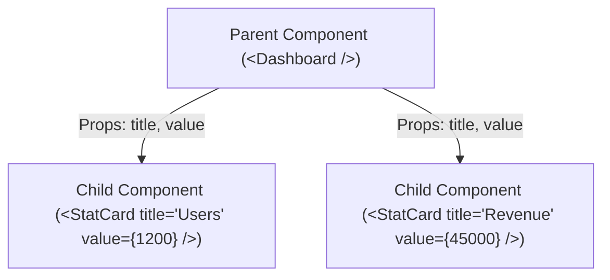

# 📦 React Props (Properties)

**Props** គឺជាទិន្នន័យ (Inputs) ដែលបញ្ជូនពី **Parent Component** ចុះទៅកាន់ **Child Component** តាមរយៈ **Unidirectional Data Flow (លំហូរទិន្នន័យឯកទិស)**។



---

## ១. Props Destructuring & TypeScript Typing

```tsx
// src/components/Badge.tsx
interface BadgeProps {
  label: string;
  variant?: "success" | "warning" | "danger" | "info";
  count?: number;
}

export function Badge({ label, variant = "info", count }: BadgeProps) {
  const variantStyles = {
    success: "bg-emerald-500/10 text-emerald-400 border-emerald-500/20",
    warning: "bg-amber-500/10 text-amber-400 border-amber-500/20",
    danger: "bg-rose-500/10 text-rose-400 border-rose-500/20",
    info: "bg-sky-500/10 text-sky-400 border-sky-500/20",
  };

  return (
    <span className={`inline-flex items-center gap-1.5 px-2.5 py-1 rounded-full text-xs font-medium border ${variantStyles[variant]}`}>
      {label}
      {count !== undefined && (
        <span className="px-1.5 py-0.5 rounded-full bg-slate-800 text-[10px]">
          {count}
        </span>
      )}
    </span>
  );
}
```

---

## ២. Passing Callback Functions as Props

```tsx
interface ActionButtonProps {
  label: string;
  onClick: () => void;
  isLoading?: boolean;
}

export function ActionButton({ label, onClick, isLoading }: ActionButtonProps) {
  return (
    <button
      onClick={onClick}
      disabled={isLoading}
      className="px-4 py-2 bg-indigo-600 hover:bg-indigo-500 disabled:opacity-50 text-white rounded-lg transition"
    >
      {isLoading ? "កំពុងដំណើរការ..." : label}
    </button>
  );
}
```

---

## ៣. Component Composition ជាមួយ `children`

```tsx
// src/components/Card.tsx
import { ReactNode } from "react";

interface CardProps {
  title: string;
  children: ReactNode;
  footer?: ReactNode;
}

export function Card({ title, children, footer }: CardProps) {
  return (
    <div className="bg-slate-900 border border-slate-800 rounded-2xl overflow-hidden">
      <div className="px-6 py-4 border-b border-slate-800">
        <h3 className="text-base font-semibold text-white">{title}</h3>
      </div>
      <div className="p-6">{children}</div>
      {footer && <div className="px-6 py-3 bg-slate-950/50 border-t border-slate-800">{footer}</div>}
    </div>
  );
}
```
