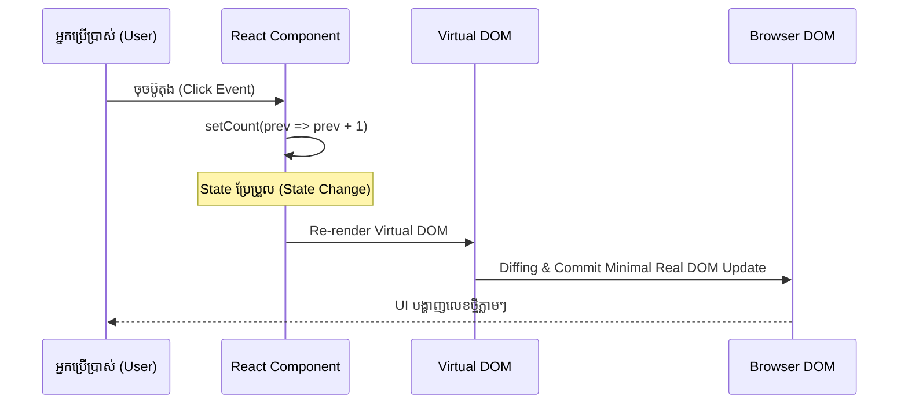

# 🧠 React State & Immutability

ប្រសិនបើ **Props** ប្រៀបដូចជា Arguments ដែលបញ្ជូនចូលពីក្រៅ នោះ **State** គឺជា **អង្គចងចាំផ្ទៃក្នុង (Internal Memory)** របស់ Component។



---

## ១. useState Mechanics & Functional Updates

```tsx
import { useState } from "react";

export function Counter() {
  const [count, setCount] = useState<number>(0);

  const handleIncrementTriple = () => {
    // ✅ ត្រឹមត្រូវ: ប្រើ Functional Updater ឡើងបាន +3 យ៉ាងសុក្រឹត
    setCount((prev) => prev + 1);
    setCount((prev) => prev + 1);
    setCount((prev) => prev + 1);
  };

  return (
    <div className="p-6 bg-slate-900 rounded-xl text-center">
      <p className="text-3xl font-bold text-indigo-400 mb-4">{count}</p>
      <button
        onClick={handleIncrementTriple}
        className="px-4 py-2 bg-indigo-600 text-white rounded-lg"
      >
        +3 (Triple Increment)
      </button>
    </div>
  );
}
```

---

## ២. Immutability ជាមួយ Object និង Array

```tsx
interface Todo {
  id: string;
  title: string;
  completed: boolean;
}

export function TodoManager() {
  const [todos, setTodos] = useState<Todo[]>([]);

  // ១. Add Item (Spread Operator)
  const addTodo = (title: string) => {
    const newTodo: Todo = { id: crypto.randomUUID(), title, completed: false };
    setTodos((prev) => [...prev, newTodo]);
  };

  // ២. Toggle Item (.map)
  const toggleTodo = (id: string) => {
    setTodos((prev) =>
      prev.map((t) => (t.id === id ? { ...t, completed: !t.completed } : t))
    );
  };

  // ៣. Delete Item (.filter)
  const deleteTodo = (id: string) => {
    setTodos((prev) => prev.filter((t) => t.id !== id));
  };

  return <div className="space-y-2">{/* Render Todo items */}</div>;
}
```
