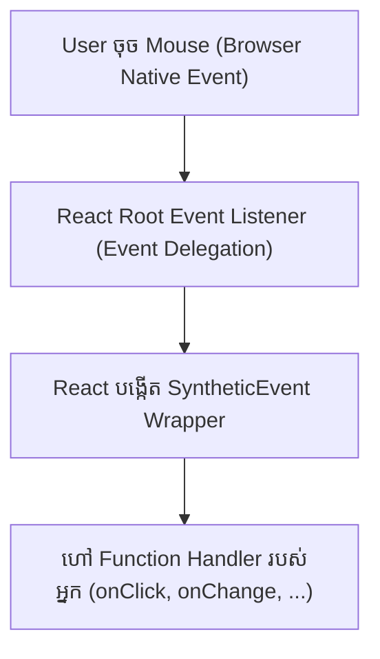

# ⚡ React Event Handling & SyntheticEvents

React ប្រើប្រព័ន្ធ **SyntheticEvent** ដែលជា Wrapper ស្រោបពីលើ Native Browser Events ដើម្បីធានាថាកូដ Event ដំណើរការដូចគ្នាបេះបិទលើគ្រប់ Browser ទាំងអស់។



---

## ១. Event Handlers និងការបញ្ជូន Arguments

```tsx
import { MouseEvent } from "react";

export function EventDemo() {
  const handleSimpleClick = (e: MouseEvent<HTMLButtonElement>) => {
    console.log("Button clicked at coords:", e.clientX, e.clientY);
  };

  const handleDeleteItem = (id: string, name: string, e: MouseEvent) => {
    e.stopPropagation(); // ទប់ស្កាត់ Event Bubbling
    console.log(`Deleting ${name} (ID: ${id})`);
  };

  return (
    <div className="space-y-4">
      <button onClick={handleSimpleClick} className="px-4 py-2 bg-indigo-600 text-white rounded-lg">
        Click Me
      </button>

      <button
        onClick={(e) => handleDeleteItem("item-101", "Product A", e)}
        className="px-4 py-2 bg-rose-600 text-white rounded-lg"
      >
        Delete Product
      </button>
    </div>
  );
}
```

---

## ២. Form Submission & `e.preventDefault()`

```tsx
import { FormEvent, useState } from "react";

export function SearchBox() {
  const [query, setQuery] = useState("");

  const handleSubmit = (e: FormEvent<HTMLFormElement>) => {
    e.preventDefault(); // 🛑 ទប់ស្កាត់ Browser Refresh
    if (!query.trim()) return;
    console.log("Searching for:", query);
  };

  return (
    <form onSubmit={handleSubmit} className="flex gap-2">
      <input
        type="text"
        value={query}
        onChange={(e) => setQuery(e.target.value)}
        placeholder="ស្វែងរក..."
        className="px-4 py-2 bg-slate-800 border border-slate-700 rounded-lg text-white"
      />
      <button type="submit" className="px-4 py-2 bg-emerald-600 text-white rounded-lg">
        ស្វែងរក
      </button>
    </form>
  );
}
```
