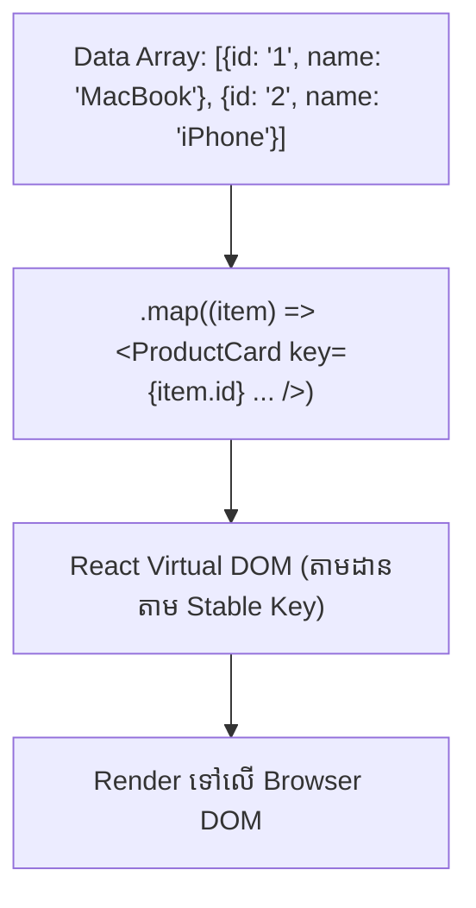

# 📋 Lists & Keys in React

នៅពេលដែលយើងចង់ Render ទិន្នន័យជា Array (ដូចជាបញ្ជីផលិតផល ឬ Users) យើងប្រើ JavaScript `.map()` Method ដើម្បីបំប្លែង Data Array ទៅជា JSX Elements Array។



---

## ការប្រើប្រាស់ `.map()` និង `key` Prop

```tsx
interface CourseCardProps {
  id: string;
  title: string;
  category: string;
  lessonsCount: number;
}

export function CourseList() {
  const courses: CourseCardProps[] = [
    { id: "c-1", title: "React Fundamentals", category: "Frontend", lessonsCount: 8 },
    { id: "c-2", title: "Node.js Architecture", category: "Backend", lessonsCount: 12 },
    { id: "c-3", title: "PostgreSQL Masterclass", category: "Database", lessonsCount: 10 },
  ];

  return (
    <div className="grid grid-cols-1 md:grid-cols-3 gap-4 p-6">
      {courses.map((course) => (
        <div
          key={course.id}
          className="p-5 bg-slate-900 border border-slate-800 rounded-xl hover:border-indigo-500 transition"
        >
          <span className="text-xs text-indigo-400 font-semibold">{course.category}</span>
          <h3 className="text-lg font-bold text-white mt-1">{course.title}</h3>
          <p className="text-sm text-slate-400 mt-2">{course.lessonsCount} មេរៀន</p>
        </div>
      ))}
    </div>
  );
}
```
