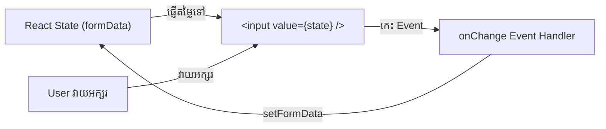

# 📝 Controlled Form Components

នៅក្នុង React **Controlled Component** គឺជា Form Input ដែលមានតម្លៃ `value` ត្រូវបានគ្រប់គ្រងដោយ React State ទាំងស្រុង ដែលធ្វើឱ្យ React ក្លាយជា **Single Source of Truth**។



---

## ការគ្រប់គ្រង Multiple Inputs ជាមួយ State តែមួយ

```tsx
import { useState, ChangeEvent, FormEvent } from "react";

interface UserFormState {
  fullName: string;
  email: string;
  role: string;
  agreeToTerms: boolean;
}

export function RegistrationForm() {
  const [formData, setFormData] = useState<UserFormState>({
    fullName: "",
    email: "",
    role: "student",
    agreeToTerms: false,
  });

  const handleChange = (e: ChangeEvent<HTMLInputElement | HTMLSelectElement>) => {
    const { name, value, type } = e.target;
    const checked = (e.target as HTMLInputElement).checked;

    setFormData((prev) => ({
      ...prev,
      [name]: type === "checkbox" ? checked : value,
    }));
  };

  const handleSubmit = (e: FormEvent) => {
    e.preventDefault();
    console.log("Form submitted payload:", formData);
    alert("ចុះឈ្មោះជោគជ័យ!");
  };

  return (
    <form onSubmit={handleSubmit} className="max-w-md p-6 bg-slate-900 rounded-2xl border border-slate-800 space-y-4 text-white">
      <h2 className="text-xl font-bold">បង្កើតគណនីថ្មី</h2>

      <div>
        <label className="block text-sm text-slate-300 mb-1">ឈ្មោះពេញ</label>
        <input
          type="text"
          name="fullName"
          value={formData.fullName}
          onChange={handleChange}
          required
          className="w-full px-4 py-2 bg-slate-800 border border-slate-700 rounded-lg"
        />
      </div>

      <div>
        <label className="block text-sm text-slate-300 mb-1">អ៊ីមែល</label>
        <input
          type="email"
          name="email"
          value={formData.email}
          onChange={handleChange}
          required
          className="w-full px-4 py-2 bg-slate-800 border border-slate-700 rounded-lg"
        />
      </div>

      <div>
        <label className="block text-sm text-slate-300 mb-1">តួនាទី</label>
        <select
          name="role"
          value={formData.role}
          onChange={handleChange}
          className="w-full px-4 py-2 bg-slate-800 border border-slate-700 rounded-lg"
        >
          <option value="student">សិស្ស / និស្សិត</option>
          <option value="developer">Developer</option>
          <option value="instructor">សាស្ត្រាចារ្យ</option>
        </select>
      </div>

      <label className="flex items-center gap-2 text-sm text-slate-300">
        <input
          type="checkbox"
          name="agreeToTerms"
          checked={formData.agreeToTerms}
          onChange={handleChange}
          className="rounded bg-slate-800 border-slate-700 text-indigo-600"
        />
        ខ្ញុំយល់ព្រមតាមលក្ខខណ្ឌប្រើប្រាស់
      </label>

      <button
        type="submit"
        disabled={!formData.agreeToTerms}
        className="w-full py-2.5 bg-indigo-600 hover:bg-indigo-500 disabled:opacity-50 text-white font-medium rounded-lg transition"
      >
        ចុះឈ្មោះឥឡូវនេះ
      </button>
    </form>
  );
}
```
