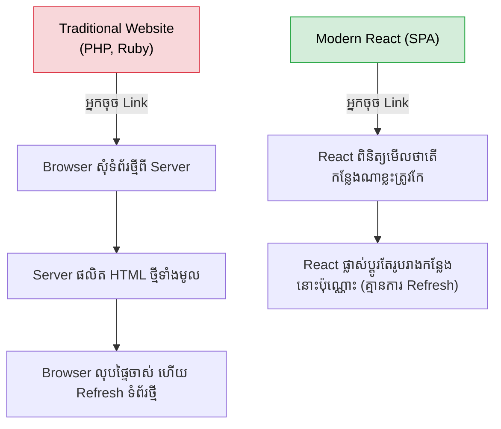

## ⚛️ អ្វីទៅជា React?

React គឺជាបណ្ណាល័យ JavaScript (JavaScript Library) មួយដែលបង្កើតឡើងដោយក្រុមហ៊ុន Meta (Facebook) នៅក្នុងឆ្នាំ 2013 សម្រាប់បង្កើតផ្ទាំងអន្តរកម្មអ្នកប្រើប្រាស់ (User Interfaces)។
បច្ចុប្បន្ន វាជាបច្ចេកវិទ្យាដែលពេញនិយមបំផុតនៅលើពិភពលោកសម្រាប់ការអភិវឌ្ឍន៍ផ្នែកខាងមុខ (Frontend)។

---

## 🧱 បេះដូងរបស់ React ទាំង ៣ យ៉ាង

ដើម្បីយល់ពី React អ្នកត្រូវយល់ពីគោលគំនិតធំៗចំនួន ៣ នេះសិន៖

### 1. Single Page Application (SPA)
ដូចបានបញ្ជាក់ក្នុង Quiz ខាងលើ React ប្រើប្រាស់ឯកសារ HTML តែមួយគត់គឺ `index.html`។ រាល់ពេលអ្នកប្រើប្រាស់ចុចផ្លាស់ប្តូរទំព័រ វាមិនមានការ Refresh នោះទេ តែវាគ្រាន់តែ "គូររូបរាង (Render)" ផ្នែកណាមួយឡើងវិញដោយប្រើ JavaScript ប៉ុណ្ណោះ ដែលធ្វើអោយវាលឿនជាងវេបសាយជំនាន់ចាស់។

### 2. Component-Based Architecture
ជំនួសអោយការសរសេរកូដ UI ដ៏វែងអន្លាយក្នុងឯកសារតែមួយ React បង្រៀនយើងអោយបំបែកវាជា "បំណែកតូចៗ" ហៅថា Components (ឧទាហរណ៍: Navbar Component, Button Component, Footer Component)។ 
អ្នកអាចយក Components ទាំងនេះទៅប្រើប្រាស់ឡើងវិញបាន (Reusable) ដែលធ្វើអោយកូដមានភាពស្អាត និងងាយស្រួលថែទាំ។

### 3. Virtual DOM (ការរៀបចំដ៏ឈ្លាសវៃ)
ធម្មតា ការបញ្ជាអោយ Browser កែប្រែផ្ទាំង HTML ដោយផ្ទាល់ (DOM Manipulation) គឺដើរយឺតណាស់។
React បានដោះស្រាយបញ្ហានេះដោយការបង្កើត **"Virtual DOM"** (ជារូបតំណាងនៃ DOM ដែលស្ថិតក្នុង Memory)។ រាល់ពេលមានការផ្លាស់ប្តូរ React នឹងយក Virtual DOM ថ្មី ទៅប្រៀបធៀបជាមួយ Virtual DOM ចាស់ រួចទាញយកតែ "ចំណុចដែលខុសគ្នា" ទៅកែលើ Browser ជាក់ស្តែង! (ដំណើរការនេះហៅថា **Reconciliation** ឬ **Diffing Algorithm**)។

---

## 🚀 ប្រព័ន្ធបរិស្ថាន (React Ecosystem)

React ខ្លួនវាផ្ទាល់គឺគ្រាន់តែជាបណ្ណាល័យសម្រាប់គូររូបរាង (UI Library) ប៉ុណ្ណោះ។ ដើម្បីបង្កើតវេបសាយដ៏ពេញលេញមួយ អ្នកត្រូវការឧបករណ៍ផ្សេងៗទៀត៖

- **Routing:** សម្រាប់គ្រប់គ្រងទំព័រ (ឧ. `react-router-dom`)
- **State Management:** សម្រាប់រក្សាទុកទិន្នន័យ (ឧ. `Redux`, `Zustand`)
- **Data Fetching:** សម្រាប់ទាញទិន្នន័យពី API (ឧ. `React Query`, `Axios`)
- **Meta-frameworks:** សម្រាប់ដោះស្រាយបញ្ហាធំៗដូចជា SEO (ឧ. `Next.js`, `Remix`)

នៅក្នុងវគ្គសិក្សានេះ យើងនឹងរៀនពីមូលដ្ឋានគ្រឹះដ៏រឹងមាំរបស់ React មុននឹងបន្តទៅសិក្សាពីឧបករណ៍ទាំងនេះ។
