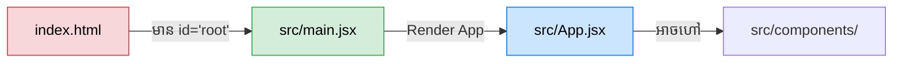

## 🛠️ ការដំឡើង និងបង្កើតគម្រោង

មុននឹងចាប់ផ្តើម អ្នកត្រូវប្រាកដថាអ្នកបានដំឡើង **Node.js** រួចរាល់នៅលើកុំព្យូទ័ររបស់អ្នក (សូមឆែកមើលដោយវាយ `node -v` ក្នុង Terminal)។

បច្ចុប្បន្ន វិធីសាស្ត្រដែលពេញនិយមនិងលឿនបំផុតក្នុងការបង្កើតគម្រោង React គឺការប្រើប្រាស់ **Vite**។

```bash
# 1. បង្កើតគម្រោងថ្មី (វានឹងសួរអ្នកអោយជ្រើសរើស Framework យក React រួចយក JavaScript ឬ TypeScript)
npm create vite@latest my-react-app -- --template react

# 2. ចូលទៅកាន់ Folder គម្រោងនោះ
cd my-react-app

# 3. ដំឡើងកញ្ចប់បណ្ណាល័យទាំងអស់ដែលចាំបាច់ (ទាញយកពី Internet)
npm install

# 4. ដំណើរការគម្រោងនៅលើកុំព្យូទ័ររបស់អ្នក (Local Development)
npm run dev
```

ចុចលើ Link (ឧទាហរណ៍ `http://localhost:5173/`) នោះអ្នកនឹងឃើញវេបសាយ React របស់អ្នកដំណើរការ!

---

## 📁 ការស្វែងយល់ពីរចនាសម្ព័ន្ធគម្រោង (Project Structure)

នៅពេលអ្នកបើកគម្រោងក្នុង VS Code អ្នកនឹងឃើញរចនាសម្ព័ន្ធជាច្រើន។ នេះជាផ្នែកសំខាន់ៗដែលអ្នកត្រូវដឹង៖



1. **`index.html`:** នេះគឺជាឯកសារ HTML តែមួយគត់នៃវេបសាយ (ព្រោះវាជា SPA)។ នៅខាងក្នុងនោះ អ្នកនឹងឃើញ `<div id="root"></div>` ដែលជាចំណុចចាប់ផ្តើម (Entry Point) សម្រាប់អោយ React ចូលទៅគូររូបរាង។
2. **`public/`:** ជាកន្លែងសម្រាប់ផ្ទុកឯកសារដែលមិនត្រូវការអោយ Vite វេចខ្ចប់ (ឧទាហរណ៍: រូបភាព icon ឫ ឯកសារ `robots.txt`)។ វាអាចត្រូវហៅដោយផ្ទាល់តាមរយៈ URL ដូចជា `/favicon.ico`។
3. **`src/` (Source):** នេះជា **កន្លែងដែលអ្នកចំណាយពេល ៩៩% ក្នុងការសរសេរកូដ!**
   - **`main.jsx`:** ជាអ្នកទទួលខុសត្រូវក្នុងការចាប់យក `<div id="root"></div>` និងបញ្ជាអោយកូដ React ចាប់ផ្តើមដំណើរការ (Render)។
   - **`App.jsx`:** ជា Component មេ (Root Component) ដែលផ្ទុក Components ផ្សេងៗទៀត។
   - **`assets/`:** កន្លែងផ្ទុករូបភាពដែលនឹងត្រូវវេចខ្ចប់ (Optimize) ដោយ Vite។
4. **`package.json`:** បញ្ជីរាយនាមបណ្ណាល័យទាំងអស់ដែលគម្រោងអ្នកត្រូវការ និងពាក្យបញ្ជា (Scripts) សម្រាប់ដំណើរការ។

---

## 📦 ពាក្យបញ្ជាសំខាន់ៗរបស់ NPM Scripts

អ្នកអាចមើលឃើញ Scripts នៅក្នុងឯកសារ `package.json`:

- **`npm run dev`:** ដំណើរការ Server សម្រាប់កែកូដប្រចាំថ្ងៃ។ វាមានល្បឿនលឿន និងចេះ Refresh ដោយស្វ័យប្រវត្តិ (HMR - Hot Module Replacement)។
- **`npm run build`:** ពេលអ្នកសរសេរចប់ ហើយចង់បញ្ជូនវេបសាយទៅអោយអតិថិជនប្រើ (Production) អ្នកត្រូវរត់ Command នេះ។ វានឹងច្របាច់កូដ React ទាំងអស់ទៅជា HTML, CSS, និង JS ធម្មតាដ៏តូចមួយ ចូលក្នុង Folder ឈ្មោះ `dist/`។
- **`npm run preview`:** ប្រើសម្រាប់សាកល្បងមើលលទ្ធផលវេបសាយនៅក្នុង Folder `dist/` (មុននឹងយកវាទៅបង្ហោះលើ Cloud)។
