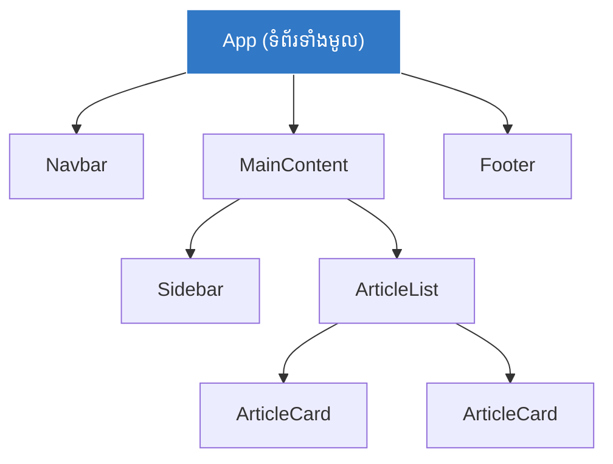

## 🧱 អ្វីទៅជា Components?

នៅក្នុង React, **Component** គឺជាបំណែកកូដ (JavaScript Function) មួយដែលតំណាងអោយផ្នែកណាមួយនៃ UI របស់អ្នក (ឧ. ប៊ូតុងមួយ, របារម៉ឺនុយ, ឫសូម្បីតែទំព័រទាំងមូល)។ 
វាអនុញ្ញាតអោយអ្នកបំបែកកូដដ៏ស្មុគស្មាញ អោយទៅជាកូដតូចៗ ងាយស្រួលអាន និងអាចយកទៅប្រើប្រាស់ឡើងវិញបានគ្រប់ទីកន្លែង។



បច្ចុប្បន្ន យើងប្រើប្រាស់ **Functional Components** (អនុគមន៍ JavaScript) ដើម្បីបង្កើតវា (កាលពីមុនគេប្រើ Class Components តែបច្ចុប្បន្នលែងមានអ្នកប្រើហើយ)។

```jsx
// 1. បង្កើត Component ឈ្មោះ Greeting
// ចំណាំ: ឈ្មោះត្រូវតែផ្តើមដោយអក្សរធំ (PascalCase)
function Greeting() {
  return <h1>សួស្តី អ្នកអភិវឌ្ឍន៍ React!</h1>;
}

// 2. ការយកមកប្រើប្រាស់
export default function App() {
  return (
    <div>
      <Greeting /> {/* ប្រើវាដូច HTML Tag ធម្មតា */}
      <Greeting /> {/* អ្នកអាចហៅវាប៉ុន្មានដងក៏បាន! */}
    </div>
  );
}
```

---

## 🧩 Component Composition (ការផ្គុំបំណែក)

ភាពស្រស់ស្អាតបំផុតនៃ React មិនមែនគ្រាន់តែការបង្កើត Component ដាច់ៗពីគ្នានោះទេ ប៉ុន្តែគឺជាការ **យកវាមកផ្គុំចូលគ្នា (Compose)**។ ការគិតបែប React គឺការសម្លឹងមើល UI ទាំងមូល រួចកាត់វាជាកង់ៗ!

ស្រមៃថាអ្នកចង់បង្កើតទំព័រពត៌មានមួយ ជំនួសអោយការសរសេរកូដរាប់រយជួរក្នុង `App` Component អ្នកអាចសរសេរវាបែបនេះ៖

```jsx
// កូដនេះងាយយល់ខ្លាំងណាស់ ព្រោះវាប្រៀបដូចជាការអានរឿងអញ្ចឹង!
function App() {
  return (
    <Layout>
      <Header />
      <div className="container">
        <Sidebar />
        <ArticleList />
      </div>
      <Footer />
    </Layout>
  );
}
```

### ហេតុអ្វីការបំបែក Components មានសារៈសំខាន់?
1. **ងាយស្រួលថែទាំ (Maintainability):** បើមានបញ្ហានៅលើ Footer អ្នកទៅបើកឯកសារ `Footer.jsx` មើលទៅ មិនបាច់ខ្វល់ពីកូដផ្សេងៗទេ។
2. **ការប្រើប្រាស់ឡើងវិញ (Reusability):** បើទំព័រ Contact ចង់បាន Header ដែរ អ្នកគ្រាន់តែហៅ `<Header />` យកទៅដាក់ជាការស្រេច។
3. **ផ្តោតលើតួនាទីតែមួយ (Single Responsibility Principle):** Component មួយ គួរតែធ្វើការងារតែមួយ។ `<ArticleCard />` មានតួនាទីបង្ហាញព័ត៌មានអត្ថបទតែមួយគត់ វាមិនគួរសរសេរលាយឡំជាមួយរបៀបទាញយកទិន្នន័យ (API fetching) រញ៉េរញ៉ៃឡើយ។

```reactdiagram
ComponentTree
```

នៅមេរៀនបន្ទាប់ យើងនឹងរៀនពីរបៀបបញ្ជូនទិន្នន័យ (Props) ពី Component ឪពុក ទៅអោយ Component កូន!
