## 🎮 Controlled Components (ការគ្រប់គ្រងដាច់ខាត)

នៅក្នុង HTML ធម្មតា ប្រអប់វាយអត្ថបទ `<input>` វាមានអំណាចរក្សាទុកទិន្នន័យ (State) របស់វាដោយខ្លួនឯង។ 
ប៉ុន្តែនៅក្នុង React យើងមិនចង់អោយវាយកខ្លួនទីពឹងខ្លួនទេ! យើងចង់អោយ **React State ជាមេបញ្ជាការដាច់ខាត (Single Source of Truth)** លើអ្វីដែលបង្ហាញនៅក្នុងប្រអប់។

បច្ចេកទេសនេះហៅថា **Controlled Components** ដែលទាមទារការភ្ជាប់ខ្សែ ២៖
1. `value` ភ្ជាប់ទៅកាន់ State របស់ React
2. `onChange` ភ្ជាប់ទៅកាន់ Setter Function ដើម្បីធ្វើបច្ចុប្បន្នភាព State

```mermaid
flowchart LR
    A["State: 'រដ្ឋា'"] -->|បោះចូល value| B["<input value={name}>"]
    B -->|អ្នកវាយអក្សរ 'ា'| C["onChange"]
    C -->|បញ្ជូន e.target.value| D["setName('រដ្ឋាា')"]
    D -->|ផ្លាស់ប្តូរតម្លៃ| A
    
    style A fill:#d4edda,stroke:#28a745,color:#000
    style B fill:#cce5ff,stroke:#007bff,color:#000
```



---

## 📝 របៀបប្រើប្រាស់ Input ប្រភេទផ្សេងៗ

```jsx
import { useState } from 'react';

function RegistrationForm() {
  // ប្រើប្រាស់ Object State ដើម្បីងាយស្រួលគ្រប់គ្រង
  const [formData, setFormData] = useState({
    username: '',
    country: 'kh',
    isAgreed: false
  });

  // អនុគមន៍ដ៏វៃឆ្លាតសម្រាប់គ្រប់គ្រង Input ទាំងអស់
  const handleChange = (e) => {
    const { name, value, type, checked } = e.target;
    
    setFormData(prev => ({
      ...prev,
      // ប្រសិនបើជា checkbox ត្រូវយក checked ជំនួសអោយ value
      [name]: type === 'checkbox' ? checked : value
    }));
  };

  return (
    <form>
      {/* 1. Text Input ธรรมดา */}
      <input 
        name="username" 
        value={formData.username} 
        onChange={handleChange} 
      />

      {/* 2. Select Dropdown */}
      <select name="country" value={formData.country} onChange={handleChange}>
        <option value="kh">កម្ពុជា</option>
        <option value="us">សហរដ្ឋអាមេរិក</option>
      </select>

      {/* 3. Checkbox (ចំណាំ: វាប្រើប្រាស់ checked ជាជំនួសអោយ value) */}
      <label>
        <input 
          type="checkbox" 
          name="isAgreed" 
          checked={formData.isAgreed} 
          onChange={handleChange} 
        /> 
        យល់ព្រមតាមលក្ខខណ្ឌ
      </label>
    </form>
  );
}
```

---

## 🛡️ ការចុច Submit និង ការបញ្ជាក់ភាពត្រឹមត្រូវ (Validation)

ដំណើរការនៃ Form មួយគួរតែមានទម្រង់៖ `Form State -> Validation -> Submit -> API`។

```jsx
function App() {
  const [email, setEmail] = useState('');
  const [error, setError] = useState('');

  const handleSubmit = (e) => {
    // 1. រារាំងការ Refresh ទំព័រ (សំខាន់បំផុត!)
    e.preventDefault();

    // 2. ការត្រួតពិនិត្យ (Validation)
    if (email.length === 0) {
      setError('សូមបញ្ចូលអ៊ីមែលសិន!');
      return; // បញ្ឈប់កូដត្រឹមនេះ
    }

    if (!email.includes('@')) {
      setError('ទម្រង់អ៊ីមែលមិនត្រឹមត្រូវទេ!');
      return;
    }

    // 3. បើកូដមកដល់ទីនេះ មានន័យថាជោគជ័យ
    setError('');
    alert(`កំពុងបញ្ជូនទិន្នន័យ: ${email}`);
    
    // 4. (ជម្រើស) សម្អាតទម្រង់
    setEmail('');
  };

  return (
    // ភ្ជាប់ Event ទៅលើផ្ទាំង <form> តែម្តង មិនមែនលើ <button> ទេ
    <form onSubmit={handleSubmit}>
      <input 
        value={email} 
        onChange={e => setEmail(e.target.value)} 
      />
      {/* បង្ហាញ Error បើមាន */}
      {error && <p style={{ color: 'red' }}>{error}</p>}
      
      <button type="submit">ផ្ញើ</button>
    </form>
  );
}
```

*(នៅពេលអ្នកធ្វើការលើគម្រោងធំៗនាពេលអនាគត អ្នកអាចប្រើប្រាស់បណ្ណាល័យជំនួយដូចជា **React Hook Form** ផ្គូផ្គងជាមួយ **Zod** ដើម្បីធ្វើអោយកូដ Validation កាន់តែមានសណ្តាប់ធ្នាប់)*
