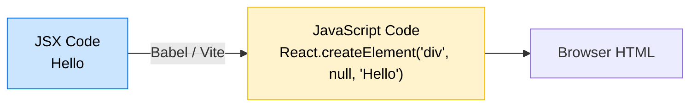

## 🎭 អ្វីទៅជា JSX?

**JSX (JavaScript XML)** គឺជាផ្នែកបន្ថែមនៃភាសា JavaScript ដែលអនុញ្ញាតអោយយើងសរសេរកូដដែលមានទម្រង់ដូច HTML នៅខាងក្នុងឯកសារ JavaScript ផ្ទាល់តែម្តង។ 



Browser មិនយល់ភាសា JSX នោះទេ! វាតែងតែត្រូវបានបម្លែង (Compiled) ទៅជា JavaScript សុទ្ធដោយឧបករណ៍ដូចជា Vite មុននឹងត្រូវដំណើរការ។

---

## 📏 ច្បាប់ទង់ដែងទាំង ៣ របស់ JSX

ដើម្បីសរសេរ JSX បានត្រឹមត្រូវ អ្នកត្រូវគោរពតាមច្បាប់ ៣ យ៉ាង៖

### 1. ត្រូវមាន Element ឪពុកតែមួយគត់ (Return a single root element)
អ្នកមិនអាច Return HTML ពីរទន្ទឹមគ្នាបានទេ។

```jsx
// ❌ ខុស (Error!)
function App() {
  return (
    <h1>សួស្តី</h1>
    <p>ស្វាគមន៍មកកាន់ React</p>
  );
}

// ✅ ត្រូវ (រុំវាដោយ div ឫ Fragment)
function App() {
  return (
    <>
      <h1>សួស្តី</h1>
      <p>ស្វាគមន៍មកកាន់ React</p>
    </>
  );
}
```
> `<></>` ហៅថា **Fragment** ត្រូវបានប្រើប្រាស់សម្រាប់អោប Elements ជាច្រើនបញ្ចូលគ្នា ដោយមិនបង្កើត Tag `<div/>` រញ៉េរញ៉ៃនៅក្នុង HTML ពិតប្រាកដ (DOM) ឡើយ។

### 2. ត្រូវបិទ Tags ទាំងអស់ (Close all the tags)
នៅក្នុង HTML ធម្មតា អ្នកអាចសរសេរ `` ឬ `<input>` ដោយមិនបាច់បិទបាន ប៉ុន្តែ JSX គឺតឹងរ៉ឹងណាស់ អ្នកត្រូវតែបិទវា៖ ``, `<input />`។

### 3. ប្រើប្រាស់ `camelCase` សម្រាប់ Attributes
នៅក្នុង JSX, Attributes របស់ HTML ភាគច្រើនត្រូវបានប្តូរឈ្មោះទៅជា `camelCase` (អក្សរតូចនៅមុខ អក្សរធំនៅកណ្តាល) ព្រោះពាក្យខ្លះជាន់ជាមួយ JavaScript។ 
- `class` ប្តូរទៅជា **`className`** (ព្រោះ `class` ជាន់ពាក្យក្នុង JS)
- `onclick` ប្តូរទៅជា **`onClick`**
- `for` (ក្នុង label) ប្តូរទៅជា **`htmlFor`**

---

## 🧮 ការបង្កប់ JavaScript ទៅក្នុង JSX (Expressions)

អំណាចពិតប្រាកដរបស់ JSX គឺសមត្ថភាពក្នុងការហៅទិន្នន័យ (Variables) ឬអនុគមន៍ JavaScript យកមកដាក់បង្ហាញនៅក្នុង HTML ដោយគ្រាន់តែប្រើប្រាស់សញ្ញាដង្កៀប **`{ }`** (Curly Braces)។

```jsx
function UserProfile() {
  const name = "រដ្ឋា";
  const age = 25;
  const imageUrl = "https://example.com/avatar.jpg";

  return (
    <div className="card">
      {/* បង្កប់អថេរ */}
      <h1>ឈ្មោះ: {name}</h1>
      
      {/* អាចធ្វើការគណនាបាន */}
      <p>ឆ្នាំក្រោយអាយុ: {age + 1}</p>
      
      {/* អាចបង្កប់កូដចូលក្នុង Attributes (ដកសញ្ញា " " ចេញ) */}
      
    </div>
  );
}
```

> ⚠️ **បម្រាម:** អ្នកអាចសរសេរបានតែប្រភេទ **Expressions** (អថេរ, ការគណនា, ឫការហៅ Function) នៅចន្លោះ `{ }` ប៉ុណ្ណោះ។ អ្នកមិនអាចសរសេរកូដមានលក្ខខណ្ឌដូចជា `if/else` ឫ ការប្រកាស `let x = 1` នៅក្នុងនោះបានទេ! (យើងនឹងរៀនពីវិធីសរសេរលក្ខខណ្ឌនៅមេរៀនក្រោយៗ)។
