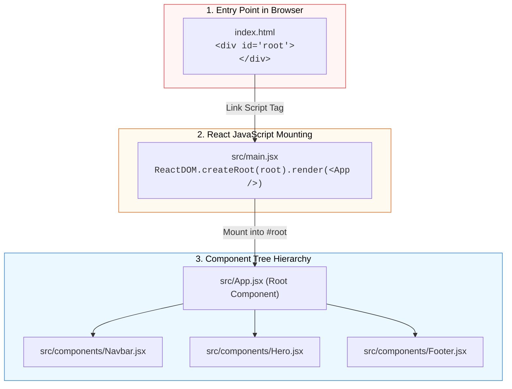
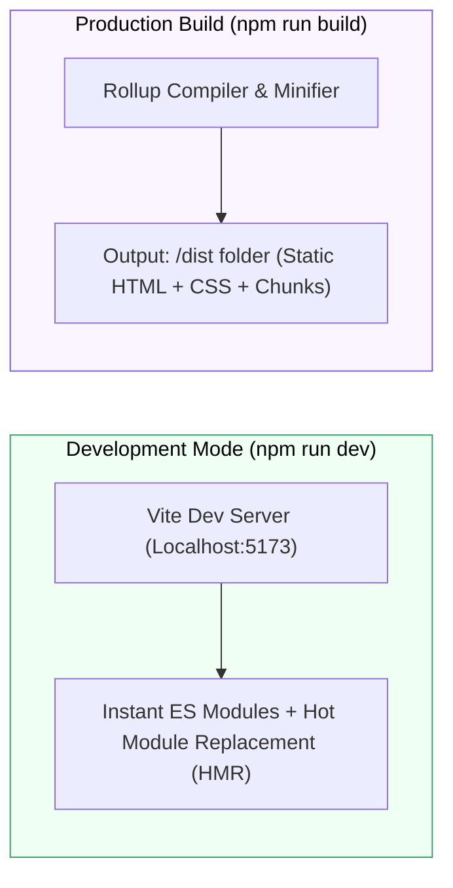

## ⚡ 1. ការបង្កើតគម្រោង React ជាមួយ Vite

**Vite** គឺជា Build Tool ជំនាន់ថ្មីដែលផ្តល់ល្បឿនលឿនបំផុតសម្រាប់ Frontend Development។

### ជំហានបង្កើតតាម Terminal៖

```bash
# 1. បង្កើតគម្រោងថ្មី (ជ្រើសរើស React រួចយក JavaScript)
npm create vite@latest my-react-app

# 2. ចូលទៅកាន់ Folder គម្រោង
cd my-react-app

# 3. ដំឡើង Dependencies
npm install
```

---

## 🎨 2. ការដំឡើង Tailwind CSS ក្នុង Vite (Tailwind Setup)

ដើម្បីសរសេរ Styling បានលឿន និងស្អាត យើងដំឡើង **Tailwind CSS** បន្ថែមចូលក្នុងគម្រោង Vite របស់យើង៖

### ជំហានទី ១: ដំឡើង Tailwind Packages
```bash
npm install -D tailwindcss postcss autoprefixer
npx tailwindcss init -p
```
*ពាក្យបញ្ជានេះនឹងបង្កើតឯកសារ `tailwind.config.js` និង `postcss.config.js` ឱ្យយើងដោយស្វ័យប្រវត្តិ។*

### ជំហានទី ២: កំណត់ Template Paths ក្នុង `tailwind.config.js`
បើកឯកសារ `tailwind.config.js` រួចបន្ថែម paths ក្នុង `content`៖
```javascript
/** @type {import('tailwindcss').Config} */
export default {
  content: [
    "./index.html",
    "./src/**/*.{js,ts,jsx,tsx}",
  ],
  theme: {
    extend: {},
  },
  plugins: [],
}
```

### ជំហានទី ៣: បន្ថែម Tailwind Directives ក្នុង `src/index.css`
លុបកូដចាស់ៗក្នុង `src/index.css` ចោលទាំងអស់ ហើយដាក់ ៣ បន្ទាត់នេះចូល៖
```css
@tailwind base;
@tailwind components;
@tailwind utilities;
```

### ជំហានទី ៤: ដំណើរការ Server និងតេស្តមើលលទ្ធផល
```bash
npm run dev
```

សាកល្បងសរសេរក្នុង `src/App.jsx`៖
```jsx
export default function App() {
  return (
    <div className="min-h-screen bg-slate-900 flex items-center justify-center p-6">
      <div className="bg-white p-8 rounded-3xl shadow-xl text-center max-w-sm">
        <h1 className="text-2xl font-black text-slate-800">⚛️ React + Vite + Tailwind</h1>
        <p className="text-slate-500 text-sm mt-2">ការដំឡើងទទួលបានជោគជ័យ ១០០%! 🎉</p>
        <button className="mt-4 px-5 py-2.5 bg-blue-600 hover:bg-blue-700 text-white font-bold rounded-xl transition shadow-md">
          Get Started
        </button>
      </div>
    </div>
  );
}
```

---

## 📁 រចនាសម្ព័ន្ធ Folder & Files (Project Architecture)



1. **`index.html`:** ឯកសារ HTML តែមួយគត់នៃ Single Page Application (SPA) ដែលផ្ទុក `<div id="root"></div>`។
2. **`src/main.jsx`:** Entry point របស់ React ដែលចាប់យក DOM element `#root` និង inject `<App />` ចូលតាមរយៈ `ReactDOM.createRoot()`។
3. **`src/App.jsx`:** Root Component ស្នូលដែលផ្គុំ Components ដទៃទៀត។
4. **`package.json`:** គ្រប់គ្រង Dependencies (ដូចជា `react`, `react-dom`) និង Scripts សម្រាប់ Run/Build។

---

## 📦 NPM Scripts Lifecycle



- **`npm run dev`:** បើក Local Server អមជាមួយ **Hot Module Replacement (HMR)** (កែកូដឃើញភ្លាមៗ)។
- **`npm run build`:** Compile កូដទាំងអស់ទៅជា minified static files ក្នុង folder `dist/` សម្រាប់ deploy ទៅ Production។
- **`npm run preview`:** តេស្តដំណើរការ Production build នៅលើ local machine មុន deploy។
