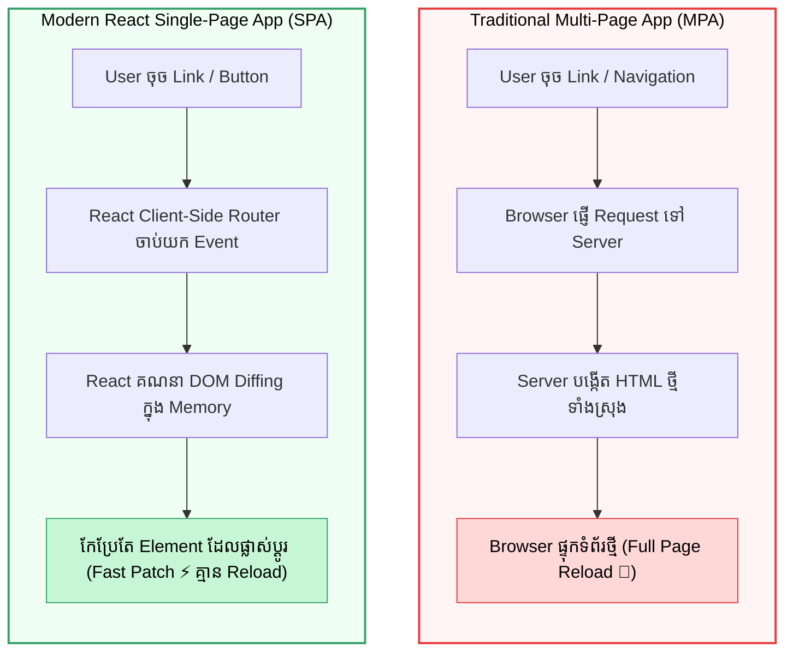
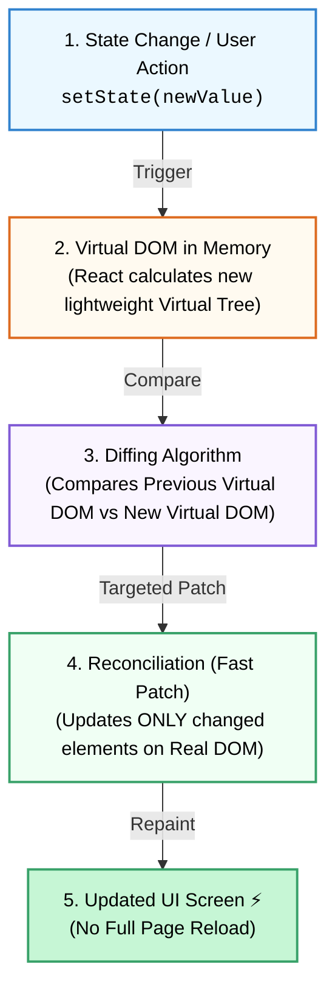

## ⚛️ 1. Single Page Application (SPA) Workflow

នៅក្នុង **Single Page Application (SPA)** Browser ទាញយកឯកសារ HTML តែមួយដងគត់ (`index.html`)។ រាល់ការ navigate ទៅកាន់ page ផ្សេងៗ គឺ React ប្រើប្រាស់ JavaScript ដើម្បី update DOM ដោយគ្មានការ Full Page Reload ឡើយ។

---

## 🎨 2. Virtual DOM & Reconciliation

ការបញ្ជាឱ្យ Browser កែប្រែ Real HTML DOM ផ្ទាល់គឺស៊ីកម្លាំង CPU និងយឺត។ React ដោះស្រាយបញ្ហានេះដោយបង្កើត **Virtual DOM** (ស្រមោលនៃ DOM នៅក្នុង JavaScript Memory)។

### ដំណើរការ ៤ ជំហាន៖
1. **Render Trigger:** State ឬ Props ផ្លាស់ប្តូរតម្លៃ។
2. **Generate New Tree:** React បង្កើត Virtual DOM Tree ថ្មីមួយក្នុង Memory។
3. **Diffing Algorithm:** React ប្រៀបធៀប Virtual DOM ថ្មី ជាមួយ Virtual DOM ចាស់។
4. **Reconciliation:** React ធ្វើការ patch តែ DOM nodes ដែលផ្លាស់ប្តូរទៅកាន់ Real DOM នៅលើអេក្រង់។
