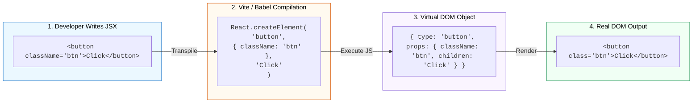

## 🎭 1. អ្វីទៅជា JSX?

**JSX (JavaScript XML)** គឺជា Syntax Extension ដែលអនុញ្ញាតឱ្យយើងសរសេរ HTML-like syntax នៅក្នុងឯកសារ JavaScript។



---

## 📏 2. វិធានគ្រឹះទាំង ៣ របស់ JSX (The 3 Core Rules)

1. **Single Root Element:** ត្រូវតែមាន Element មេតែមួយគត់ ឬប្រើ **Fragment** `<></>`៖
```jsx
// ✅ ត្រឹមត្រូវ (ប្រើ Fragment)
return (
  <>
    <h1>សួស្តី</h1>
    <p>ស្វាគមន៍មកកាន់ React</p>
  </>
);
```

2. **Close All Tags:** រាល់ Tags ទាំងអស់ត្រូវតែបិទជានិច្ច (រួមទាំង Self-closing tags ដូចជា ``, `<input />`, `<br />`)។

3. **camelCase Attributes:** ឈ្មោះ HTML Attributes ត្រូវប្តូរជា camelCase៖
   - `class` $\rightarrow$ **`className`**
   - `onclick` $\rightarrow$ **`onClick`**
   - `for` $\rightarrow$ **`htmlFor`**

---

## 🧮 3. ការប្រើប្រាស់ JavaScript Expressions ក្នុង `{ }`

យើងអាចបញ្ចូល JavaScript Variables, Calculations, ឬ Function Calls ចូលក្នុង JSX ដោយប្រើប្រាស់សញ្ញា **`{ }`** (Curly Braces)៖

```jsx
export default function UserGreeting() {
  const userName = "រដ្ឋា";
  const unreadCount = 5;

  return (
    <div className="card">
      <h2>សួស្តី, {userName.toUpperCase()}! 👋</h2>
      <p>សារមិនទាន់អាន: {unreadCount * 2} សារ</p>
    </div>
  );
}
```
