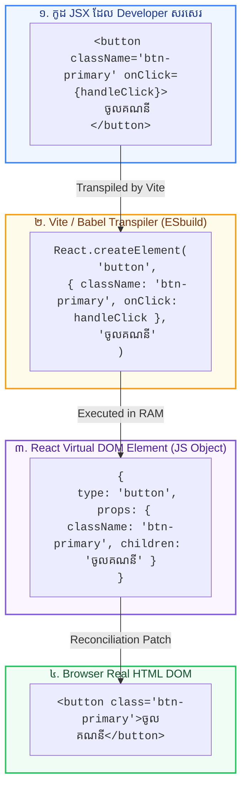

## 🎭 ១. ដំណើរការ Transpilation នៃ JSX (Behind the Scenes)

**JSX (JavaScript XML)** មិនមែនជា HTML ពិតប្រាកដឡើយ — វាគឺជា Syntax Extension ដែលបង្កើតឡើងដើម្បីឱ្យ Developer អាចសរសេរ UI Components ក្នុង JavaScript ដោយស្រួលមើល។



---

## 📏 ២. វិធានមាសទាំង ៣ របស់ JSX (The 3 Core Rules)

### វិធានទី ១ ៖ Single Root Element (ឬប្រើ React Fragment)
គ្រប់ Component ត្រូវតែ Return Element មេតែមួយគត់។ ប្រសិនបើមិនចង់បន្ថែម `<div>` បន្ថែមលើ DOM ទេ ចូរប្រើ **Fragment** `<>...</>`៖

```jsx
// ❌ ខុស: Return Elements ពីរទន្ទឹមគ្នា (Syntax Error)
return (
  <h1>ចំណងជើង</h1>
  <p>កថាខណ្ឌ</p>
);

// ✅ ត្រឹមត្រូវ: ប្រើ React Fragment (<>...</>)
return (
  <>
    <h1>ចំណងជើង</h1>
    <p>កថាខណ្ឌ</p>
  </>
);
```

---

### វិធានទី ២ ៖ បិទគ្រប់ Tags ទាំងអស់ (Close All Tags)
ក្នុង HTML ធម្មតា Tag មួយចំនួនដូចជា `` ឬ `<input>` មិនបាច់បិទក៏បាន ប៉ុន្តែក្នុង JSX រាល់ Tag ទាំងអស់ត្រូវតែបិទជាដាច់ខាត (Self-Closing Tags)៖

```jsx
// ❌ ខុសក្នុង JSX

<input type="text">
<br>

// ✅ ត្រឹមត្រូវក្នុង JSX

<input type="text" placeholder="វាយឈ្មោះ..." />
<br />
```

---

### វិធានទី ៣ ៖ ប្រើប្រាស់ camelCase សម្រាប់ Attributes
ដោយសារ JSX គឺស្ថិតក្នុងឯកសារ JavaScript Attributes ភាគច្រើនត្រូវសរសេរជា camelCase៖

| HTML ធម្មតា | JSX ក្នុង React | មូលហេតុបច្ចេកទេស |
| :--- | :--- | :--- |
| `class="btn"` | **`className="btn"`** | `class` ជា JS Reserved Word សម្រាប់ Object Classes |
| `for="email"` | **`htmlFor="email"`** | `for` ជា JS Reserved Word សម្រាប់ For Loop |
| `onclick="..."` | **`onClick={...}`** | ប្រើប្រាស់ React Synthetic Event System |
| `tabindex="0"` | **`tabIndex={0}`** | អនុវត្តតាម camelCase convention |
| `stroke-width` | **`strokeWidth`** | SVG Attributes ត្រូវប្តូរជា camelCase |

---

## 🧮 ៣. ការបង្កប់ JavaScript Expressions ក្នុង `{ }`

សញ្ញា **Curly Braces `{ }`** ប្រៀបដូចជាបង្អួចវេទមន្តដែលអនុញ្ញាតឱ្យយើងដំណើរការកូដ JavaScript ណាមួយក៏បាន (Variables, Math, String Methods, Ternaries) នៅខាងក្នុង HTML UI៖

```jsx
// src/components/UserProfileCard.jsx
import React from 'react';

export default function UserProfileCard() {
  const user = {
    firstName: 'សុខ',
    lastName: 'ដារ៉ា',
    role: 'Full-Stack Developer',
    experienceYears: 4,
    avatarUrl: 'https://images.unsplash.com/photo-1534528741775-53994a69daeb?w=150',
    isProMember: true,
  };

  const currentYear = new Date().getFullYear();

  return (
    <div className="max-w-sm mx-auto p-6 bg-white dark:bg-slate-900 rounded-3xl border border-slate-200 dark:border-slate-800 shadow-xl text-center">
      {/* Dynamic Image & Alt Expression */}
      

      {/* String Concatenation Expression */}
      <h2 className="text-xl font-black text-slate-800 dark:text-white">
        {user.firstName} {user.lastName}
      </h2>

      <p className="text-xs font-semibold text-blue-600 dark:text-blue-400 mt-0.5">
        {user.role}
      </p>

      {/* Math Calculation Expression */}
      <div className="mt-4 p-3 bg-slate-50 dark:bg-slate-800 rounded-2xl flex justify-around text-xs font-bold text-slate-600 dark:text-slate-300">
        <div>
          <p className="text-slate-400 font-medium">បទពិសោធន៍</p>
          <p className="text-base text-slate-800 dark:text-white mt-0.5">{user.experienceYears} ឆ្នាំ</p>
        </div>
        <div className="border-r border-slate-200 dark:border-slate-700" />
        <div>
          <p className="text-slate-400 font-medium">ឆ្នាំចាប់ផ្តើម</p>
          <p className="text-base text-slate-800 dark:text-white mt-0.5">{currentYear - user.experienceYears}</p>
        </div>
      </div>

      {/* Ternary Condition Expression */}
      <div className="mt-4">
        {user.isProMember ? (
          <span className="inline-flex items-center gap-1 px-3 py-1 bg-amber-500/10 text-amber-600 dark:text-amber-400 text-xs font-black rounded-full border border-amber-500/20">
            ⭐ PRO SUBSCRIBER
          </span>
        ) : (
          <span className="text-xs text-slate-400 font-medium">FREE TIER</span>
        )}
      </div>
    </div>
  );
}
```

---

## 🔍 ៤. ការពន្យល់កូដមួយជួរៗ (Line-by-Line Breakdown)

1. `alt={\`${user.firstName} ${user.lastName}\`}`
   - ប្រើ Template Literal ខាងក្នុង `{}` ដើម្បីបូកបញ្ចូល string ឈ្មោះ និងត្រកូលចូលទៅក្នុង Attribute `alt`។
2. `{currentYear - user.experienceYears}`
   - គណនា phép trừ គណិតវិទ្យាដោយផ្ទាល់ក្នុង JSX (ឧ. `2026 - 4 = 2022`)។
3. `{user.isProMember ? (...) : (...)}`
   - ប្រើ Ternary Operator ដើម្បីបង្ហាញ Badge ផ្សេងគ្នាតាមលក្ខខណ្ឌ Boolean។ ហាមប្រើ `if-else` statement ក្នុង `{}` ព្រោះ `if-else` មិនមែនជា Expression ដែល return តម្លៃឡើយ។
4. `<div className="border-r ..."/>`
   - Self-closing tag ត្រឹមត្រូវតាមស្តង់ដារ JSX។

---

## 💡 ៥. អ្វីដែល *អាច* និង *មិនអាច* ដាក់ក្នុង `{ }`

| ប្រភេទ Expression | អាចដាក់ក្នុង `{ }` បាន? | ឧទាហរណ៍ |
| :--- | :---: | :--- |
| **Variables & Math** | ✅ បាន | `{price * quantity}`, `{user.name}` |
| **Function Calls** | ✅ បាន | `{formatPrice(100)}`, `{title.toUpperCase()}` |
| **Ternary Operator** | ✅ បាន | `{isLoggedIn ? <Logout /> : <Login />}` |
| **Logical AND (`&&`)** | ✅ បាន | `{hasUnread && <Badge count={3} />}` |
| **`if-else` Statements** | ❌ មិនបាន | ត្រូវប្តូរទៅប្រើ Ternary `?:` ជំនួស |
| **`for` Loops** | ❌ មិនបាន | ត្រូវប្តូរទៅប្រើ `.map()` ជំនួស |
| **Raw Objects** | ❌ មិនបាន (Error) | `{ { name: "Sok" } }` នឹង throw React child error |
