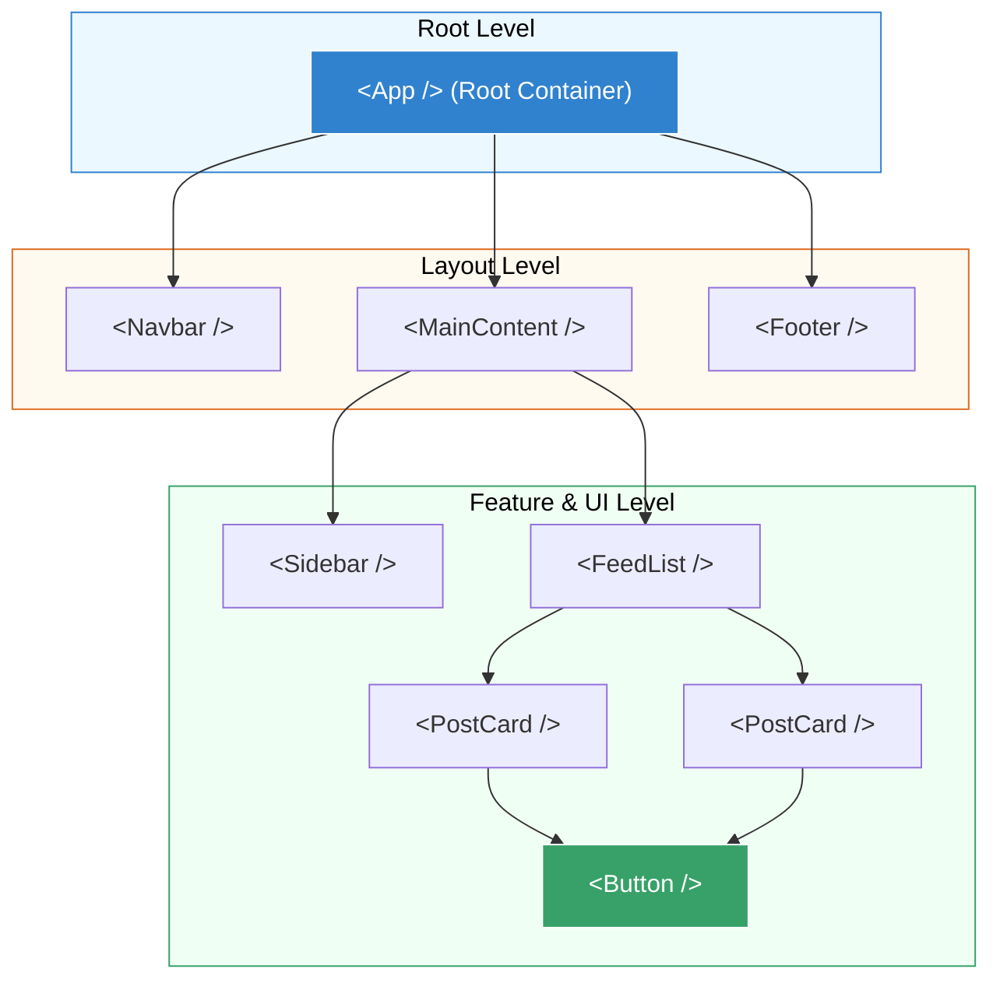

## 🧩 1. អ្វីទៅជា Functional Component?

នៅក្នុង React, **Component** គឺជា JavaScript Function ដែលទទួល Data និង return ចេញជា JSX សម្រាប់គូរ UI នៅលើ Browser។ ឈ្មោះ Component ត្រូវតែចាប់ផ្តើមដោយ **PascalCase** (អក្សរធំនៅខាងមុខ) ជានិច្ច។

```jsx
// 1. បង្កើត Button Component
export function PrimaryButton() {
  return <button className="btn-primary">ចុចទីនេះ</button>;
}
```

---

## 🌳 2. Component Hierarchy & Nesting

យើងអាចយក Components តូចៗមកផ្គុំគ្នា (Nesting) បង្កើតជារចនាសម្ព័ន្ធទំព័រពេញលេញមួយ៖



---

## 📦 3. Modular Imports & Exports

ដើម្បីឱ្យកូដស្អាត យើងបំបែក Component នីមួយៗដាក់ក្នុងឯកសារដាច់ដោយឡែកពីគ្នា ក្នុង folder `src/components/`៖

```javascript
// ឯកសារ: src/components/Header.jsx
export default function Header() {
  return <header><h1>គេហទំព័ររបស់ខ្ញុំ</h1></header>;
}

// ឯកសារ: src/components/Badge.jsx (Named Export)
export function Badge({ label }) {
  return <span className="badge">{label}</span>;
}
```

នាំចូលមកប្រើក្នុង `App.jsx`៖
```jsx
// ឯកសារ: src/App.jsx
import Header from './components/Header';       // Default Import
import { Badge } from './components/Badge';     // Named Import

export default function App() {
  return (
    <div>
      <Header />
      <Badge label="New Feature" />
    </div>
  );
}
```
