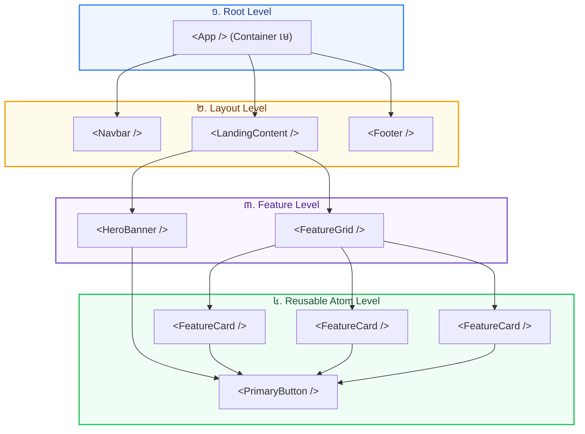

## 🧩 ១. កាយវិភាគវិទ្យានៃ Functional Component (Component Anatomy)

នៅក្នុង React, **Component** គឺជា Pure JavaScript Function មួយដែលទទួល Inputs (Props) និង Return ចេញជា JSX Element សម្រាប់បង្ហាញលើអេក្រង់ ៖

```jsx
// 1. Function Name ត្រូវតែជា PascalCase (អក្សរធំនៅខាងមុខ)
export function StatusBadge({ status = 'active' }) {
  // 2. Component Logic (JavaScript code)
  const isOnline = status === 'active';

  // 3. Return JSX UI
  return (
    <span className={`inline-flex items-center gap-1.5 px-2.5 py-1 rounded-full text-xs font-bold ${
      isOnline ? 'bg-emerald-50 text-emerald-600' : 'bg-slate-100 text-slate-500'
    }`}>
      <span className={`w-2 h-2 rounded-full ${isOnline ? 'bg-emerald-500' : 'bg-slate-400'}`} />
      {isOnline ? 'Active' : 'Offline'}
    </span>
  );
}
```

---

## 🌳 ២. រចនាសម្ព័ន្ធ Component Tree Hierarchy (Component Nesting)

Component អាចត្រូវបានយកមកផ្គុំគ្នាតាមលំដាប់ជាន់ថ្នាក់ (Parent-Child Hierarchy) ដូចជាមែកធាង ៖



---

## 📦 ៣. ការបែងចែក ES6 Modules: Default vs Named Exports

| លក្ខណៈពិសេស | `Default Export` | `Named Export` |
| :--- | :--- | :--- |
| **ចំនួនក្នុងមួយ File** | មានបានតែ **១ គត់** (`export default ...`) | អាចមាន **ច្រើន** (`export function A()`, `export const B`) |
| **ការ Export** | `export default function Navbar() { ... }` | `export function Button() { ... }` |
| **ការ Import** | `import Navbar from './Navbar'` | `import { Button } from './Button'` |
| **ការប្តូរឈ្មោះពេល Import** | អាចដាក់ឈ្មោះតាមចិត្ត (`import MyNav ...`) | ត្រូវប្រើ `as` (`import { Button as PrimaryBtn } ...`) |
| **ការណែនាំប្រើប្រាស់** | សមស្របសម្រាប់ **Page ឬ Main Component** | សមស្របសម្រាប់ **UI Kits, Icons, Utilities** |

---

## 💻 ៤. កូដគំរូនៃប្រព័ន្ធ Component Modular Architecture

### ១. `src/components/FeatureCard.jsx` (Named Export)

```jsx
// src/components/FeatureCard.jsx
import React from 'react';

export function FeatureCard({ icon, title, description, isHighlighted = false }) {
  return (
    <div className={`p-6 rounded-3xl border transition-all duration-300 hover:shadow-lg ${
      isHighlighted
        ? 'bg-gradient-to-br from-blue-600 to-indigo-700 text-white border-blue-500 shadow-blue-500/20 shadow-md'
        : 'bg-white dark:bg-slate-900 text-slate-800 dark:text-white border-slate-200 dark:border-slate-800'
    }`}>
      <div className={`w-12 h-12 rounded-2xl flex items-center justify-center text-2xl mb-4 ${
        isHighlighted ? 'bg-white/20' : 'bg-blue-50 dark:bg-blue-900/30 text-blue-600'
      }`}>
        {icon}
      </div>
      <h3 className="text-lg font-black leading-tight mb-2">{title}</h3>
      <p className={`text-xs leading-relaxed ${isHighlighted ? 'text-blue-100' : 'text-slate-500 dark:text-slate-400'}`}>
        {description}
      </p>
    </div>
  );
}
```

---

### ២. `src/components/Navbar.jsx` (Named Export)

```jsx
// src/components/Navbar.jsx
import React from 'react';

export function Navbar() {
  return (
    <header className="px-6 py-4 bg-white/80 dark:bg-slate-900/80 backdrop-blur-md border-b border-slate-200 dark:border-slate-800 sticky top-0 z-40">
      <div className="max-w-6xl mx-auto flex items-center justify-between">
        <div className="flex items-center gap-2 font-black text-lg text-slate-900 dark:text-white">
          <span className="text-2xl">⚡</span>
          <span>FastReact</span>
        </div>
        <nav className="flex items-center gap-4">
          <button className="px-4 py-2 text-xs font-bold text-slate-600 dark:text-slate-300 hover:text-blue-600">
            មេរៀន
          </button>
          <button className="px-4 py-2 bg-blue-600 hover:bg-blue-700 text-white font-bold text-xs rounded-xl shadow-sm transition">
            ចាប់ផ្តើមរៀន →
          </button>
        </nav>
      </div>
    </header>
  );
}
```

---

### ៣. `src/App.jsx` (Default Export & Integration)

```jsx
// src/App.jsx
import React from 'react';
import { Navbar } from './components/Navbar';
import { FeatureCard } from './components/FeatureCard';

export default function App() {
  return (
    <div className="min-h-screen bg-slate-50 dark:bg-slate-950 font-sans">
      <Navbar />

      <main className="max-w-6xl mx-auto px-6 py-12 space-y-12">
        {/* Hero Section */}
        <section className="text-center space-y-4 max-w-2xl mx-auto">
          <span className="px-3 py-1 bg-blue-50 dark:bg-blue-900/30 text-blue-600 dark:text-blue-400 text-xs font-black rounded-full uppercase tracking-wider">
            ⚛️ Modular Component Architecture
          </span>
          <h1 className="text-4xl font-black text-slate-900 dark:text-white leading-tight">
            រៀនបង្កើត React Components ប្រកបដោយវិជ្ជាជីវៈ
          </h1>
          <p className="text-sm text-slate-500 dark:text-slate-400">
            បំបែកកូដធំៗទៅជា Reusable Components តូចៗដែលងាយស្រួលអាន ងាយស្រួលតេស្ត និងងាយស្រួលថែទាំ។
          </p>
        </section>

        {/* Feature Grid Section */}
        <section className="grid grid-cols-1 md:grid-cols-3 gap-6">
          <FeatureCard
            icon="⚡"
            title="ល្បឿនលឿនជាមួយ Vite"
            description="បង្កើត និង Compile កូដជាមួយ Native ES Modules ផ្តល់ Hot Module Replacement (HMR) ភ្លាមៗ 0ms។"
          />
          <FeatureCard
            icon="🧩"
            title="Reusable Components"
            description="សរសេរកូដម្តង យកទៅប្រើប្រាស់បានរាប់សិបកន្លែងដោយគ្រាន់តែបញ្ជូន Props ខុសៗគ្នា។"
            isHighlighted={true}
          />
          <FeatureCard
            icon="🛡️"
            title="Type-Safe & Scalable"
            description="រចនាសម្ព័ន្ធ Folder ច្បាស់លាស់ ងាយស្រួលពង្រីកសម្រាប់គម្រោង Enterprise ខ្នាតធំ។"
          />
        </section>
      </main>
    </div>
  );
}
```

---

## 🔍 ៥. ការពន្យល់កូដមួយជួរៗ (Line-by-Line Breakdown)

1. `export function FeatureCard({ icon, title, description, isHighlighted = false })`
   - បង្កើត Named Export Component ដែល Destructure យក Props ភ្លាមៗនៅ parameter list ព្រមទាំងកំណត់ Default Value `isHighlighted = false`។
2. `import { Navbar } from './components/Navbar';`
   - Named Import ពី Folder `components` ដោយប្រើ Curly Braces `{}` ដើម្បីនាំចូល Component ជាក់លាក់។
3. `export default function App() { ... }`
   - Default Export សម្រាប់ Root Component ដែលតំណាងឱ្យទំព័រទាំងមូល។
4. `<FeatureCard isHighlighted={true} ... />`
   - ប្រើប្រាស់ Component ដដែល តែផ្តល់ Stylistic Appearance ខុសគ្នាទាំងស្រុងដោយគ្រាន់តែបញ្ជូន Prop `isHighlighted`។

---

## 💡 ៦. Component Best Practices សម្រាប់ Developer

- [x] ដាក់ឯកសារ Component មួយក្នុងមួយ File ជានិច្ច (ឧ. `Navbar.jsx`)
- [x] ដាក់ឈ្មោះ Component និង File ជា **PascalCase** (ឧ. `FeatureCard.jsx` មិនមែន `featureCard.jsx`)
- [x] រក្សា Component ឱ្យខ្លី និងងាយយល់ (ក្រោម ១៥០ បន្ទាត់) — បើវែងពេក ចូរពិចារណាបំបែកជា Sub-components
- [x] ដាក់ Reusable Components ក្នុង Folder `src/components/` និង Page Views ក្នុង `src/pages/`
