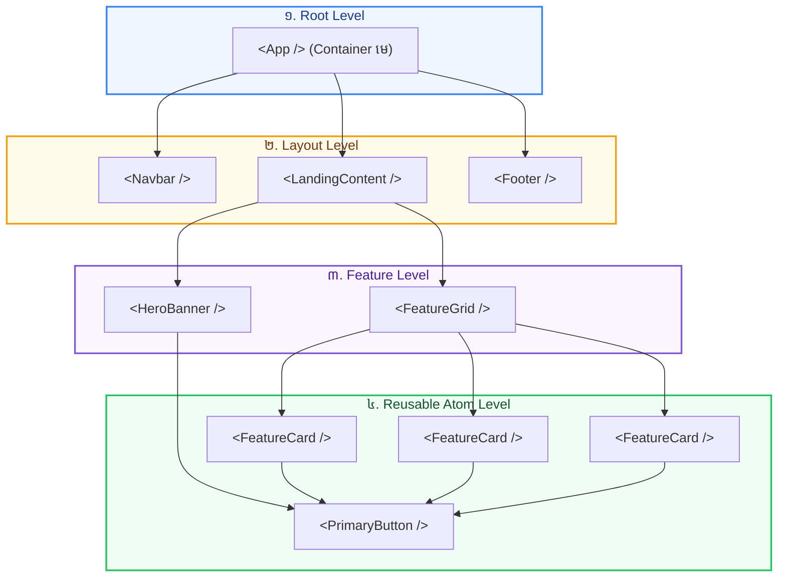

## 🧩 ១. Component Anatomy & Architecture

> [!IMPORTANT]
> **និយមន័យ Functional Component (Definition) ៖**  
> **React Functional Component** គឺជា JavaScript Function ធម្មតាមួយដែលទទួលទិន្នន័យពីខាងក្រៅ (ហៅថា `props`) ជា Argument ហើយ Return ត្រឡប់មកវិញនូវ React Elements (តាមរយៈ JSX) ដើម្បី Render បង្ហាញលើ UI។ ឈ្មោះរបស់ Component ត្រូវតែសរសេរជា **PascalCase** (ចាប់ផ្តើមដោយអក្សរធំ)។

នៅក្នុង React, **Component** គឺជា Pure JavaScript Function មួយដែលទទួល Inputs (Props) និង Return ចេញជា JSX Element សម្រាប់បង្ហាញលើអេក្រង់ ៖

```jsx
// 1. Function Name ត្រូវតែជា PascalCase (អក្សរធំនៅខាងមុខ)
export function StatusBadge({ status = 'active' }) {
  // 2. Component Logic (JavaScript code)
  const isOnline = status === 'active';

  // 3. Return JSX UI
  return (
    <span className={`inline-flex items-center gap-1.5 px-2.5 py-1 rounded-full text-xs font-bold ${
      isOnline ? 'bg-emerald-50 text-emerald-600' : 'bg-slate-100 text-slate-500'
    }`}>
      <span className={`w-2 h-2 rounded-full ${isOnline ? 'bg-emerald-500' : 'bg-slate-400'}`} />
      {isOnline ? 'Active' : 'Offline'}
    </span>
  );
}
```

### 🔍 ការពន្យល់កូដ `StatusBadge` មួយជួរៗ (Line-by-Line Breakdown)

| បន្ទាត់ (Line) | កូដ (Code) | ការពន្យល់លម្អិតបច្ចេកទេស |
| :--- | :--- | :--- |
| **Line 51** | `export function StatusBadge({ status = 'active' }) {` | **1. `export`** ៖ អនុញ្ញាតឱ្យឯកសារដទៃអាច import ទៅប្រើប្រាស់បាន (Named Export)។<br/>**2. `StatusBadge`** ៖ ឈ្មោះជា **PascalCase** (អក្សរធំ `S` និង `B`) ដើម្បីឱ្យ React ដឹងថាជា Custom Component មិនមែនជា HTML Native Element។<br/>**3. `{ status = 'active' }`** ៖ ធ្វើ **Object Destructuring** យក prop `status` ផ្ទាល់ និងកំណត់ Default Value ស្មើ `'active'` ប្រសិនបើ Parent មិនបានបញ្ជូនមក។ |
| **Line 53** | `const isOnline = status === 'active';` | **Component Logic** ៖ គណនាតម្លៃ Boolean (`true` ឬ `false`) ដោយប្រៀបធៀបតម្លៃ prop ជាមួយ string `'active'` សម្រាប់យកទៅប្រើប្រាស់ក្នុងការកំណត់ Style និង Text។ |
| **Line 56** | `return (` | **JSX Return** ៖ ចាប់ផ្តើម Return នូវ React Element ត្រឡប់ទៅ Render លើ Virtual DOM។ Component ត្រូវតែ return តែ Root Element មួយគត់។ |
| **Line 57-59** | `<span className={`inline-flex ... ${isOnline ? '...' : '...'}`}>` | **Dynamic ClassName with Template Literals** ៖ ប្រើប្រាស់ `${...}` ដើម្បីផ្លាស់ប្តូរ Style ដោយស្វ័យប្រវត្តិតាម `isOnline` ៖ ប្រសិនបើ Online ប្រើផ្ទៃពណ៌បៃតងខ្ចី (`bg-emerald-50 text-emerald-600`) ហើយបើ Offline ប្រើពណ៌ប្រផេះ (`bg-slate-100 text-slate-500`)។ |
| **Line 60** | `<span className={`w-2 h-2 rounded-full ${isOnline ? ...}`} />` | **Self-Closing Indicator Dot** ៖ បង្កើតសញ្ញាចុចមូលតូចមួយបង្ហាញពី Status Dot ដែលប្តូរពណ៌តាមលក្ខខណ្ឌ។ |
| **Line 61** | `{isOnline ? 'Active' : 'Offline'}` | **JSX Expression Slot** ៖ ប្រើ `{}` ដើម្បីដំណើរការ JavaScript Ternary Expression បង្ហាញអក្សរ `'Active'` ឬ `'Offline'` ទៅតាម State ជាក់ស្តែង។ |
| **Line 63-64** | `</span> ); }` | បិទ Root Element និងបញ្ចប់តួ Functional Component។ |

---

## 🌳 ២. រចនាសម្ព័ន្ធ Component Tree Hierarchy (Component Nesting)

Component អាចត្រូវបានយកមកផ្គុំគ្នាតាមលំដាប់ជាន់ថ្នាក់ (Parent-Child Hierarchy) ដូចជាមែកធាង ៖


```mermaid
flowchart TD
    subgraph Root["១. Root Level"]
        App["&lt;App /&gt; (Container មេ)"]
    end

    subgraph Layout["២. Layout Level"]
        Nav["&lt;Navbar /&gt;"]
        Main["&lt;LandingContent /&gt;"]
        Foot["&lt;Footer /&gt;"]
    end

    subgraph Feature["៣. Feature Level"]
        Hero["&lt;HeroBanner /&gt;"]
        Grid["&lt;FeatureGrid /&gt;"]
    end

    subgraph Atoms["៤. Reusable Atom Level"]
        Card1["&lt;FeatureCard /&gt;"]
        Card2["&lt;FeatureCard /&gt;"]
        Card3["&lt;FeatureCard /&gt;"]
        Btn["&lt;PrimaryButton /&gt;"]
    end

    App --> Nav
    App --> Main
    App --> Foot

    Main --> Hero
    Main --> Grid

    Grid --> Card1 & Card2 & Card3
    Hero --> Btn
    Card1 --> Btn
    Card2 --> Btn
    Card3 --> Btn

    style Root fill:#eff6ff,stroke:#3b82f6,stroke-width:2px,color:#1e3a8a
    style Layout fill:#fffbeb,stroke:#f59e0b,stroke-width:2px,color:#78350f
    style Feature fill:#faf5ff,stroke:#805ad5,stroke-width:2px,color:#4c1d95
    style Atoms fill:#f0fdf4,stroke:#22c55e,stroke-width:2px,color:#14532d
```

---

## 📦 ៣. ការបែងចែក ES6 Modules: Default vs Named Exports

| លក្ខណៈពិសេស | `Default Export` | `Named Export` |
| :--- | :--- | :--- |
| **ចំនួនក្នុងមួយ File** | មានបានតែ **១ គត់** (`export default ...`) | អាចមាន **ច្រើន** (`export function A()`, `export const B`) |
| **ការ Export** | `export default function Navbar() { ... }` | `export function Button() { ... }` |
| **ការ Import** | `import Navbar from './Navbar'` | `import { Button } from './Button'` |
| **ការប្តូរឈ្មោះពេល Import** | អាចដាក់ឈ្មោះតាមចិត្ត (`import MyNav ...`) | ត្រូវប្រើ `as` (`import { Button as PrimaryBtn } ...`) |
| **ការណែនាំប្រើប្រាស់** | សមស្របសម្រាប់ **Page ឬ Main Component** | សមស្របសម្រាប់ **UI Kits, Icons, Utilities** |

---

## 💻 ៤. កូដគំរូនៃប្រព័ន្ធ Component Modular Architecture

### ១. `src/components/FeatureCard.jsx` (Named Export)

```jsx
// src/components/FeatureCard.jsx
import React from 'react';

export function FeatureCard({ icon, title, description, isHighlighted = false }) {
  return (
    <div className={`p-6 rounded-3xl border transition-all duration-300 hover:shadow-lg ${
      isHighlighted
        ? 'bg-gradient-to-br from-blue-600 to-indigo-700 text-white border-blue-500 shadow-blue-500/20 shadow-md'
        : 'bg-white dark:bg-slate-900 text-slate-800 dark:text-white border-slate-200 dark:border-slate-800'
    }`}>
      <div className={`w-12 h-12 rounded-2xl flex items-center justify-center text-2xl mb-4 ${
        isHighlighted ? 'bg-white/20' : 'bg-blue-50 dark:bg-blue-900/30 text-blue-600'
      }`}>
        {icon}
      </div>
      <h3 className="text-lg font-black leading-tight mb-2">{title}</h3>
      <p className={`text-xs leading-relaxed ${isHighlighted ? 'text-blue-100' : 'text-slate-500 dark:text-slate-400'}`}>
        {description}
      </p>
    </div>
  );
}
```

---

### ២. `src/components/Navbar.jsx` (Named Export)

```jsx
// src/components/Navbar.jsx
import React from 'react';

export function Navbar() {
  return (
    <header className="px-6 py-4 bg-white/80 dark:bg-slate-900/80 backdrop-blur-md border-b border-slate-200 dark:border-slate-800 sticky top-0 z-40">
      <div className="max-w-6xl mx-auto flex items-center justify-between">
        <div className="flex items-center gap-2 font-black text-lg text-slate-900 dark:text-white">
          <span className="text-2xl">⚡</span>
          <span>FastReact</span>
        </div>
        <nav className="flex items-center gap-4">
          <button className="px-4 py-2 text-xs font-bold text-slate-600 dark:text-slate-300 hover:text-blue-600">
            មេរៀន
          </button>
          <button className="px-4 py-2 bg-blue-600 hover:bg-blue-700 text-white font-bold text-xs rounded-xl shadow-sm transition">
            ចាប់ផ្តើមរៀន →
          </button>
        </nav>
      </div>
    </header>
  );
}
```

---

### ៣. `src/App.jsx` (Default Export & Integration)

```jsx
// src/App.jsx
import React from 'react';
import { Navbar } from './components/Navbar';
import { FeatureCard } from './components/FeatureCard';

export default function App() {
  return (
    <div className="min-h-screen bg-slate-50 dark:bg-slate-950 font-sans">
      <Navbar />

      <main className="max-w-6xl mx-auto px-6 py-12 space-y-12">
        {/* Hero Section */}
        <section className="text-center space-y-4 max-w-2xl mx-auto">
          <span className="px-3 py-1 bg-blue-50 dark:bg-blue-900/30 text-blue-600 dark:text-blue-400 text-xs font-black rounded-full uppercase tracking-wider">
            ⚛️ Modular Component Architecture
          </span>
          <h1 className="text-4xl font-black text-slate-900 dark:text-white leading-tight">
            រៀនបង្កើត React Components ប្រកបដោយវិជ្ជាជីវៈ
          </h1>
          <p className="text-sm text-slate-500 dark:text-slate-400">
            បំបែកកូដធំៗទៅជា Reusable Components តូចៗដែលងាយស្រួលអាន ងាយស្រួលតេស្ត និងងាយស្រួលថែទាំ។
          </p>
        </section>

        {/* Feature Grid Section */}
        <section className="grid grid-cols-1 md:grid-cols-3 gap-6">
          <FeatureCard
            icon="⚡"
            title="ល្បឿនលឿនជាមួយ Vite"
            description="បង្កើត និង Compile កូដជាមួយ Native ES Modules ផ្តល់ Hot Module Replacement (HMR) ភ្លាមៗ 0ms។"
          />
          <FeatureCard
            icon="🧩"
            title="Reusable Components"
            description="សរសេរកូដម្តង យកទៅប្រើប្រាស់បានរាប់សិបកន្លែងដោយគ្រាន់តែបញ្ជូន Props ខុសៗគ្នា។"
            isHighlighted={true}
          />
          <FeatureCard
            icon="🛡️"
            title="Type-Safe & Scalable"
            description="រចនាសម្ព័ន្ធ Folder ច្បាស់លាស់ ងាយស្រួលពង្រីកសម្រាប់គម្រោង Enterprise ខ្នាតធំ។"
          />
        </section>
      </main>
    </div>
  );
}
```

---

## 🔍 ៥. ការពន្យល់កូដមួយជួរៗតាមឯកសារ និង Component (Deep-Dive Breakdown)

ដើម្បីឱ្យយល់ច្បាស់ ១០០% ពីរបៀបដែលកូដដំណើរការ ខាងក្រោមនេះជាការពន្យល់លម្អិតតាមឯកសារ (File-by-File), តាម Component (Component-by-Component), និងតាមបន្ទាត់កូដនីមួយៗ (Line-by-Line) ៖

---

### 📁 ឯកសារទី ១ ៖ `src/components/FeatureCard.jsx` (Domain Component)
* **តួនាទីឯកសារ (File Role) ៖** ឯកសារនេះផ្ទុក `<FeatureCard />` Component ដែលមានភារកិច្ចតែមួយគត់ (Single Responsibility) គឺបង្ហាញកាតព័ត៌មាន Feature ដោយទទួលទិន្នន័យពីខាងក្រៅតាមរយៈ Props។

```jsx
// src/components/FeatureCard.jsx
import React from 'react'; // [Line 1]

export function FeatureCard({ icon, title, description, isHighlighted = false }) { // [Line 3]
  return ( // [Line 4]
    <div className={`p-6 rounded-3xl border transition-all duration-300 hover:shadow-lg ${ // [Line 5]
      isHighlighted // [Line 6]
        ? 'bg-gradient-to-br from-blue-600 to-indigo-700 text-white border-blue-500 shadow-blue-500/20 shadow-md' // [Line 7]
        : 'bg-white dark:bg-slate-900 text-slate-800 dark:text-white border-slate-200 dark:border-slate-800' // [Line 8]
    }`}> // [Line 9]
      <div className={`w-12 h-12 rounded-2xl flex items-center justify-center text-2xl mb-4 ${ // [Line 10]
        isHighlighted ? 'bg-white/20' : 'bg-blue-50 dark:bg-blue-900/30 text-blue-600' // [Line 11]
      }`}> // [Line 12]
        {icon} // [Line 13]
      </div> // [Line 14]
      <h3 className="text-lg font-black leading-tight mb-2">{title}</h3> // [Line 15]
      <p className={`text-xs leading-relaxed ${isHighlighted ? 'text-blue-100' : 'text-slate-500 dark:text-slate-400'}`}> // [Line 16]
        {description} // [Line 17]
      </p> // [Line 18]
    </div> // [Line 19]
  ); // [Line 20]
} // [Line 21]
```

#### 📋 តារាងពន្យល់បន្ទាត់កូដនៃ `FeatureCard.jsx`:
| បន្ទាត់ (Line) | សេចក្តីពន្យល់លម្អិត |
| :--- | :--- |
| **Line 1** | `import React from 'react';` — នាំចូល React Library សម្រាប់គាំទ្រ JSX និង IDE Type Safety។ |
| **Line 3** | `export function FeatureCard({ ... })` — **Named Export** ជាមួយ **Props Destructuring** ៖ ដកស្រង់យក props ទាំង ៤ ដោយផ្ទាល់ (`icon`, `title`, `description`, `isHighlighted`) ព្រមទាំងផ្តល់តម្លៃ Default `isHighlighted = false` ក្នុងករណី Caller មិនបានបញ្ជូនវា។ |
| **Line 4-5** | `return ( <div className={...}>` — ចាប់ផ្តើម JSX Container ដោយកំណត់ base styles (padding `p-6`, កាច់ជ្រុង `rounded-3xl`, ព្រមទាំង smooth hover animation `transition-all duration-300 hover:shadow-lg`)។ |
| **Line 6-8** | `isHighlighted ? '...' : '...'` — **Conditional Styling** ៖ ប្រសិនបើកាតត្រូវបាន Highlight វានឹងប្រើ Gradient Background ពណ៌ខៀវ-ស្វាយ (`from-blue-600 to-indigo-700`) អមដោយ Glow Shadow; បើមិន Highlight ទេ វានឹងប្រើសាច់ពណ៌សស្អាតលើ Light mode ឬ slate លើ Dark mode។ |
| **Line 10-14** | `<div className={...}>{icon}</div>` — កន្លែងដាក់រូប Emoji ឬ Icon ដោយមានរាងមូលកោង និង Background ទន់ភ្លន់តាម Theme នៃកាត។ |
| **Line 15** | `<h3 className="..."> {title} </h3>` — បង្ហាញចំណងជើង Feature ដោយអក្សរដិតខ្លាំង (`font-black`) និងទំហំសមល្មម (`text-lg`)។ |
| **Line 16-18** | `<p className="..."> {description} </p>` — បង្ហាញអត្ថបទពិពណ៌នា ដោយប្តូរពណ៌អក្សរទៅជាពណ៌សស្រាល (`text-blue-100`) ពេល Highlight ឬពណ៌ប្រផេះ (`text-slate-500`) ពេលធម្មតា។ |
| **Line 19-21** | បិទ `<div>` tag និងបញ្ចប់មុខងារ `FeatureCard` Component។ |

---

### 📁 ឯកសារទី ២ ៖ `src/components/Navbar.jsx` (Layout Component)
* **តួនាទីឯកសារ (File Role) ៖** បង្ហាញ Header Navigation Bar ដែលស្ថិតនៅជាប់ខាងលើគេជានិច្ច (`sticky top-0`) ជាមួយកញ្ចក់ថ្លាព្រាល (Glassmorphism Effect)។

```jsx
// src/components/Navbar.jsx
import React from 'react'; // [Line 1]

export function Navbar() { // [Line 3]
  return ( // [Line 4]
    <header className="px-6 py-4 bg-white/80 dark:bg-slate-900/80 backdrop-blur-md border-b border-slate-200 dark:border-slate-800 sticky top-0 z-40"> // [Line 5]
      <div className="max-w-6xl mx-auto flex items-center justify-between"> // [Line 6]
        <div className="flex items-center gap-2 font-black text-lg text-slate-900 dark:text-white"> // [Line 7]
          <span className="text-2xl">⚡</span> // [Line 8]
          <span>FastReact</span> // [Line 9]
        </div> // [Line 10]
        <nav className="flex items-center gap-4"> // [Line 11]
          <button className="px-4 py-2 text-xs font-bold text-slate-600 dark:text-slate-300 hover:text-blue-600"> // [Line 12]
            មេរៀន // [Line 13]
          </button> // [Line 14]
          <button className="px-4 py-2 bg-blue-600 hover:bg-blue-700 text-white font-bold text-xs rounded-xl shadow-sm transition"> // [Line 15]
            ចាប់ផ្តើមរៀន → // [Line 16]
          </button> // [Line 17]
        </nav> // [Line 18]
      </div> // [Line 19]
    </header> // [Line 20]
  ); // [Line 21]
} // [Line 22]
```

#### 📋 តារាងពន្យល់បន្ទាត់កូដនៃ `Navbar.jsx`:
| បន្ទាត់ (Line) | សេចក្តីពន្យល់លម្អិត |
| :--- | :--- |
| **Line 3** | `export function Navbar() {` — **Named Export** នៃ Stateless Component (គ្មានទទួល Props ទេ ព្រោះវាជា Static UI Header)។ |
| **Line 5** | `<header className="... backdrop-blur-md sticky top-0 z-40">` —<br/>• `sticky top-0`: ធ្វើឱ្យ Header អណ្តែតនៅជាប់កំពូលអេក្រង់រហូតពេល User Scroll ចុះក្រោម។<br/>• `backdrop-blur-md`: បង្កើត Glassmorphism Effect ព្រាលផ្ទៃខាងក្រោយពេល Content ធ្លាក់មកក្រោម Header។<br/>• `z-40`: កំណត់ជាន់ z-index ខ្ពស់ ដើម្បីកុំឱ្យ Content ខាងក្រោមលេចធ្លាយមកពីលើ Header។ |
| **Line 6** | `<div className="max-w-6xl mx-auto flex ... justify-between">` — កំណត់ទំហំទទឹងអតិបរមា (`max-w-6xl`), តម្រឹមកណ្តាលអេក្រង់ (`mx-auto`), និងរុញ Logo ទៅឆ្វេង រុញ Navigation Buttons ទៅស្តាំ (`justify-between`)។ |
| **Line 7-10** | Brand Identity — បង្ហាញ Logo Icon និងឈ្មោះ Brand `FastReact`។ |
| **Line 11-18** | `<nav>` Navigation Actions — បង្ហាញ Menu Buttons រួមទាំង Call-To-Action (CTA) Button ពណ៌ខៀវ (`bg-blue-600`)។ |

---

### 📁 ឯកសារទី ៣ ៖ `src/App.jsx` (Root Assembly Component)
* **តួនាទីឯកសារ (File Role) ៖** ជា Root Component មេដែលគ្រប់គ្រងការផ្គុំ (Composition) នៃ Components ទាំងអស់ និងបញ្ជូនទិន្នន័យជាក់ស្តែងតាមរយៈ Props។

```jsx
// src/App.jsx
import React from 'react'; // [Line 1]
import { Navbar } from './components/Navbar'; // [Line 2]
import { FeatureCard } from './components/FeatureCard'; // [Line 3]

export default function App() { // [Line 5]
  return ( // [Line 6]
    <div className="min-h-screen bg-slate-50 dark:bg-slate-950 font-sans"> // [Line 7]
      <Navbar /> // [Line 8]

      <main className="max-w-6xl mx-auto px-6 py-12 space-y-12"> // [Line 10]
        {/* Hero Section */} // [Line 11]
        <section className="text-center space-y-4 max-w-2xl mx-auto"> // [Line 12]
          <span className="px-3 py-1 bg-blue-50 dark:bg-blue-900/30 text-blue-600 dark:text-blue-400 text-xs font-black rounded-full uppercase tracking-wider"> // [Line 13]
            ⚛️ Modular Component Architecture // [Line 14]
          </span> // [Line 15]
          <h1 className="text-4xl font-black text-slate-900 dark:text-white leading-tight"> // [Line 16]
            រៀនបង្កើត React Components ប្រកបដោយវិជ្ជាជីវៈ // [Line 17]
          </h1> // [Line 18]
          <p className="text-sm text-slate-500 dark:text-slate-400"> // [Line 19]
            បំបែកកូដធំៗទៅជា Reusable Components តូចៗដែលងាយស្រួលអាន ងាយស្រួលតេស្ត និងងាយស្រួលថែទាំ។ // [Line 20]
          </p> // [Line 21]
        </section> // [Line 22]

        {/* Feature Grid Section */} // [Line 24]
        <section className="grid grid-cols-1 md:grid-cols-3 gap-6"> // [Line 25]
          <FeatureCard // [Line 26]
            icon="⚡" // [Line 27]
            title="ល្បឿនលឿនជាមួយ Vite" // [Line 28]
            description="បង្កើត និង Compile កូដជាមួយ Native ES Modules ផ្តល់ Hot Module Replacement (HMR) ភ្លាមៗ 0ms។" // [Line 29]
          /> // [Line 30]
          <FeatureCard // [Line 31]
            icon="🧩" // [Line 32]
            title="Reusable Components" // [Line 33]
            description="សរសេរកូដម្តង យកទៅប្រើប្រាស់បានរាប់សិបកន្លែងដោយគ្រាន់តែបញ្ជូន Props ខុសៗគ្នា។" // [Line 34]
            isHighlighted={true} // [Line 35]
          /> // [Line 36]
          <FeatureCard // [Line 37]
            icon="🛡️" // [Line 38]
            title="Type-Safe & Scalable" // [Line 39]
            description="រចនាសម្ព័ន្ធ Folder ច្បាស់លាស់ ងាយស្រួលពង្រីកសម្រាប់គម្រោង Enterprise ខ្នាតធំ។" // [Line 40]
          /> // [Line 41]
        </section> // [Line 42]
      </main> // [Line 43]
    </div> // [Line 44]
  ); // [Line 45]
} // [Line 46]
```

#### 📋 តារាងពន្យល់បន្ទាត់កូដនៃ `App.jsx`:
| បន្ទាត់ (Line) | សេចក្តីពន្យល់លម្អិត |
| :--- | :--- |
| **Line 2-3** | `import { Navbar } ...; import { FeatureCard } ...;` — នាំចូល Child Components ទាំងពីរពី Folder `src/components/` ដោយប្រើ Named Imports (Curly Braces `{}`) ស្របតាមរបៀបដែលពួកវាត្រូវបាន Export។ |
| **Line 5** | `export default function App() {` — **Default Export** សម្រាប់ Main Component។ ឯកសារ `src/main.jsx` នឹង import យក Component នេះទៅ Render ចូលក្នុង HTML Root DOM (`#root`)។ |
| **Line 7** | `<div className="min-h-screen bg-slate-50 ...">` — Base Wrapper ដែលធានាថា Background លាតពេញកម្ពស់អេក្រង់កុំព្យូទ័រ (`min-h-screen`) ទាំង Light & Dark modes។ |
| **Line 8** | `<Navbar />` — ហៅ Render Header Navigation តែមួយដងគត់នៅផ្នែកខាងលើនៃ Layout។ |
| **Line 10-22** | `<main>` & Hero Section — តំបន់កណ្តាលនៃទំព័រ បង្ហាញ Badge, H1 Title, និង Tagline។ |
| **Line 25** | `<section className="grid grid-cols-1 md:grid-cols-3 gap-6">` — រៀបចំ **CSS Responsive Grid** ៖ នៅលើទូរស័ព្ទដៃបង្ហាញ ១ ជួរឈរ (`grid-cols-1`) ចំណែកលើកុំព្យូទ័របង្ហាញ ៣ ជួរឈរស្មើគ្នា (`md:grid-cols-3`) អមដោយគម្លាត `gap-6` (24px)។ |
| **Line 26-30** | `<FeatureCard icon="⚡" ... />` — ហៅ Instance ទី ១ នៃ `FeatureCard` ដោយមិនបញ្ជូន `isHighlighted` (វាទាញយក default value = `false`)។ |
| **Line 31-36** | `<FeatureCard isHighlighted={true} ... />` — ហៅ Instance ទី ២ នៃ `FeatureCard` ដោយបញ្ជូន `isHighlighted={true}` ➔ Component នឹងឆ្លើយតបដោយផ្លាស់ប្តូររូបរាងទៅជាកាត Gradient ពណ៌ខៀវលេចធ្លោជាងគេភ្លាមៗ! |
| **Line 37-41** | `<FeatureCard icon="🛡️" ... />` — ហៅ Instance ទី ៣ នៃ `FeatureCard` សម្រាប់បង្ហាញចំណុចខ្លាំងផ្នែក Enterprise Scalability។ |

---

## 💡 ៦. Component Best Practices សម្រាប់ Developer

- [x] ដាក់ឯកសារ Component មួយក្នុងមួយ File ជានិច្ច (ឧ. `Navbar.jsx`)
- [x] ដាក់ឈ្មោះ Component និង File ជា **PascalCase** (ឧ. `FeatureCard.jsx` មិនមែន `featureCard.jsx`)
- [x] រក្សា Component ឱ្យខ្លី និងងាយយល់ (ក្រោម ១៥០ បន្ទាត់) — បើវែងពេក ចូរពិចារណាបំបែកជា Sub-components
- [x] ដាក់ Reusable Components ក្នុង Folder `src/components/` និង Page Views ក្នុង `src/pages/`
