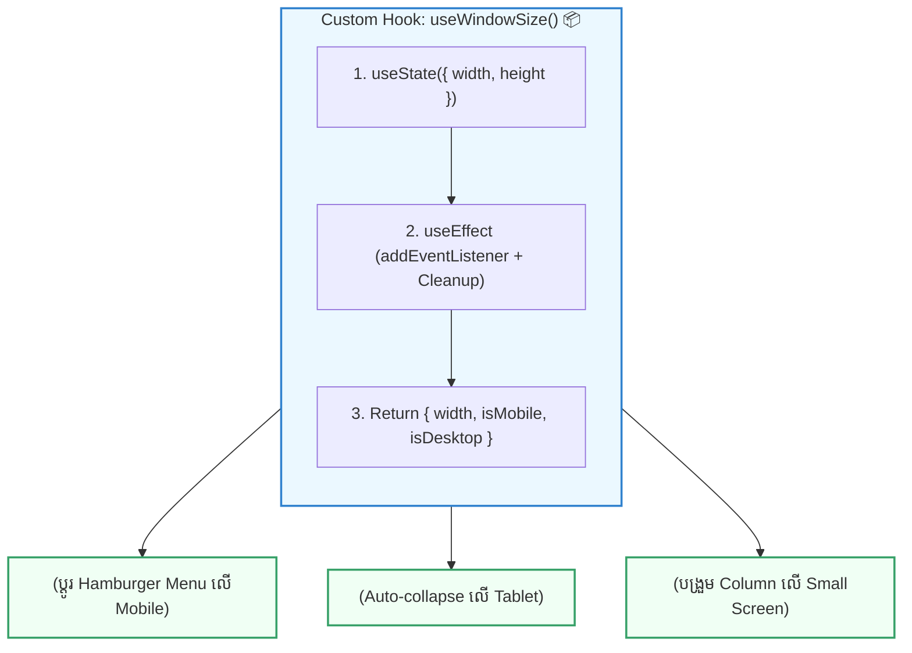

## 🎯 ១. តើអ្វីទៅជា Custom Hook? (Mental Model)

នៅក្នុង React Component យើងតែងតែសរសេរ UI (JSX) និង Logic (State, Effects, Event Handlers)។ នៅពេលដែល Components ផ្សេងៗគ្នាត្រូវការ Logic ដដែលៗ (ដូចជា ពិនិត្យទំហំ Screen, ទាញយក Data, ឬ Save ទៅ Storage) យើងមិនត្រូវ Copy/Paste កូដឡើយ។

**Custom Hook** គឺជា JavaScript Function ធម្មតាមួយដែល៖
1. ចាប់ផ្តើមដោយឈ្មោះ **`use...`**
2. អាចហៅ React Built-in Hooks (`useState`, `useEffect`, `useRef`, `useCallback`) នៅខាងក្នុងខ្លួនវាបាន
3. ច្របាច់បញ្ចូល **Stateful Logic** ឱ្យក្លាយជា Reusable Module (ចែករំលែក Logic មិនមែន UI ទេ!)



---

## 📜 ២. ច្បាប់មាសទាំង ២ នៃ Hooks (The 2 Golden Rules)

> [!IMPORTANT]
> **ច្បាប់ទី ១ ៖ Only Call Hooks at the Top Level**  
> ហាមហៅ Hooks នៅខាងក្នុង `if` conditions, loops (`for`, `while`), ឬ nested functions ជាដាច់ខាត! ត្រូវហៅនៅកំពូលគេនៃ React Component ជានិច្ច។

```javascript
// ❌ ខុសធ្ងន់ធ្ងរ: ហៅ Hook ក្នុង Condition
function BadComponent({ isMember }) {
  if (isMember) {
    useEffect(() => { ... }, []); // 💣 នឹងបង្ក Error ពេល isMember ប្រែប្រួល!
  }
}

// ✅ ត្រឹមត្រូវ: ហៅ Hook នៅ Top-level ហើយដាក់ Condition ខាងក្នុង Effect វិញ
function GoodComponent({ isMember }) {
  useEffect(() => {
    if (isMember) {
      console.log('Member profile loaded');
    }
  }, [isMember]);
}
```

> [!IMPORTANT]
> **ច្បាប់ទី ២ ៖ Only Call Hooks from React Functions**  
> អាចហៅ Hooks បានតែចេញពី **React Functional Components** ឬ **Custom Hooks** ផ្សេងទៀតប៉ុណ្ណោះ ហាមហៅក្នុង Regular JavaScript Utility functions ធម្មតា។

---

## 💻 ៣. ការអនុវត្តជាក់ស្តែង ៖ បង្កើត `useWindowSize` & `useMediaQuery`

### 📂 ឯកសារ `src/hooks/useWindowSize.js`

```javascript
// src/hooks/useWindowSize.js
import { useState, useEffect } from 'react';

export function useWindowSize() {
  // ១. State រក្សាទុកទទឹង និងកម្ពស់ Window
  const [windowSize, setWindowSize] = useState({
    width: typeof window !== 'undefined' ? window.innerWidth : 1200,
    height: typeof window !== 'undefined' ? window.innerHeight : 800,
  });

  useEffect(() => {
    // ២. Event Handler ពេល Window ផ្លាស់ប្តូរទំហំ
    const handleResize = () => {
      setWindowSize({
        width: window.innerWidth,
        height: window.innerHeight,
      });
    };

    // ៣. ចុះឈ្មោះ Listener លើ Window
    window.addEventListener('resize', handleResize);

    // ៤. 🧹 Cleanup Listener ពេល Component Unmount
    return () => {
      window.removeEventListener('resize', handleResize);
    };
  }, []);

  return {
    width: windowSize.width,
    height: windowSize.height,
    isMobile: windowSize.width < 768,
    isTablet: windowSize.width >= 768 && windowSize.width < 1024,
    isDesktop: windowSize.width >= 1024,
  };
}
```

---

## 🚀 ៤. ការប្រើប្រាស់ក្នុង Component (Responsive Layout)

```jsx
// src/components/ResponsiveNavbar.jsx
import { useWindowSize } from '../hooks/useWindowSize';

export default function ResponsiveNavbar() {
  // ហៅ Custom Hook ត្រឹមតែ ១ ជួរ!
  const { width, isMobile, isDesktop } = useWindowSize();

  return (
    <nav className="p-4 bg-white dark:bg-slate-900 border-b border-slate-200 dark:border-slate-800 flex justify-between items-center max-w-2xl mx-auto rounded-2xl shadow-sm">
      <div className="flex items-center gap-2">
        <span className="text-xl">⚡</span>
        <h1 className="font-bold text-sm text-slate-800 dark:text-white">
          Responsive App
        </h1>
        <span className="text-[10px] font-mono px-2 py-0.5 bg-slate-100 dark:bg-slate-800 rounded-md text-slate-500">
          {width}px
        </span>
      </div>

      {/* RENDER UI តាម SCREEN TYPE */}
      {isMobile ? (
        <button
          onClick={() => alert('បើក Mobile Drawer Menu')}
          className="px-3 py-1.5 bg-indigo-600 text-white rounded-xl text-xs font-bold shadow"
        >
          🍔 Menu
        </button>
      ) : (
        <div className="flex gap-4 text-xs font-semibold text-slate-600 dark:text-slate-300">
          <a href="#home" className="hover:text-indigo-600">ទំព័រដើម</a>
          <a href="#courses" className="hover:text-indigo-600">វគ្គសិក្សា</a>
          <a href="#about" className="hover:text-indigo-600">អំពីយើង</a>
          {isDesktop && (
            <button className="px-3 py-1 bg-indigo-600 text-white rounded-lg font-bold">
              ចូលរៀន
            </button>
          )}
        </div>
      )}
    </nav>
  );
}
```

---

## 🔍 ៥. ការវិភាគចំណុចគន្លឹះ

1. **Clean Separation of Concerns:**  
   Component `ResponsiveNavbar` មិនចាំបាច់ដឹងពីរបៀប register `window.addEventListener('resize')` ឬលុប `removeEventListener` ឡើយ — វាគ្រាន់តែអាន `{ isMobile }` ហើយ Render UI ភ្លាមៗ។
2. **Derived Properties ក្នុង Return Object:**  
   នៅក្នុង `useWindowSize` យើងមិនត្រឹមតែ return `width` ទេ ថែមទាំងផ្តល់នូវ boolean helpers ស្រាប់ (`isMobile`, `isTablet`, `isDesktop`) ដែលជួយសម្រួលការសរសេរកូដក្នុង UI Components យ៉ាងច្រើន។

---

## 🧠 ៦. សង្ខេប Mental Model ងាយចាំ

| លក្ខណៈវិនិច្ឆ័យ | Return ជា Array Tuple `[a, b]` | Return ជា Object `{ a, b, c }` |
| :--- | :--- | :--- |
| **ភាពបត់បែនក្នុងការ Rename** | ងាយស្រួល Rename តាមចំណូលចិត្ត | ត្រូវប្រើ Object Destructuring Rename |
| **ចំនួន Properties សមស្រប** | ១ ទៅ ២ Properties (ដូច `useState`) | ៣ Properties ឡើងទៅ (State + Handlers) |
| **ឧទាហរណ៍ជាក់ស្តែង** | `useLocalStorage`, `useToggle` | `useFetch`, `useAuth`, `useWindowSize` |
