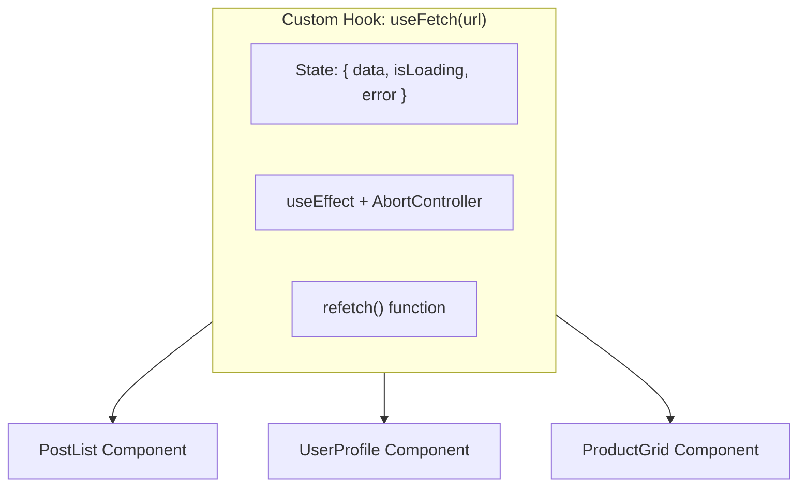

## 🏗️ 1. Architecture of `useFetch`



---

## 💻 2. Building `useFetch` Step by Step

### 💻 Code សម្រាប់តែ `useFetch` Hook:

```javascript
// src/hooks/useFetch.js
import { useState, useEffect, useCallback } from 'react';

export function useFetch(url) {
  const [data, setData] = useState(null);
  const [isLoading, setIsLoading] = useState(true);
  const [error, setError] = useState(null);

  // Function សម្រាប់ Fetch Data
  const fetchData = useCallback(async (signal) => {
    if (!url) return;

    setIsLoading(true);
    setError(null);

    try {
      const res = await fetch(url, { signal });
      if (!res.ok) throw new Error(`HTTP ${res.status}: ${res.statusText}`);
      const json = await res.json();
      setData(json);
    } catch (err) {
      if (err.name !== 'AbortError') {
        setError(err.message);
      }
    } finally {
      setIsLoading(false);
    }
  }, [url]);

  useEffect(() => {
    const controller = new AbortController();
    fetchData(controller.signal);

    return () => controller.abort();
  }, [fetchData]);

  // បង្កើត refetch trigger
  const refetch = () => {
    const controller = new AbortController();
    fetchData(controller.signal);
  };

  // Return ជា Object ងាយស្រួល Destructure
  return { data, isLoading, error, refetch };
}
```

### 🔍 ការពន្យល់មួយជួរៗ (Line-by-Line Explanation):

1. `export function useFetch(url)`
   - ទទួល parameter `url` (អាសយដ្ឋាន API Endpoint ដែលត្រូវ fetch)។
2. `const [data, setData] = useState(null);`
   - រក្សាទុកទិន្នន័យ Response។
3. `const fetchData = useCallback(async (signal) => {...}, [url]);`
   - ប្រើ `useCallback` ដើម្បីកុំឱ្យ function នេះត្រូវ regenerate ថ្មីរាល់ពេល Component Re-render លុះត្រាតែ `url` ប្រែប្រួល។
4. `const res = await fetch(url, { signal });`
   - ភ្ជាប់ AbortSignal ដើម្បីអាច cancel request បាន។
5. `return () => controller.abort();`
   - Cleanup ស្វ័យប្រវត្តនៅពេល `url` ប្តូរ ឬ Component Unmount។
6. `return { data, isLoading, error, refetch };`
   - បញ្ជូន States ទាំងអស់ និង helper function `refetch` ចេញទៅក្រៅ។

---

## 🛠️ 3. Using `useFetch` in a Component

### 💻 Code សម្រាប់ Component:

```jsx
import { useFetch } from '../hooks/useFetch';

export default function UserProfile({ userId }) {
  // ប្រើ Hook យ៉ាងសាមញ្ញត្រឹមតែ ១ ជួរ!
  const { data: user, isLoading, error, refetch } = useFetch(
    `https://jsonplaceholder.typicode.com/users/${userId}`
  );

  if (isLoading) return <div className="p-4">⏳ កំពុងទាញទិន្នន័យ User...</div>;
  if (error) return <div className="p-4 text-red-500">⚠️ មានបញ្ហា៖ {error}</div>;

  return (
    <div className="p-4 bg-white dark:bg-slate-800 rounded-xl shadow-sm border max-w-sm">
      <h3 className="font-bold text-lg text-slate-800 dark:text-white">{user.name}</h3>
      <p className="text-sm text-slate-500">{user.email}</p>
      <p className="text-sm text-slate-500">{user.phone}</p>

      <button
        onClick={refetch}
        className="mt-3 px-3 py-1.5 bg-blue-600 hover:bg-blue-700 text-white text-xs font-bold rounded-lg transition"
      >
        🔄 Refresh Profile
      </button>
    </div>
  );
}
```

### 🔍 ការពន្យល់មួយជួរៗ (Line-by-Line Explanation):

1. `const { data: user, isLoading, error, refetch } = useFetch(...)`
   - ប្រើ Destructuring និង Rename `data` ទៅជា `user` ឱ្យត្រូវតាម Context នៃ Component។
2. `if (isLoading)` និង `if (error)`
   - គ្រប់គ្រង UI Loading និង Error បានយ៉ាងស្អាត ដោយមិនចាំបាច់សរសេរ State variables នៅក្នុង Component នេះឡើយ។
3. `<button onClick={refetch}>`
   - អាចចុចទាញយកទិន្នន័យថ្មីម្តងទៀតបានគ្រប់ពេលដោយគ្រាន់តែហៅ `refetch()`។
